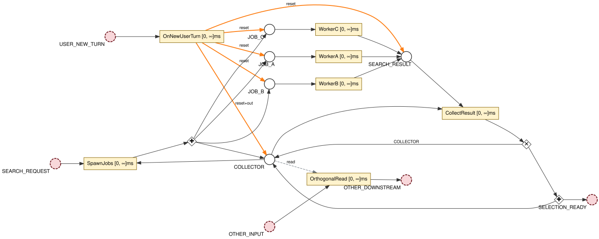
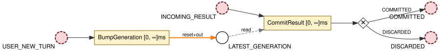
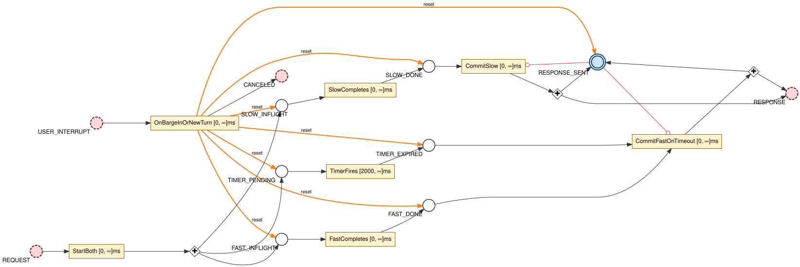
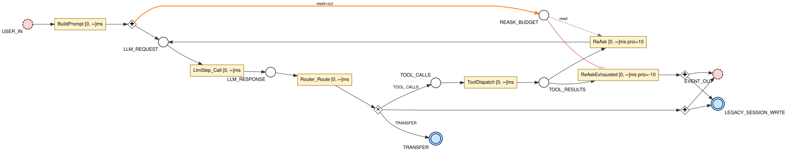
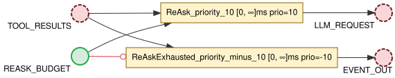

# adk-libpetri

[](https://github.com/debe/adk-libpetri/actions/workflows/ci.yml)
[](LICENSE)

adk-libpetri replaces Google ADK Java's orchestration core with a
Coloured Time Petri Net runtime built on
[libpetri](https://github.com/debe/libpetri). The pieces it replaces
are `SequentialAgent`, `ParallelAgent`, `LoopAgent`, `BaseLlmFlow`,
`AgentTransfer`, and the `Runner` that drives them over an RxJava
pipeline. In their place, the whole control flow of a session is one
coloured Petri net you compose from typed subnets. Stock ADK `Runner`
consumes it through an ~80-line `PetriAgent extends BaseAgent` adapter.
There is no fork of ADK and no fork of genai.

Both shipped demo nets are Z3-proved deadlock-free on every
`mvn verify`. The voice/BIDI demo additionally has its reachable state
space confirmed finite by bounded state-class graph exploration.

## Project status

This is early-stage. The runtime, the stock subnets, and both verified
demos are real and pass on every build, but the scope of the ADK
integration is still being worked out. Which slices of the ADK surface
a Petri-driven agent should own, and exactly where the net-to-ADK seam
belongs, are still open questions this repo is exploring. Expect the
boundary colour catalog, the stock subnet set, and the adapter shape to
move as that scope is found. Releases are working snapshots of that
exploration, not a frozen API.

## What the enhancement is

ADK Java expresses an agent process as a sequence with concurrency
layered on at runtime (`BaseLlmFlow` over RxJava 3). That shape gives
you `before` and `after`. It does not give you semantics for what flows
along the edges, nor native concurrency, inhibition, mutual exclusion,
time, structural loops, or proof. Each of those arrives as a separate
operator chain or annotation, and past a certain complexity the diagram
on the whiteboard stops matching the artefact in production.

A Coloured Time Petri Net makes each of those a structural property of
one artefact:

- **Concurrency is the default.** Two transitions with disjoint
  preconditions fire independently. Parallelism is a property of the
  runtime, not an operator the caller composes.
- **Loops are cycles in the topology**, not a `LoopAgent` wrapped
  around a sequence.
- **Branching is `Out.xor`; joins are multi-arc `In.one`.** The diagram
  expresses what happens.
- **Inhibitor, read, and reset arcs, and time, are first-class.** "Fire
  only if X is absent," "atomic snapshot of upstream state without
  consuming it," "fire after T units of silence," and "reset this whole
  region in one firing" are arcs, not guard code hidden in callbacks.
- **The marking is the state.** Tokens carry typed domain colours
  (`Place<LlmRequest>`, `Place<Content>`, `Place<FunctionCall>`). There
  is no external state object racing against itself.
- **Causality is structural.** A transition fires when its
  preconditions are present, not when a previous step "called" it.

Coloured Petri nets with inhibitor arcs are Turing-complete, a
long-established property that the library's coloured timed nets with
inhibitor and reset arcs inherit. The expressive ceiling is a property
of the shape, not of the library.

The formal model is well established and research-grade tools exist
(CPN Tools, TINA, LoLA), but a fast, deployable runtime for it has not.
libpetri fills that gap with a fast executor, structural composition
with type inference, a state-class graph for bounded-reachability
checks, and IC3/SMT-backed verification via Z3. adk-libpetri is the
first applied showcase of that runtime against a real orchestration
problem.

## Why the sequence shape runs out

The bug classes that haunt agent frameworks at scale are not
implementation bugs in those frameworks. They are shape mismatches
between the runtime and the process being modelled. Three of the four
cases below are the same failure: a check-and-act race the prevailing
APIs leave open because the check runs at one boundary (a callback, a
`session.state` read, a flag at the top of a step) while the act runs
at another. A single transition firing collapses the check and the act
into one atomic step, so the window between them does not exist. The
fourth case covers full-duplex failure modes that are hard to express
in any sequence-shaped runtime. Each case names the closest one-liner
in ADK or RxJava and why it does not survive composition.

### 1. Concurrent fan-out with batch-scoped state

A retrieval-heavy agent dispatches a batch of tagged jobs whose count
varies per request (an intent classifier picks 1 or 3 strategies).
Results accumulate into a record carrying the expected count, the
per-strategy buckets, and a merge rule derived from the intent. While
the batch is in flight, an orthogonal subnet wants to read the partial
state (to skip a redundant computation, or send an "I'm still
searching" placeholder), and a new user turn must abort the in-flight
workers and the partial accumulator before the next batch.

The closest one-liner is `Flowable.zip(a, b, c)`, but it handles fan-in
for a fixed arity only, exposes the accumulator to nothing else, offers
no single reset point for new-turn cancellation, and has no home for
the per-batch merge rule. The ADK accumulator pattern (`ParallelAgent`
plus a `ConcurrentHashMap` plus a `CountDownLatch`) separates the
accumulator update, the latch decrement, and the downstream emit by
TOCTOU windows.

In the net, the accumulator is the token in a typed `COLLECTOR` place.
`CollectResult` consumes one result plus the `COLLECTOR`, merges, and
uses `Out.xor` to either return the collector alone or return it
together with the downstream signal. `OrthogonalRead` reads `COLLECTOR`
through a read arc, so orthogonal subnets get atomic snapshots without
disturbing the merge. `OnNewUserTurn` consumes `USER_NEW_TURN` and
resets `COLLECTOR` and every job place in one firing; the whole
in-flight batch cancels atomically.

<p align="center">
  
</p>

### 2. Stale-result detection across many commit sites

A long-running session has streaming chunks, parallel tool results, and
placeholder replies in flight at once. When the user takes a new turn,
the generation counter advances, and every in-flight result that lands
after the advance must be discarded before it enters conversation
history or triggers another model call.

The closest one-liner is an `AtomicReference<Generation>` in
`session.state` with an `if (current.get() != myGen) discard()` at each
commit site. The read is atomic; the problem is that the check is not
one site but one per result-emitting transition, and missing it at any
one leaks stale data. This is exactly the failure mode of ADK's
advisory `endInvocation` flag, which is checked at the top of each step
while an in-flight `Flowable.merge` of parallel tool calls fires past
it.

In the net, `LATEST_GENERATION` holds the current generation token. The
commit transition reads it and XOR-routes to a committed or discarded
leaf. `BumpGeneration` consumes `USER_NEW_TURN`, resets
`LATEST_GENERATION`, and emits a fresh token, invalidating every
in-flight commit at once. Each additional commit site is one more
transition carrying the same `read(LATEST_GENERATION)` arc, which lifts
the discipline into a build-time invariant: a freshness-read validator
fits the same template as the structural validators in
[Verification](#verification) and rejects any composed net whose commit
transitions omit the read arc. The "remember to check everywhere"
answer ADK gives for `endInvocation` becomes a compile-time refusal.

<p align="center">
  
</p>

### 3. Speculative race with composable cancellation

Two paths fire concurrently: a slow accurate compute and a fast
approximate one. The slow path is preferred if it returns within a
2-second deadline; otherwise the fast result commits at the deadline.
The user can barge in at any point, and both in-flight paths must cancel
atomically while the `RESPONSE_SENT` lock resets so the next turn starts
clean. A third tier (a cached default at five seconds) must slot in
without disturbing the at-most-once invariant or the cancellation.

The closest one-liner is
`Mono.first(slow, fast.delayElement(ofSeconds(2)))`, but barge-in needs
`takeUntil` on each path, at-most-once needs an external flag tracked
alongside the chain, the SLA disappears into a `delayElement` call
indistinguishable from a debounce, and adding the third tier means
rewriting the composition. None of these properties survive into a
formal checker.

In the net, `StartBoth` forks the request into `SLOW_INFLIGHT`,
`FAST_INFLIGHT`, and `TIMER_PENDING`. `CommitSlow` fires as soon as
`SLOW_DONE` lands, gated by `inhibitor(RESPONSE_SENT)`;
`CommitFastOnTimeout` requires `FAST_DONE` and `TIMER_EXPIRED` under the
same inhibitor. The at-most-once invariant `PlaceBound(RESPONSE, 1)` is
visible in the diagram and SMT-checkable. `OnBargeInOrNewTurn` resets
every race place plus `RESPONSE_SENT` in one firing. The third tier is
one more transition under the same inhibitor with a longer timer; the
invariant and the cancellation are unchanged because both are
properties of the topology. This case is backed by
`PatternA_SpeculativeRaceDemoTest`.

<p align="center">
  
</p>

### 4. Voice and full-duplex failure modes

A voice agent streams partial responses, detects barge-in mid-stream,
applies a two-stage silence-recovery timer, and resets stale state on
new utterances. The four modes interact: a barge-in must suppress
further chunks, a recovery transition must not fire while the model is
speaking, and a new utterance must wipe in-flight tool requests and
pending recovery flags.

The closest one-liner is a `Flux` with `timeout(silence)` plus
`takeUntil(bargeIn)` plus `switchMap(newUtterance)`, each handling one
mode in isolation. The composition is where it breaks: the silence
timeout fires against a chunk the barge-in had logically cancelled but
the stream had not yet seen, and the new-utterance reset races the
in-flight recovery.

In the net, each mode is one arc: an inhibitor on `MODEL_ACTIVE` gates
recovery, a read arc on `VOICE_ACTIVITY_OPEN` gates barge-in dispatch,
`CHUNK_BUDGET` bounds concurrent chunk emission, and reset arcs on the
new-utterance transition wipe in-flight state. They compose because
they are all properties of the marking. `VoiceSessionDemoTest` composes
the four into one long-lived per-session net; Z3 proves it deadlock-free
with the state-class graph bounded under 256 reachable markings. The
composed topology is rendered in
[`bidi-composition.svg`](docs/diagrams/svg/bidi-composition.svg).

## What this looks like for ADK

The whole control flow is one user-designed coloured Petri net composed
from typed subnets, consumed by stock ADK `Runner` through the
`PetriAgent` adapter. The ADK source tree is untouched. Three benefits
carry the design:

1. **Compose-time type safety.** Each subnet declares typed ports such
   as `Place<LlmRequest>` and `Place<List<FunctionCall>>`.
   `PetriNet.Builder.compose(...)` auto-binds by `(name, tokenType)`
   structural match, so wiring an `LlmResponse` port into a `Content`
   port fails at net-build time, not at runtime.
2. **The diagram reads as a domain process.** Places carry domain
   colours (`Content`, `LlmRequest`, `FunctionCall`,
   `LegacySessionWrite`), not an opaque `InvocationToken`. Rendering the
   net via libpetri's `DotExporter` shows the agent process directly;
   every diagram here is generated that way (see
   [`docs/diagrams/`](docs/diagrams/)).
3. **Structural bug-class elimination, SMT-verified.** The TOCTOU,
   race, and NPE patterns above become structurally absent or are caught
   at net-build time. `AdkNetInvariants` ships three structural
   validators that run on every `mvn verify`, plus SMT property
   factories that Z3 Spacer proves on the assembled demo nets.

### Runtime model

- **One `PetriNet` per session**, built at session start and kept alive
  for the session lifetime. A new user message is
  `executor.inject(USER_IN, content)` into the already-running net.
- **The only interaction with a running net is env-place tokens.** Input
  is `inject(envPlace, token)` from any thread. Output is the
  `EVENT_OUT` bridge plus the `EventStore` decorator chain. There are no
  method calls into the net and no side channels. Ingress is generic
  (any number of typed env places); egress is deliberately narrow (no
  generic `observe(Place<T>)`), so the net keeps one auditable way in
  and one way out.
- **Executors are caller-supplied.** `PetriRunner.Builder` requires
  explicit `actionExecutor` and `orchestratorExecutor`. The library
  carries no shared executor singleton; callers own lifecycle.
- **The marking is the state.** Read arcs to typed in-net places are
  fine. External stores (ADK `Session.state`, a database, a cache) are
  write-only legacy bridges, never read from inside the net during
  execution. The only bag-shaped colour is `LegacySessionWrite`, named
  loudly and used only for the ADK Session export bridge.

### Calling Gemini without `commonPool`

The async genai client, and ADK's own `Gemini.generateContent`,
schedule continuations on `ForkJoinPool.commonPool()`, the shared
singleton this project bans. The fix needs no fork: call genai's
synchronous API on a virtual thread. genai's sync facade
(`client.models.generateContent` / `generateContentStream`) and
OkHttp's synchronous `execute()` both run on the calling thread, so a
`BaseLlm` that calls genai synchronously, subscribed on the Petri
action's virtual thread, keeps the whole call (HTTP I/O, parsing,
mapping) on that thread and never touches `commonPool`.

```java
// build once, share across sessions, close() on shutdown
Client client = Client.builder().apiKey(apiKey).build();
BaseLlm llm  = new SyncGeminiLlm("gemini-2.0-flash", client); // ~25-line adapter; see demos/

var bound = net.bindActions(LlmStepSubnet.actionBindings(llm));
runner = PetriRunner.builder(bound)
    .environmentPlace(AdkColours.USER_IN)
    .actionExecutor(Executors.newVirtualThreadPerTaskExecutor())  // blocking the call is cheap here
    .orchestratorExecutor(orchestrator)
    .start();
```

`SyncGeminiLlm` is an exemplar under `demos/`, not library code. It
reuses ADK's public `GeminiUtil` / `LlmResponse.create` mappers, and
server-streaming drains genai's sync `ResponseStream` per chunk on the
same virtual thread. BIDI/Live is a separate path: read genai's Live
session directly (`client.async.live.connect` plus
`AsyncSession.receive`) and inject each server event into its env place.
The VAD and barge-in signals (`LiveServerContent.interrupted()`,
`LiveServerMessage.voiceActivity()`) are already public on genai, so
voice needs no fork either. ADK's `Gemini.generateContent` and
`GeminiLlmConnection` wrappers, which add the `commonPool` hops and drop
the VAD signals, are bypassed in thin user code rather than patched.

### Boundary colour catalog (`AdkColours`)

A fixed set of typed places that all stock subnets share. Compose-time
inference fuses them by `(name, tokenType)` structural equality, so
users do not write port mappings unless they want to.

| Colour | Type | Use |
|---|---|---|
| `USER_IN`              | `Place<Content>`             | user message inbound (env place) |
| `EVENT_OUT`            | `Place<Event>`               | agent event outbound |
| `LLM_REQUEST`          | `Place<LlmRequest>`          | prepared LLM request |
| `LLM_RESPONSE`         | `Place<LlmResponse>`         | LLM response (merged for streaming) |
| `TOOL_CALLS`           | `Place<ToolCalls>`           | list of FunctionCalls to dispatch |
| `TOOL_RESULTS`         | `Place<ToolResults>`         | list of FunctionResponses |
| `LEGACY_SESSION_WRITE` | `Place<LegacySessionWrite>`  | write-only bridge to ADK Session.state |
| `TRANSFER`             | `Place<TransferTarget>`      | agent-transfer routing token |
| `END_INVOCATION`       | `Place<Void>`                | termination signal (inhibitor source) |

Users add their own colours for in-net state such as
`Place<ConversationHistory>` or `Place<CurrentProduct>`. The convention
is typed places per domain concept, never a single
`Place<Map<String, Object>>` bag.

### Stock subnet catalog

Each is an overridable `SubnetDef` or factory; users compose via
`PetriNet.builder().compose(SubnetDef)` with port inference. These are
convenience templates, not the framework. The framework is the
composition primitives together with `SubnetDef.fromNet(...)`.

| Subnet | Input ports | Output ports | What it does |
|---|---|---|---|
| `LlmStepSubnet`         | `LLM_REQUEST` | `LLM_RESPONSE`, internal-error | Calls `BaseLlm.generateContent`. Before/After/Error callback transitions with `Out.xor(continue, shortCircuit)` |
| `ToolDispatchSubnet`    | `TOOL_CALLS`  | `TOOL_RESULTS`                 | Per-call task on a virtual-thread executor, AND-join of results. Per-call errors captured in the response payload |
| `PromptBuilderSubnet`   | `USER_IN`     | `LLM_REQUEST`                  | Builds `LlmRequest` (model, system instruction, tools) |
| `RouterSubnet`          | `LLM_RESPONSE`| `Out.xor(TOOL_CALLS, TRANSFER, EVENT_OUT)` | Routes by response shape. `transfer_to_agent` takes precedence |
| `LlmAgentSubnet`        | `USER_IN`     | `EVENT_OUT`, `LEGACY_SESSION_WRITE`, `TRANSFER` | Composes the above four with a reask-budget feedback loop that structurally bounds the autonomous tool loop |
| `PersistStateSubnet`    | `LEGACY_SESSION_WRITE` | terminal | Single transition draining `StateDelta` to `BaseSessionService.appendEvent`. Race-free by construction: one writer transition in the entire net |
| `TransferRouterSubnet`  | `TRANSFER`    | `target/<name>*`, `target/_unknown`, `EVENT_OUT` | `Out.xor` over compile-time-known target places. A hallucinated name routes to a typed error Event, not an NPE |

The canonical composition is `LlmAgentSubnet`: prompt build, LLM call,
route, tool dispatch, the reask-budget feedback loop, and the
legacy-session-write sink. `BuildPrompt` resets `REASK_BUDGET` and seeds
K tokens (the diagram shows one arc; K is per-session via
`LlmAgentSubnet.Config.reaskBudget(int)`).

<p align="center">
  
</p>

#### Bounding autonomous loops: the reask budget

An LLM-and-tool loop that re-asks the model after every tool batch is
the classic autonomous-runaway risk. The net bounds it structurally,
not with a counter in application state. `BuildPrompt` seeds K tokens
into a `Place<Void> REASK_BUDGET`; each re-ask consumes one. When the
budget place is empty, an inhibitor-guarded, lower-priority fallback
transition is the only one still enabled, so the loop ends with a
graceful answer instead of spinning. The bound is visible in the
diagram and SMT-checkable.

<p align="center">
   REASK_BUDGET; when the budget is exhausted the fallback transition fires"
       width="720">
</p>

Voice-specific demo subnets (`BargeIn`, `LiveApiRecovery`,
`LlmStreamingStep`, `Vad`) are not part of the shipped library. They
live under `src/test/java/org/libpetri/adk/demos/voice/` as composable
exemplars of the patterns in
[case 4](#4-voice-and-full-duplex-failure-modes). The `Vad` producer
reads genai's Live session directly and injects speech-activity edges
into the net.

### Composition patterns ADK orchestration can't express

Three patterns sit outside what `SequentialAgent`, `ParallelAgent`,
`LoopAgent`, and `AgentTransfer` can express, each because ADK's agent
vocabulary lacks a primitive (first-wins, K-of-N, path switching), and
each is roughly 40 to 50 LOC of `PetriNet.builder()` user code. Each is
paired with an ADK-only foil test that locks in the broken behaviour.

- **Speculative race with structural cancellation.** `Place<Void>
  RACE_WON` plus per-branch commit inhibitors; the first result wins and
  losers structurally cannot commit. Z3 proves `PlaceBound(EVENT_OUT, 1)`
  per turn. `PatternA_SpeculativeRaceDemoTest` /
  `PatternA_AdkOnlyFoilTest`.
- **Late-join / K-of-N quorum.** `Arc.In.exactly(K, RESULT)` fires the
  instant K branches return; late arrivals drain to a typed `DISCARDED`
  sink. Runtime is bounded by the K-th-fastest branch, not the slowest.
  `PatternB_QuorumDemoTest` / `PatternB_AdkOnlyFoilTest`.
- **Optimistic commit with structural fallback.** Cheap and slow paths
  run concurrently; an XOR validation transition routes to the
  cheap-commit or slow-commit path via inhibitors on a shared
  `COMMITTED` mutex. `PatternC_OptimisticCommitDemoTest` /
  `PatternC_AdkOnlyFoilTest`.

All six tests live under
`java/src/test/java/org/libpetri/adk/demos/patterns/`. Each foil test
passes as a green-locked assertion of the broken behaviour; if a future
ADK release fixes one, the assertion flips red and the catalog gets
updated.

### Stock ADK Runner integration without a source change

`PetriAgent extends BaseAgent` (in
`java/src/main/java/org/libpetri/adk/runner/`) is the integration seam,
roughly 80 lines in two halves:

```java
@Override
protected Flowable<Event> runAsyncImpl(InvocationContext ctx) {
    SessionKey key = SessionKey.from(ctx.session());
    Object owner  = ownerExtractor.apply(ctx);          // lifetime owner
    PetriRunner runner = registry.getOrCreate(key, owner, runnerFactory);
    Content userContent = ctx.userContent().orElse(null);
    if (userContent == null) return Flowable.empty();

    // Subscribe BEFORE inject to avoid the hot-stream race.
    CompletableFuture<Event> nextEvent = new CompletableFuture<>();
    runner.adkEvents().take(1).subscribe(nextEvent::complete, nextEvent::completeExceptionally);
    runner.inject(AdkColours.USER_IN, userContent);
    return Single.fromCompletionStage(nextEvent).toFlowable();
}

@Override
protected Flowable<Event> runLiveImpl(InvocationContext ctx) {
    // BIDI bridge: ADK Runner.runLive(...) drives the live channel;
    // the net provides the orchestration brain underneath.
    SessionKey key = SessionKey.from(ctx.session());
    Object owner  = ownerExtractor.apply(ctx);
    PetriRunner runner = registry.getOrCreate(key, owner, runnerFactory);
    return runner.adkEvents();
}
```

The two paths divide cleanly. `runAsyncImpl` replaces ADK
orchestration: the net is the brain for the whole request/response.
`runLiveImpl` is a bridge: ADK owns the BIDI runtime (WebSocket, audio
framing, turn detection), the adapter wires its hot event stream into
ADK's pipeline, and the caller forwards `LiveRequestQueue` frames into
`runner.inject(...)` from its WebSocket handler. Input wiring stays
caller-side because frame transformation varies per transport.

`SessionExecutorRegistry` lazily creates one `PetriRunner` per
`(appName, userId, sessionId)`, so consecutive `runAsync` calls reuse
the same long-lived executor. Stock `InMemoryRunner(agent)` consumes a
`PetriAgent` like any other `BaseAgent`, so existing apps swap
orchestrators without touching the rest. The registry ships in two
modes: `cleanerOwned()` (default, `Cleaner`-based auto-teardown when the
lifetime owner is GC'd) and `strongOwned()` (explicit `close(SessionKey)`
for frameworks with no stable strong-reference owner). The
`Cleaner`-bound lifetime means an orphaned session runner (orchestrator
thread, hot processor, marking state) cannot leak: there is no API path
that registers a runner without attaching its teardown hook.

### Why ADK and not pure libpetri?

libpetri on its own can drive a composed net through its native
executor, and that is the right choice for some projects. The ADK layer
adds:

- **Session model.** ADK's `Session`, `SessionService`, and the
  in-memory and persistent variants provide per-user conversation state
  and the session lifecycle the ADK ecosystem expects.
- **Wire protocol.** `Content`, `Part`, `Event`, `FunctionCall`, and
  `FunctionResponse` are the envelope shared with the Gemini API, the
  Agent-to-Agent (A2A) protocol, and the managed deploy targets.
- **Tool ecosystem.** `BaseTool` and adapters for the Model Context
  Protocol (MCP), A2A clients, and built-in tool families reuse from a
  Petri-driven agent exactly as from any `BaseAgent`.
- **Deploy targets.** Vertex Agent Engine and Cloud Run agent hosting
  accept the ADK contract; a `PetriAgent` deploys with no extra
  transport adapter.
- **Composition with non-Petri agents.** A `SequentialAgent`,
  `ParallelAgent`, or `LoopAgent` can hold a `PetriAgent` as a child, so
  existing deployments adopt the Petri runtime incrementally.
- **Evaluation.** When ADK Java grows an evaluator, a `PetriAgent` is
  already a `BaseAgent` and plugs in.

Pure libpetri solves the orchestration shape problem; the ADK layer
adds the protocol, deploy, and ecosystem integration the Google agent
platform expects. Projects that need none of it can drive libpetri
directly.

## Design commitments

These are the structural commitments the rest of the design rests on.
Each exists to make a class of bug impossible to express, not merely
discouraged.

1. **Interaction is env-place injection only.** Every external signal
   (a user message, a scroll event, a sensor reading, a webhook, an
   audio frame) enters a running net through `inject(envPlace, token)`
   on its own typed place. There are no method calls into transitions
   and no side channels.
2. **The marking is the state.** State lives in tokens. External stores
   (ADK `Session.state`, a database, a cache) are write-only legacy
   bridges, never read from inside the net during execution. Read arcs
   snapshot typed in-net places instead.
3. **Typed colours per domain concept.** A place carries a typed colour
   (`Place<LlmRequest>`, `Place<Content>`), never a single
   `Place<Map<String,Object>>` bag. The one bag-shaped colour,
   `LegacySessionWrite`, is named loudly and used only for the Session
   export bridge.
4. **Zero forks.** ADK is integrated through the `PetriAgent extends
   BaseAgent` adapter, never by forking it. Where a defect lives in
   ADK's wrapper over genai (the `commonPool` hops, the dropped VAD
   signals), the wrapper is bypassed in thin user code that calls genai
   directly, not patched in a fork of genai or ADK.
5. **Observability is an `EventStore` decorator chain.**
   `OtelEventStore`, `EventStore.logging()`, and any structured-logging
   or debug-recording store wrap each other via the delegate pattern.
   Side effects live in transition actions; there is no second
   observability channel and no `observe(Place<T>)`.
6. **Autonomous loops are bounded structurally.** The reask-budget
   pattern (`Place<Void>` plus priority plus inhibitor fallback) bounds
   the LLM-and-tool loop in the topology, not with a counter in
   application state.
7. **Stock subnets are templates, not the framework.** The framework is
   the composition primitives (`PetriNet.builder().compose()` plus
   `SubnetDef.fromNet(...)`). The seven stock subnets are convenient
   starting points; you are expected to compose your own.
8. **Per-session executor lifetime is caller-owned.** A session runner
   is bound to a caller-owned object via `java.lang.ref.Cleaner` (or
   closed explicitly in `strongOwned` mode). There is no shared executor
   singleton and no API path that registers a runner without its
   teardown hook, so orphaned threads and marking state cannot leak.

## Verification

Every `mvn verify` runs the following.

- Three structural validators, no SMT solver needed.
  `singleLegacySessionWriter` catches parallel writes to
  `Session.state`. `endInvocationInhibitsAll` catches missing
  termination inhibitors. `transferDemuxHasUnknownFallback` catches
  dead-letter accumulation.
- SMT property factories (`reaskBudgetIsBounded`, `eventOutBounded`,
  `noFireAfterEndInvocation`, `atMostOneCommits`) proved on the
  assembled nets via libpetri's `SmtVerifier`.
- Both demos Z3-proved deadlock-free via
  `SmtVerifier.forNet(net).property(deadlockFree()).verify()`.
- The BIDI demo's reachable state space confirmed bounded by
  `StateClassGraph.build(net, initial, 256)` terminating within the
  exploration cap.

The tests assert the proof result rather than relying on example
traces.

## Languages

| | Status |
|---|---|
| **Java** | Working. See [`java/`](java/) |
| TypeScript | Reserved. Slot here when ready |
| Rust       | Reserved |
| Python     | Reserved (matches `adk-python` SDK reach) |

The repo follows the same multi-language layout as
[libpetri](https://github.com/debe/libpetri). Add a sibling subdir
(`typescript/`, `rust/`, `python/`) when porting.

### Quickstart (Java)

```bash
cd java
./mvnw verify
```

173 tests across 29 test classes. Z3 (`com.microsoft.z3`) is pulled
transitively for the deadlock-free and bounded-state tests; those carry
`@EnabledIf("z3Available")` so the build passes even without native Z3
libs installed. See [`java/README.md`](java/README.md) for
composition patterns and the two end-to-end demos.

### Consuming from a project: protobuf version floor

ADK 1.3.0's transitives (notably `com.google.cloud:google-cloud-dlp`
and `com.google.longrunning`) ship protobuf gencode compiled against
4.33.x. The protobuf runtime contract is "runtime at least linked
gencode," so consumers that pin protobuf-java to an older version hit
`ProtobufRuntimeVersionException` at first class-load, typically inside
an apparently-unrelated dependency. The failure is silent until that
load, and the stack trace points at the consumer's code rather than at
the version pin that caused the downgrade.

adk-libpetri pins protobuf-java to 4.33.2 via `dependencyManagement` in
its own POM, so direct consumers get the right version transitively.
Consumers using an enforced platform BOM (Helidon's `enforcedPlatform`,
Spring Boot's BOM in strict mode) must add an explicit override to undo
the BOM's downgrade. Gradle:

```groovy
configurations.all {
    resolutionStrategy {
        force 'com.google.protobuf:protobuf-java:4.33.2'
        force 'com.google.protobuf:protobuf-java-util:4.33.2'
    }
}
```

Maven consumers using a BOM should add an explicit
`<dependencyManagement>` entry for the same coordinates, since the
nearest-wins rules favour the consumer's BOM over a transitive's. The
same pattern applies to any other gencode-bumped dependency (Guava is a
watch-item: shipped at 33.5.0 but commonly managed to 32.x).

## Relationship to libpetri

adk-libpetri consumes libpetri from Maven Central
(`org.libpetri:libpetri:2.6.1`). It is a sibling project, not a fork.
The shared design principles (env-place-only interaction, typed colours
per concept, marking-as-state, EventStore-decorated observability) come
from libpetri and apply identically here.

## License

Apache 2.0. See [`LICENSE`](LICENSE).
