# adk-libpetri

[](https://github.com/debe/adk-libpetri/actions/workflows/ci.yml)
[](https://central.sonatype.com/artifact/org.libpetri/adk-libpetri)
[](LICENSE)
<!-- add PyPI badge at python/v0.1.0 -->

<p align="center"></p>

adk-libpetri replaces the orchestration core of Google ADK with a Coloured
Time Petri Net runtime built on [libpetri](https://github.com/debe/libpetri).
In ADK Java 1.x that is `SequentialAgent`, `ParallelAgent`, `LoopAgent`,
`BaseLlmFlow`, `AgentTransfer` and the `Runner` that drives them over RxJava.
In ADK Python 2.x it is the graph `Workflow` (and the deprecated
Sequential/Parallel/Loop agents). A session's whole control flow becomes one
net composed from typed subnets.

- **Drop-in for ADK.** `PetriAgent` is an ordinary `BaseAgent` in both
  ports, run by the stock ADK `Runner`. In Python, a compiled ADK 2
  `Workflow` also drops in as `PetriWorkflow`, a `BaseNode` under
  `Runner(node=...)`. Live/BIDI sessions go through the `BidiPetriAgent`
  bridge (`bidi_petri_agent.bridge` in Python) over a provider-neutral
  `LiveConnection`. There is no fork of ADK and no fork of genai.
- **Concurrency, cancellation and loop bounds live in the topology.**
  Races, joins, barge-in and runaway tool loops are arcs and places, not
  flags checked in callbacks.
- **Proved on every CI build, in both ports.** Z3 proves turn-level
  properties of the stock subnets `LlmStep`, `Router`, `ToolDispatch`,
  `TransferRouter` and `PersistState`, of the composed `LlmAgent` and
  `StreamingLlmAgent`, of both demo nets (deadlock freedom among them) and,
  in Python, of compiled sample workflows. The proofs run under `mvn verify`
  and `pytest`. Each CI job installs `z3` and sets `REQUIRE_Z3=1`, under
  which a gate test (`Z3NativeGateTest`, `tests/test_z3_gate.py`) fails the
  build when `z3` is missing instead of letting the proofs skip.
- **Prove an existing ADK 2 `Workflow` without rewriting it.**
  `from_workflow` (Python, experimental) compiles the graph into a net and
  checks its safety properties with Z3; see
  [From Workflow to net](#from-workflow-to-net-from_workflow-python-experimental).

## Contents

- [Project status](#project-status)
- [Install](#install)
- [A quick look](#a-quick-look)
- [What is proved](#what-is-proved)
- [Why a Petri net](#why-a-petri-net)
- [From Workflow to net: from_workflow *(Python, experimental)*](#from-workflow-to-net-from_workflow-python-experimental)
- [Guarantees](#guarantees)
  - [G1 One turn at a time, and no stranded turn](#g1-one-turn-at-a-time-and-no-stranded-turn)
  - [G2 Bounded autonomous loops (reask budget)](#g2-bounded-autonomous-loops-reask-budget)
  - [G3 Typed fallbacks: no dead letters](#g3-typed-fallbacks-no-dead-letters)
  - [G4 At most one commit per turn](#g4-at-most-one-commit-per-turn-race-optimistic-commit-quorum)
  - [G5 Escalation ladders](#g5-escalation-ladders-timed-recovery-as-places)
  - [G6 Full duplex *(experimental)*](#g6-full-duplex-vad-barge-in-chunk-drop-ordering-experimental)
  - [N1 Not yet guaranteed: staleness across turns](#n1-not-yet-guaranteed-staleness-across-turns)
  - [N2 Not yet guaranteed: variable-N fan-out](#n2-not-yet-guaranteed-variable-n-fan-out)
- [How it works](#how-it-works)
- [ADK integration](#adk-integration)
- [Design commitments](#design-commitments)
- [Verification](#verification)
- [Development](#development)
- [Relationship to libpetri](#relationship-to-libpetri)
- [License](#license)

## Project status

This is early-stage. The runtime, the stock subnets and the verified
demos are real and pass on every build. The scope of the ADK seam is
still being worked out: which slices of the ADK surface a Petri-driven
agent should own, and where the net-to-ADK boundary belongs. Expect the
boundary colour catalog, the stock subnet set and the adapter shape to
move as that scope is found. Each release is a working point in that
exploration, not a frozen API.

Versioning is **0.x**, and a minor version may break API. What is settled
and what is experimental, per port:

- **Java.** The turn-based path is settled: `PetriAgent.builder` and the
  `PetriAgent.of` shorthands, the non-streaming stock subnets, and
  `SessionExecutorRegistry`. SSE streaming, BIDI/live and checkpoints are
  marked `@Experimental` in source and may change in any release.
- **Python.** The turn-based path mirrors Java. SSE streaming, BIDI/live,
  checkpoints and `from_workflow` are marked `@experimental`.

Each language has its own version and its own tags (`java/v…`,
`python/v…`).

| Port | Status | ADK target | libpetri | Release |
|---|---|---|---|---|
| **Java** ([`java/`](java/)) | Working | ADK Java 1.10.1 | `org.libpetri:libpetri:8.0.0` (Maven Central) | 0.4.0, unreleased |
| **Python** ([`python/`](python/)) | Working, experimental | ADK Python 2.11 (`google-adk~=2.11.0`) | `libpetri>=7.2,<8` (PyPI, a binding over the Rust runtime) | 0.1.0, unreleased |
| TypeScript | Reserved | | | |
| Rust | Reserved | | | |

Both ports golden-check every stock subnet's structure against the shared
fixtures in [`spec/fixtures/nets`](spec/README.md), so a topology drift in
either port fails that port's build.

<p align="center">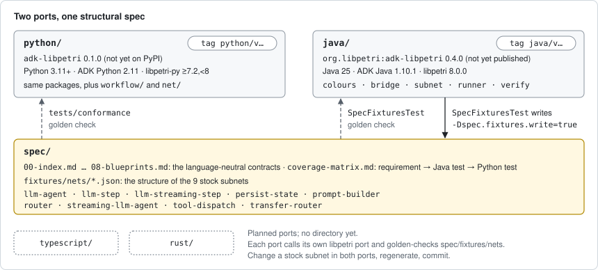</p>

## Install

### Java

```xml
<dependency>
    <groupId>org.libpetri</groupId>
    <artifactId>adk-libpetri</artifactId>
    <version>0.4.0</version>
</dependency>
```

```groovy
implementation 'org.libpetri:adk-libpetri:0.4.0'
```

The artifact is not published yet: until the first tagged release
(`java/v<version>`), build it from source with `cd java && ./mvnw install`.
Java 25 or later; ADK and libpetri come transitively. Before pinning
protobuf yourself or using an enforced platform BOM, read the
[protobuf version floor](java/README.md#protobuf-version-floor).

### Python

```bash
pip install adk-libpetri
```

The package is not on PyPI yet: until the first tagged release
(`python/v0.1.0`), install from a clone with `pip install -e python/`.
Python 3.11 or later, `google-adk~=2.11.0`, `libpetri>=7.2,<8`. See
[`python/README.md`](python/README.md).

## A quick look

One `LlmAgentSubnet` (prompt, model call, routing, tool dispatch, a
bounded re-ask loop) composed into a net, wrapped in a `PetriAgent`, and
run by stock `InMemoryRunner`:

```java
BaseLlm llm = yourModel();  // any com.google.adk.models.BaseLlm

var config = LlmAgentSubnet.Config.builder("my_agent", "gemini-2.5-flash")
        .systemInstruction("Be helpful.")
        .reaskBudget(3)                                // bounds the tool loop
        .dispatchExecutor(Executors.newVirtualThreadPerTaskExecutor())
        .build();

// bindComposed rejects a missing, unknown or doubly-bound transition.
var net = SubnetActions.bindComposed(
        PetriNet.builder("hello").compose(LlmAgentSubnet.DEF).build(),
        LlmAgentSubnet.actionBindings(llm, config));

var registry = SessionExecutorRegistry.strongOwned();  // one runner per session
var agent = PetriAgent.builder("my_agent", registry,
                key -> PetriRunner.builder(net)
                        .environmentPlace(AdkColours.USER_IN)
                        .orchestratorExecutor(Executors.newVirtualThreadPerTaskExecutor())
                        .start())
        .build();

var runner = new InMemoryRunner(agent);                // stock ADK, no fork
// ... runner.runAsync(userId, sessionId, content, runConfig)
// from your session-end hook: registry.close(SessionKey.from(session));
```

<details><summary>The same agent in Python</summary>

```python
from google.adk.runners import InMemoryRunner

from adk_libpetri import OrchestratorLoop
from adk_libpetri import colours as C
from adk_libpetri.runner import PetriAgent, PetriRunner, SessionExecutorRegistry, SessionKey
from adk_libpetri.subnet import llm_agent

llm = your_model()  # any google.adk.models.BaseLlm
loop = OrchestratorLoop()  # one per process; loop.close() at shutdown
config = llm_agent.Config(
    name="my_agent", model="gemini-2.5-flash",
    system_instruction="Be helpful.", reask_budget=3,  # bounds the tool loop
)


def start(key):  # one runner per session
    # builder(spec, actions) rejects a missing, unknown or doubly bound action.
    return (
        PetriRunner.builder(llm_agent.DEF, llm_agent.action_bindings(llm, config))
        .environment_place(C.USER_IN)
        .orchestrator(loop)
        .astart()
    )


registry = SessionExecutorRegistry.strong_owned()
agent = PetriAgent.builder("my_agent", registry, start).build()
runner = InMemoryRunner(agent=agent, app_name="app")  # stock ADK, no fork
# ... runner.run_async(user_id=..., session_id=..., new_message=content)
# from your session-end hook: await registry.aclose(SessionKey.of(session))
```

Tool dispatch joins its calls with `asyncio.gather` inside the action, so
there is no dispatch executor to pass.

</details>

This agent carries [G1](#g1-one-turn-at-a-time-and-no-stranded-turn)
and [G2](#g2-bounded-autonomous-loops-reask-budget) below; compose
`TransferRouterSubnet` next to it for
[G3](#g3-typed-fallbacks-no-dead-letters). This repository's CI proves
G1 and G2 for `LlmAgentSubnet` in both ports; to prove your own
composition, call `verify` on it (see [Verification](#verification)).

[`java/README.md`](java/README.md) has the complete Java program with
imports, plus SSE streaming, Live/BIDI wiring and the two end-to-end
demos; [`python/README.md`](python/README.md) covers the Python port.

Already have an ADK 2 `Workflow`? Compile it instead:
[From Workflow to net](#from-workflow-to-net-from_workflow-python-experimental).

## What is proved

Each row names a guarantee, the net mechanism behind it, what stock ADK
does instead, and how far the claim reaches. Status uses five labels
throughout this README: **Proven + foil** (an SMT proof, plus an ADK-only
foil test that locks in what stock ADK does), **Proven, no foil**,
**Behavioural + foil** (tests and a foil, no SMT), **Behavioural** (tests,
no SMT) and **Illustrative** (a sketch, not a net either port runs).
Before relying on a row, read [How to read the proofs](#how-to-read-the-proofs);
the tests behind each row are listed under [Evidence](#evidence).

A Python twin of a Java test has the same name with a `test_` prefix and
lives under `python/tests/`. The Python column notes where the port differs.

| Guarantee | Mechanism | What stock ADK does | Status | Scope | Python |
|---|---|---|---|---|---|
| [One turn in flight](#g1-one-turn-at-a-time-and-no-stranded-turn) | Seeded `TURN_PERMIT`, consumed by `LlmAgent_StartTurn` | ADK Java's `Runner` does not serialise invocations per session; ADK Python's `Workflow` does not model it ([from_workflow](#from-workflow-to-net-from_workflow-python-experimental)) | Proven, no foil | Two arrivals; no atomic-firing assumption | Same |
| [Every input gets one outcome; failures recovered; no second permit](#g1-one-turn-at-a-time-and-no-stranded-turn) | `LlmAgent_AbortTurn`, `LlmAgent_DropAbort` | No counterpart | Proven, no foil | `arrivals(k, k)` with a failure model at every step; `TURN_ABORT` arrivals for the permit | Same |
| [Reask budget never stacks](#g2-bounded-autonomous-loops-reask-budget) | Priority plus `inhibitor(REASK_BUDGET)` fallback | Only `RunConfig.maxLlmCalls`, which fails the invocation | Proven, no foil | Stated in seeds | Same |
| [Unknown transfer target becomes a typed error; one egress event per turn](#g3-typed-fallbacks-no-dead-letters) | `Out.xor` with a `_unknown` branch | ADK Java: a silent no-op or an untyped error downstream. ADK Python 2.11: a bare `ValueError` ends the invocation | Proven + foil | One turn on the multi-agent net | Same proof; the foil locks in the `ValueError` |
| [Race: one commit, one event; permit never stacks](#g4-at-most-one-commit-per-turn-race-optimistic-commit-quorum) | Consumed `RACE_PERMIT` | ADK Java `ParallelAgent`: first escalation wins. ADK Python `Workflow`: losers are not cancelled. Neither has a provable at-most-once commit | Proven + foil | Per turn, untimed; the permit bound across turns assumes atomic firing | Same; the assumption is exact because `Race_Start`'s action is synchronous |
| [Optimistic commit: one commit; exclusive verdicts](#g4-at-most-one-commit-per-turn-race-optimistic-commit-quorum) | XOR validation verdict | ADK Java: a conditional fallback needs a custom `BaseAgent`. ADK Python `Workflow`: a sequential fallback only; pre-warming double-commits | Proven + foil | Per turn | Same |
| [K-of-N: one synthesis per turn](#g4-at-most-one-commit-per-turn-race-optimistic-commit-quorum) | `In.exactly(3, RESULT)` | Waits for all N (`ParallelAgent`; `JoinNode` in ADK Python) | Proven + foil | Per turn; stragglers can vote in the next turn | Same |
| [Silence escalation ladder](#g5-escalation-ladders-timed-recovery-as-places) | `delayed` rungs under `inhibitor(MODEL_ACTIVE)`; an answer consumes its rung | No counterpart | Behavioural | Timing is not proved (the verifier is untimed) | Same tests on `SteppedClock`, to the millisecond |
| [Voice composition deadlock-free](#g6-full-duplex-vad-barge-in-chunk-drop-ordering-experimental) | Env places modelled `bounded(1)` | No counterpart | Proven, no foil | `deadlock_free` only; streaming, barge-in and recovery, without the Router or `Vad` | Same |
| [VAD edges that ADK Java turns into errors are recovered](#g6-full-duplex-vad-barge-in-chunk-drop-ordering-experimental) | `VadTapGemini` plus the `Vad` window | ADK Java 1.10.1 maps a VAD-only frame to an error | Behavioural + foil | ADK Java 1.10.1 | n/a: ADK Python 2.11 keeps the edges, and a foil locks that in |
| [Compiled workflow safety](#from-workflow-to-net-from_workflow-python-experimental) | Turn permit, idle place per node, `unmatched` places | Raises at finalize on a second output; logs and ends the branch on an unmatched route | Proven, no foil | Per compiled workflow; `deadlock_free` is not claimed when the workflow has interrupts | Python only |

## Why a Petri net

ADK Java expresses an agent process as a sequence, with concurrency
layered on at runtime (`BaseLlmFlow` over RxJava 3). That shape gives you
*before* and *after*. It has no semantics for what flows along the
edges, and no native concurrency, inhibition, mutual exclusion, time,
structural loops or proof. Each arrives as a separate operator chain or
annotation. ADK Java does have escalate-based early exit (`ParallelAgent`
stops on escalate, `LoopAgent` exits on it); what it lacks is a provable
bound and a preference order. ADK Python 2.x moved to a graph `Workflow`;
the next subsection says why a net still adds what a graph lacks.

A Coloured Time Petri Net makes each of those a structural property of
one artefact:

- **Concurrency is the default.** Two transitions with disjoint
  preconditions fire independently.
- **Loops are cycles in the topology**, not a `LoopAgent` wrapped around
  a sequence.
- **Branching is an XOR output (`Out.xor`); a join is one transition with
  several input arcs.** The diagram says what happens.
- **Inhibitor, read and reset arcs, and time, are first-class.** "Fire
  only if X is absent," "snapshot upstream state without consuming it,"
  "fire after T units of silence" and "reset this whole region in one
  firing" are arcs, not guard code hidden in callbacks.
- **The marking is the state.** Tokens carry typed domain colours
  (`LlmRequest`, `Content`, `ToolCalls`). No external state object races
  against itself.
- **Causality is structural.** A transition fires when its preconditions
  are present, not when a previous step "called" it.

The formal model is well established and research tools exist (CPN
Tools, TINA, LoLA), but a deployable runtime did not. libpetri supplies
one in both languages: an executor, structural composition of subnets,
and SMT verification via Z3, plus, in the Java port, a state-class graph
for bounded-reachability checks. adk-libpetri applies that runtime to a
real orchestration problem.

### ADK 2's workflow runtime

ADK 2 (Python; ADK Java is still on 1.x) replaces the nested
`SequentialAgent` / `ParallelAgent` / `LoopAgent` executor with a graph
`Workflow` whose nodes are agents, tools and functions. Leaving the tree
concedes that nesting sequence and parallel shapes projects a concurrent
process onto a structure too narrow to hold it. The Java port targets ADK
Java 1.x; the Python port targets ADK Python 2.11 and compiles its graph
`Workflow` into a net
([From Workflow to net](#from-workflow-to-net-from_workflow-python-experimental)).

On the axes that govern orchestration correctness a coloured timed Petri
net is a superset of that graph model: a transition with several input
places *is* an AND-join, a shared place feeding competing transitions
*is* a race, and choice, exclusion, bounded loops and pre-emption are
arcs and priorities, not checks inside node bodies. The difference that
matters is *when* correctness is established: a graph runtime tracks its
state at run time, while a marking lets the same properties be proved
before execution. The cost is modelling discipline; a plain graph is
simpler to author for linear or fan-out flows. Where ordering, exclusion
and cancellation are load-bearing, `PetriAgent` (or, for a compiled
workflow, `PetriWorkflow`) keeps a verifiable net inside the ADK
contract.

### Why ADK and not pure libpetri?

libpetri alone can drive a composed net through its native executor, and
for some projects that is the right choice. The ADK layer adds:

- **Session model.** ADK's `Session`, session services and their
  in-memory and persistent variants: per-user conversation state and the
  session lifecycle the ADK ecosystem expects.
- **Wire protocol.** `Content`, `Part`, `Event`, `FunctionCall` and
  `FunctionResponse`, the envelope shared with the Gemini API.
- **Tool ecosystem.** `BaseTool` and its adapters, such as those for the
  Model Context Protocol (MCP), work from a net as from any agent.
- **Deploy targets.** A2A, Vertex Agent Engine and Cloud Run hosting are
  available through the `BaseAgent` contract; no test here exercises them.
- **Composition with non-Petri agents** (untested). In Java a
  `PetriAgent` can be the child of a `SequentialAgent`, `ParallelAgent`
  or `LoopAgent`. In Python a `PetriWorkflow` is a `BaseNode` and nests
  inside another `Workflow`, and a `PetriAgent` can be a `Workflow` node
  through its input, output and route mappers.
- **Evaluation.** ADK Python 2.11 ships an evaluator; a `PetriAgent` is a
  `BaseAgent` there, though no test here exercises it. ADK Java has no
  evaluator yet.

Pure libpetri solves the orchestration shape problem; the ADK layer adds
the protocol, deploy and ecosystem integration. Projects that need none
of that can drive libpetri directly.

## From Workflow to net: from_workflow *(Python, experimental)*

The Python port compiles an existing ADK 2 graph `Workflow` into a net, so
a team that already wrote the graph gets proofs without rewriting it:

```python
from google.adk.runners import InMemoryRunner

from adk_libpetri import OrchestratorLoop
from adk_libpetri.workflow import PetriWorkflow, compile_workflow, verify_workflow

loop = OrchestratorLoop()                        # one per process
compiled = compile_workflow(workflow)            # routes, joins, retries; interrupts opt-in via interruptible=[...]
proofs = verify_workflow(compiled, k=2)          # one Z3 verify() per claim; needs the z3 binary
assert all(p.proven for p in proofs)
runner = InMemoryRunner(node=PetriWorkflow.from_compiled(compiled, orchestrator=loop),
                        app_name="app")          # in place of InMemoryRunner(node=workflow)
# or in one call: PetriWorkflow.from_workflow(workflow, orchestrator=loop)
```

Each ADK node still runs through ADK's own node runner, inside the
invocation. What moves into the net is the scheduling: triggers, routes,
joins, retries, concurrency, interrupts and the turn itself.

<p align="center">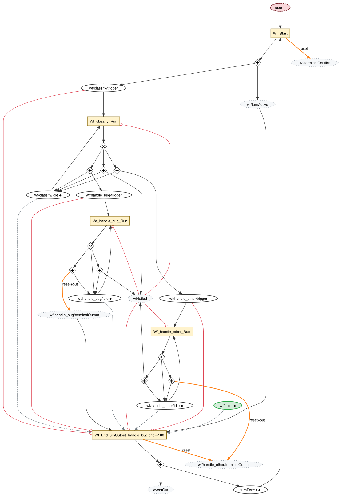</p>

*Exported from the compiled router sample; the abort and empty/failed turn
endings are omitted.*

| Claim | ADK's `Workflow` | Compiled net |
|---|---|---|
| one turn at a time per session | not modelled | `place_bound(wf/turnActive, 1)` |
| the turn permit never doubles | not modelled | `place_bound(turnPermit, 1)` |
| at most one terminal output | raises at finalize | `place_bound(wf/terminalOutput, 1)` |
| every node runs serially | runtime queue | `place_bound(wf/<node>/idle, 1)` |
| a route always matches an edge | logs a warning, ends the branch | `unreachable(wf/<node>/unmatched)` |
| no turn gets stuck | no | `deadlock_free` (not claimed for interruptible workflows; safety is then proved on the match-free over-approximation) |
| a loop is bounded | no bound | opt-in `back_edge_budget` ([ADR 0007](docs/adr/0007-compiled-workflow-back-edge-budgets.md)) |

A cycle without a budget still compiles, and the compiler reports it as
approximated: deadlock freedom and safety are provable, termination is not.
`back_edge_budget={(a, b): K}` routes the edge through a budget place seeded
with K permits each turn. Once they are spent, a fallback transition fails
the turn with a typed `LoopBudgetExhausted` error event.

<p align="center">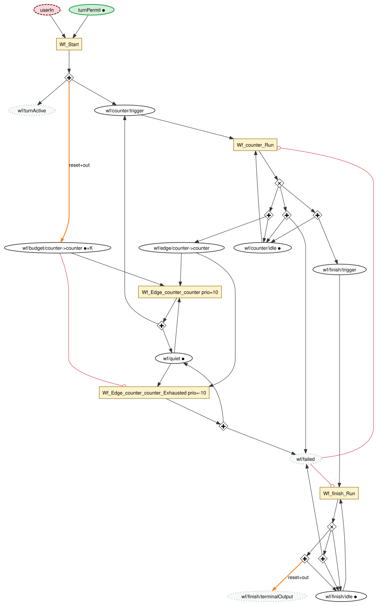</p>

*The same priority plus inhibitor shape as the reask budget in
[G2](#g2-bounded-autonomous-loops-reask-budget).*

**Status: Proven, no foil** for the safety claims; runtime parity
**Behavioural**. ADK-only foils for Patterns A/B/C run against ADK 2
`Workflow` (see [G4](#g4-at-most-one-commit-per-turn-race-optimistic-commit-quorum)).

Four sample workflows, in five cases, run natively and compiled with the
same final output and event authors; retry, budgeted loop and
`RequestInput` resume each have their own test that compares final output.
What the compiler cannot translate faithfully, it rejects; what it
approximates, it reports. See
[`python/README.md`](python/README.md#1-compile-an-existing-adk-workflow-from_workflow).

## Guarantees

Each section below follows one template: the **ADK side** (the class and
method involved, and the foil test if one exists) where ADK has a
counterpart, the **net** (the arcs and a diagram), what is **proved**
(property and test), and the **limits** of the claim. The status labels
are the ones from [What is proved](#what-is-proved). Test names are the
Java ones (for the Python names, see [Verification](#verification)).
Where ADK Python behaves differently, the ADK side says so.

### Reading the diagrams

<p align="center">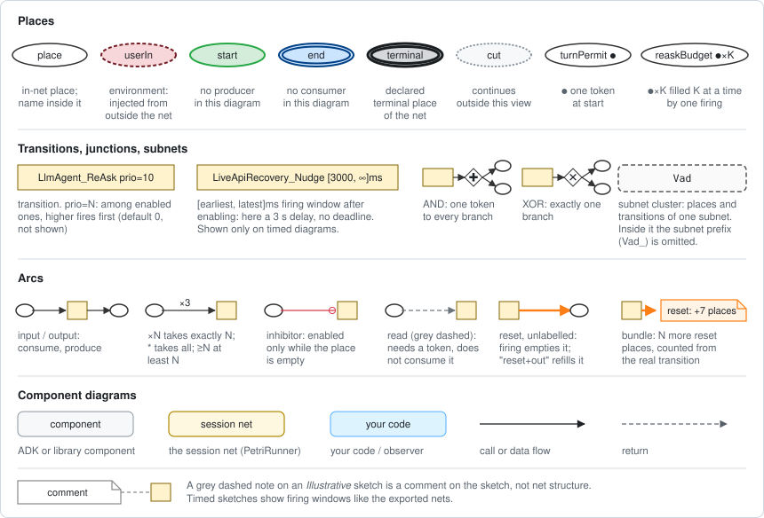</p>

Net diagrams are exported from the nets the Java tests run. The Python
stock subnets have the same structure, golden-checked against
[`spec/fixtures/nets`](spec/fixtures/nets), so each diagram describes
both ports. The workflow diagrams are exported from the Python compiler.
Sketches are marked Illustrative and are not nets either port runs.

<details>
<summary>The notation in full</summary>

- Ellipses are places, named inside. Pink dashed: an env place, injected
  from outside. Green: no producer in the view. Blue, double outline: no
  consumer. Dotted grey: continues outside the view.
- `●` marks a place seeded with one token at start; `●×K` marks a place
  one transition fills with K tokens in a single firing (the proofs bound
  such firings, not tokens).
- Boxes are transitions. `prio=N` ranks enabled transitions;
  `[3000, ∞]ms` is a firing window, shown only on timed diagrams.
- ✚ sends a token to every branch, ✕ to exactly one. An input-arc label
  counts tokens: `×3` takes exactly three, `≥N` at least N, `*` takes all.
- Red arc ending in a circle: inhibitor. Grey dashed: read. Bold orange:
  reset; a "reset: +N places" note bundles N more. A grey dashed note on
  a sketch is a comment, not net structure.
- A rounded dashed frame is a subnet cluster; inside it the subnet
  prefix (`LiveApiRecovery_`) is omitted from labels.
- Labels are the nets' real place names (`userIn`, `LlmAgent_reaskBudget`);
  the prose uses the constant names (`USER_IN`, `REASK_BUDGET`), the same
  in both ports. Sketches use UPPER_SNAKE prose names.
- Component diagrams: grey box, an ADK or library component; yellow, the
  session net; blue, your code or an observer. Solid arrow: call or data;
  dashed: return.

</details>

### G1 One turn at a time, and no stranded turn

**Status: Proven, no foil.**

**ADK side.** ADK Java's `Runner` does not serialise invocations per
session, so a client that retries after a timeout sends the next input
while the previous turn still runs
([ADR 0005](docs/adr/0005-llm-agent-turn-permit.md)). ADK Python 2.11's
`Workflow` does not model it either (see the
[from_workflow table](#from-workflow-to-net-from_workflow-python-experimental)).

**Net.** The admission-token pattern:

- `LlmAgent_StartTurn` consumes `USER_IN` and `TURN_PERMIT` and produces
  `TURN_ACTIVE` and `TURN_INPUT`.
- `LlmAgent_EmitAnswer` and `LlmAgent_EmitTransfer` return the permit and
  reset `REASK_BUDGET`.
- `LlmAgent_AbortTurn` (priority 30) consumes `TURN_ABORT` and
  `TURN_ACTIVE`, returns the permit, and resets every place a turn holds:
  `TURN_INPUT`, `REASK_BUDGET`, `CONVERSATION`, `ANSWER`, `HANDOFF`,
  `LLM_REQUEST`, `LLM_RESPONSE`, `TOOL_CALLS`, `TOOL_RESULTS` and the step
  subnet's own places.
- `LlmAgent_DropAbort` (priority 30) consumes a `TURN_ABORT` that finds
  the permit at rest (`read(TURN_PERMIT)`). It ranks above `StartTurn`:
  at equal priority, an abort and an input landing in one pass would let
  `StartTurn` take the permit and `AbortTurn` wipe the fresh turn.

The permit is a seeded token (`PetriRunner` seeds it), not an inhibitor
on `TURN_ACTIVE`: the verifier lets an inhibitor-guarded transition start
twice from the same marking, so exclusion needs a token both contenders
consume (ADR 0005, "Why a seeded permit, not an inhibitor"). The bug that
led here is in [When the proofs caught us](#when-the-proofs-caught-us).

<p align="center">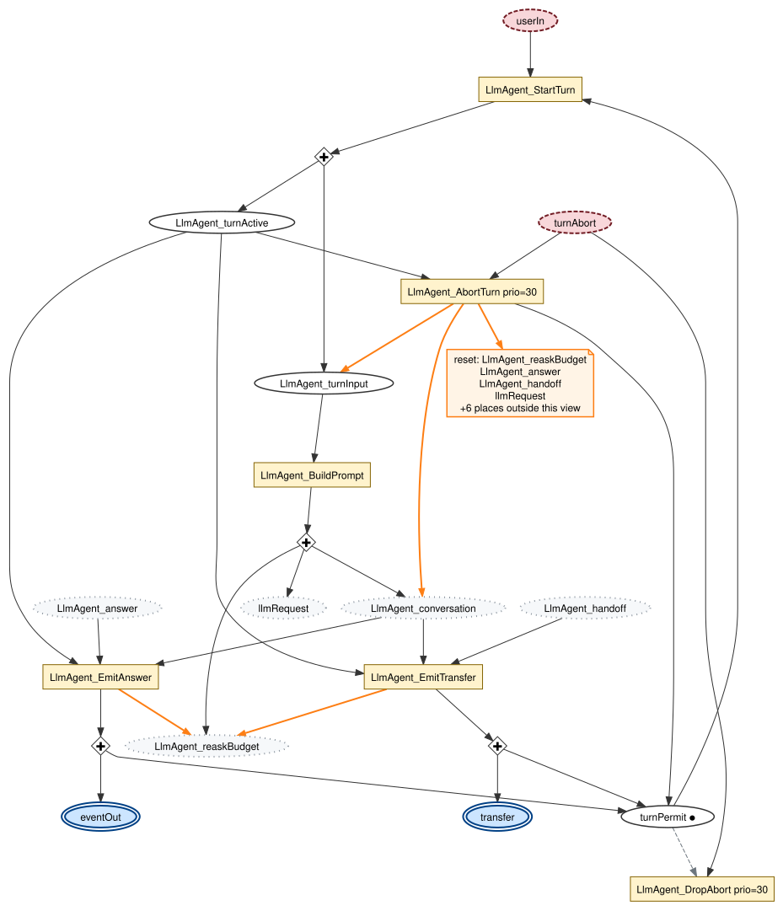</p>

**Proved** in `StockSubnetProofsTest`: one turn in flight, one
conversation and one budget seed, one permit however aborts arrive,
exactly one outcome per input, and recovery from a failure at any step
(`placeBound`, `budgetPlaceBounded`, `quiescentCount`, `deadlockFree`;
tests in [Verification](#verification)).

**Limits.** The permit serialises turns but does not stamp them (N1). A
second input waits in `USER_IN`; it is not coalesced. What an abort does
to the late output of an action still running is not covered; ADR 0005
states that limit.

### G2 Bounded autonomous loops (reask budget)

**Status: Proven, no foil.**

**ADK side.** `BaseLlmFlow` re-asks the model until an event is final.
Its only cap is `RunConfig.maxLlmCalls` (`max_llm_calls`), a counter in
the invocation that raises once exceeded: it fails the invocation instead
of ending the turn with an answer, and nothing structural bounds it.

**Net.** `LlmAgent_BuildPrompt` fills `Place<Void> REASK_BUDGET` with K
tokens in one firing. `LlmAgent_ReAsk` (priority 10) consumes
`TOOL_RESULTS`, one budget token and `CONVERSATION`, and emits the next
`LLM_REQUEST`, so `ReAsk` fires at most K times per turn. K is set per
agent in `Config` (`reaskBudget(int)` / `reask_budget`, default 3) and
bound into the action by `actionBindings`. `LlmAgent_ReAskExhaustedFallback` (priority
-10) consumes `TOOL_RESULTS` under `inhibitor(REASK_BUDGET)` and outputs
to `ANSWER`; with the budget empty it is the only transition left, so
the turn ends through `EmitAnswer` with the configured fallback reply.

<p align="center"></p>

**Proved.** `budgetPlaceBounded(REASK_BUDGET, 1)` in
`llm_agent_runs_one_turn_at_a_time_without_assuming_atomic_firing`. The
proof bounds seeds, not tokens: the budget never holds a second turn's
seed ([How to read the proofs](#how-to-read-the-proofs)).

**Limits.** The budget bounds autonomous runaway, not loops in general
(commitment 6): the LLM-and-tool loop here, and in Python a back edge of
a compiled workflow that the caller budgets explicitly
([ADR 0007](docs/adr/0007-compiled-workflow-back-edge-budgets.md)).

### G3 Typed fallbacks: no dead letters

**Status: Proven + foil.**

**ADK side.** ADK Java's `BaseAgent.findAgent` and `findSubAgent` return
`Optional.empty()` for a made-up name, and `AgentTransfer.transferToAgent`
records the string unvalidated; the failure surfaces downstream, untyped
or as a silent no-op
([`TransferUnknownTargetAdkFoilTest`](java/src/test/java/org/libpetri/adk/demos/TransferUnknownTargetAdkFoilTest.java)).
In ADK Python 2.11 the lookup returns `None`, the scheduler raises a bare
`ValueError`, and the invocation ends with no error `Event`
([`test_transfer_unknown_target_adk_foil.py`](python/tests/demos/test_transfer_unknown_target_adk_foil.py)).

**Net.** `TransferRouter_Demux` routes each `TRANSFER` token through
`Out.xor` over one place per known agent plus `TransferRouter_target/_unknown`;
`TransferRouter_EmitUnknownError` turns `_unknown` into a typed error
`Event` on `EVENT_OUT`. Every token has a consumer; the voice subnets
follow the same rule with their ignore branches (G6).

<p align="center">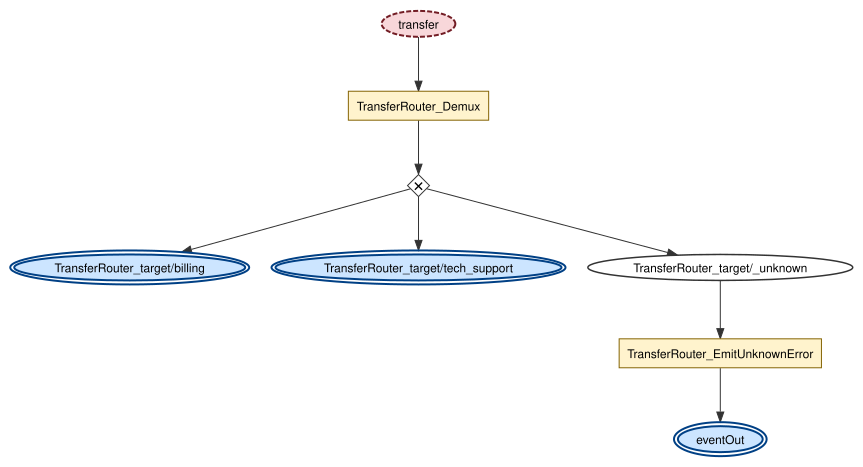</p>

**Proved.** `transfer_router_delivers_every_transfer_to_exactly_one_target_or_unknown`
turns k transfers into exactly k outcomes.
`MultiAgentDemoTest.multi_agent_net_is_smt_proven_deadlock_free` proves
planner plus router deadlock-free with one event per turn
(`eventOutBounded(1)`); the validator `transferDemuxHasUnknownFallback`
runs on the same net, and
`hallucinated_agent_name_surfaces_as_typed_error_event_not_npe` drives
the typed error end to end through `InMemoryRunner`.

**Limits.** The target set is fixed when the net is built.

### G4 At most one commit per turn: race, optimistic commit, quorum

**Status: Proven + foil.** Scope: per turn.

**ADK side.** ADK Java 1.10.1: `ParallelAgent.runAsyncImpl` is
`Flowable.merge(branches).takeUntil(escalate)`, first escalation wins,
with no preference order, no K-of-N and no provable at-most-once commit
([detail](java/README.md#adk-java-1101-behaviour-the-argument-relies-on)).
ADK Python 2.11's `Workflow`: `JoinNode` waits for all predecessors, a
plain successor fires once per branch, losers are not cancelled, and
nothing reads escalate; only the deprecated `ParallelAgent` is
first-wins, on escalate
([`test_pattern_{a,b,c}_adk_only_foil.py`](python/tests/demos/patterns/)).

**Net.** Each pattern commits through one structural gate. Pattern A's
gate is a consumed permit, because an inhibitor reads the pass-start
marking and two commits ready in one pass would both fire. B and C commit
under `inhibitor(QUORUM_MET)` and `inhibitor(COMMITTED)` because no second
commit can be enabled in the same pass: B has one `Quorum_Synthesize`,
which fires at most once per pass, and N=5 < 2K=6 leaves too few results
for a second; C's XOR verdict marks one of `VALIDATION_PASSED` and
`VALIDATION_FAILED`, which enables one commit transition per turn.

- **A, first-wins** (`PatternA_SpeculativeRaceDemoTest`). `Race_Start`
  resets nine per-turn places and mints one `RACE_PERMIT`.
  `Race_RunBranch{A,B,C}` run under `inhibitor(RACE_WON)`, so a branch
  not yet started is held off once the race is won. Each `Race_Commit*`
  (priority 10) consumes the permit and outputs `EVENT_OUT` and
  `RACE_WON`. A branch already in flight runs to completion and
  `Race_Discard*` (priority -10, `read(RACE_WON)`) drains it to
  `RACE_DISCARDED`. Foil: `PatternA_AdkOnlyFoilTest` (first-wins needs a
  custom `BaseAgent` over `merge(...).firstElement()`).
- **B, K-of-N** (`PatternB_QuorumDemoTest`). Five branches feed one
  `RESULT` place. `Quorum_Synthesize` consumes `In.exactly(3, RESULT)` at
  priority 10, so K is in the topology; `Quorum_AbsorbLate` (priority
  -10) sinks late results under `read(QUORUM_MET)`. Foil:
  `PatternB_AdkOnlyFoilTest` (`ParallelAgent` waits for all N).
- **C, preference plus fallback** (`PatternC_OptimisticCommitDemoTest`).
  `Opt_RunCheap` and `Opt_RunSlow` start together; `Opt_Validate`
  XOR-routes to a verdict; `Opt_CommitCheap` or `Opt_CommitSlow`
  (`read(VALIDATION_FAILED)`) commits at priority 10; `Opt_DiscardSlow`
  drains under `read(COMMITTED)`. Foil: `PatternC_AdkOnlyFoilTest` (ADK Java:
  `LoopAgent` repeats one agent, `SequentialAgent` always runs the slow
  path, and a conditional fallback needs a custom `BaseAgent`). In ADK
  Python 2.11, `Workflow` routes give a sequential fallback with no
  pre-warm, and pre-warming double-commits
  (`test_pattern_c_adk_only_foil.py`).

<p align="center"></p>

<p align="center">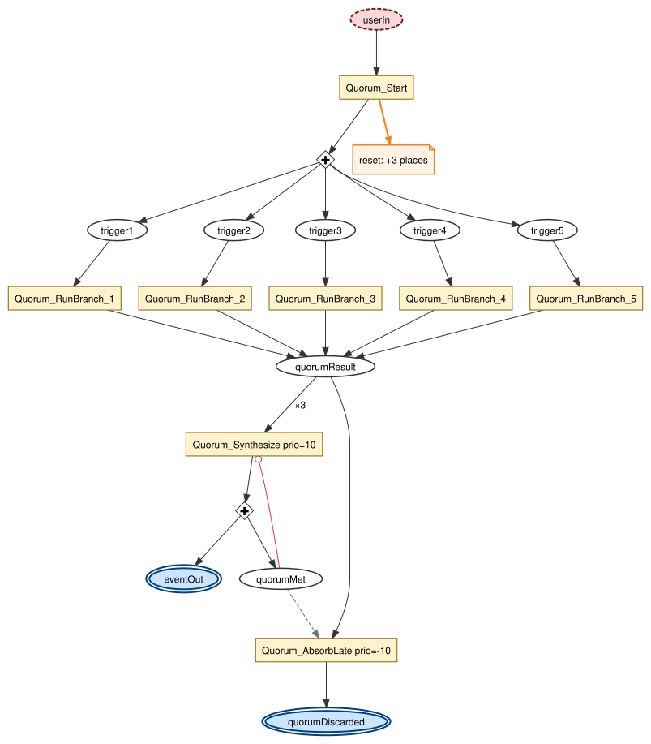</p>

<details>
<summary>Optimistic commit (Pattern C) diagram</summary>

<p align="center">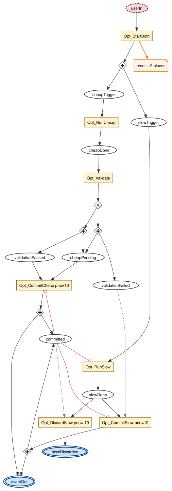</p>

</details>

**Proved**, each property in its own `verify()`: one race commit and one
race event, one optimistic commit with exclusive verdicts, and one quorum
synthesis and one event, per turn; and a race permit that never stacks
across two turns (scope: assumes atomic firing, exact on both executors;
see [How to read the proofs](#how-to-read-the-proofs)). Tests, and the
regression that replays the double commit an `inhibitor(RACE_WON)` gate
caused, are under [Evidence](#evidence).

**Limits.** Per turn, and untimed. A reset arc clears only the marking an
orchestrator pass started with, so a branch still running when the next
turn starts lands in that turn; for B it counts as a quorum vote.
Stamping results with their turn
([N1](#n1-not-yet-guaranteed-staleness-across-turns)) is the fix.

### G5 Escalation ladders: timed recovery as places

**Status: Behavioural** (the demo ladder); **Illustrative** (the
tiered-SLA sketch).

An escalation ladder is a chain of rung places, each drained by a timed
transition that the awaited event disables; the event must also cancel
the rung it lands on, or a later silence escalates from a stale rung.

**Demo instance.** `LiveApiRecoverySubnet` (test scope in both ports,
under `demos/voice/`) recovers a Live-API model that goes silent
mid-turn, and cancels on activity (transition names drop the
`LiveApiRecovery_` prefix here):

- `Nudge` consumes `RESPONSE_AWAITED` after `nudgeAfter`, under
  `inhibitor(MODEL_ACTIVE)`, and outputs `NUDGE_NEEDED` (the host re-sends
  `turnComplete=true`) and `RECOVERY_PENDING`. `Recover` consumes that
  `reconnectAfter` later, under the same inhibitor, and outputs
  `RECONNECT_NEEDED` (the host reconnects).
- `Answered` and `AnsweredLate` (priority 10) consume `RESPONSE_AWAITED`
  or `RECOVERY_PENDING` under `read(MODEL_ACTIVE)`: once the model
  answers, no rung survives.
- `ModelQuiet` consumes a `MODEL_QUIET` with every `MODEL_ACTIVE` token
  (`In.all`, at least one); `IgnoreQuiet` sinks a `MODEL_QUIET` that finds
  no activity into `QUIET_IGNORED`, which a reset keeps at one token.

The host injects `RESPONSE_AWAITED` after it sends `turnComplete`,
`MODEL_ACTIVE` when the model produces output and `MODEL_QUIET` when it
stops, all as env places (commitment 1); the ladder restarts on the next
`RESPONSE_AWAITED`.

<p align="center">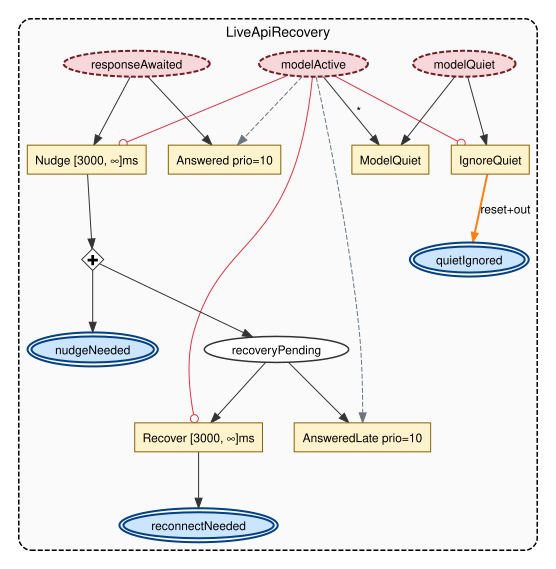</p>

*`Config.defaults()`: 3 s per rung; most tests use 80 ms, one uses the defaults.*

**Tested.** Seven `ManualClock` tests in
[`LiveApiRecoverySubnetTest`](java/src/test/java/org/libpetri/adk/demos/voice/LiveApiRecoverySubnetTest.java)
pin each rung to the millisecond, including cancel-on-answer and stale
`RESPONSE_AWAITED` ([list](java/README.md#silence-ladder-timing-tests)).
Python runs the same seven on libpetri's `SteppedClock`, with the same
millisecond boundaries.

**Proved.** `composed_voice_demo_net_is_smt_proven_deadlock_free`
includes the ladder, its three inputs as `bounded(1)` env places. For the
composed BIDI net with `MODEL_QUIET` as a `bounded(1)` env place, Java's
state-class graph completes; Python, which has no state-class-graph
binding, proves a one-token SMT bound on every place under atomic firing,
exact because every action with an output is synchronous.

**Limits.** The verifier is untimed, so no timing is proved.
`NUDGE_NEEDED` and `RECONNECT_NEEDED` are output ports; the host composes
the transitions that act on them.

**Tiered SLA (sketch).** The same shape gives the primary answer if it
lands in time, else a fallback after 2 s, else a cached default after a
further 3 s. One rung token exists per turn and every answer consumes it,
so an answer cancels escalation and at most one answer leaves.

<p align="center">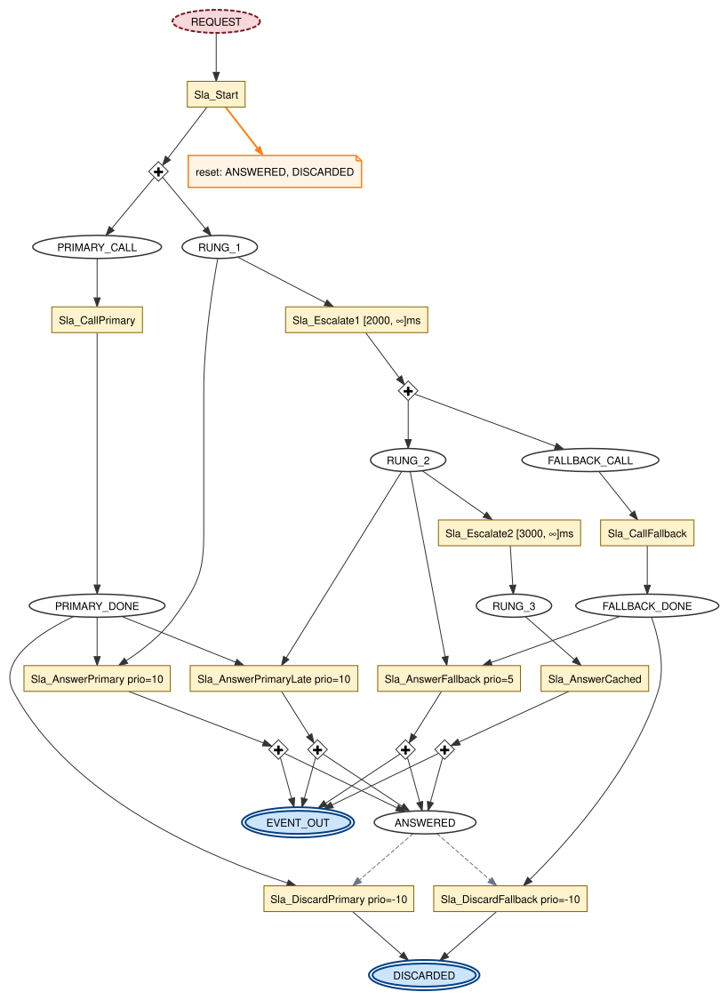</p>

### G6 Full duplex: VAD, barge-in, chunk drop, ordering *(experimental)*

**Status: Proven, no foil** (deadlock freedom of streaming + barge-in +
recovery, with the VAD window as an env place); the VAD-edge recovery is
**Behavioural + foil**; the other motifs are **Behavioural**.

**ADK side.** ADK Java 1.10.1's `GeminiLlmConnection` maps a VAD-only
frame to an "Unknown server message" error, because the edge rides
`LiveServerMessage.voiceActivity()`, not `serverContent()`
([`VoiceVadEdgeAdkFoilTest`](java/src/test/java/org/libpetri/adk/demos/VoiceVadEdgeAdkFoilTest.java)).
ADK Python 2.11 keeps the edges on `Event.voice_activity`, so stock live
receive is enough
([`test_voice_vad_edge_adk_foil.py`](python/tests/demos/test_voice_vad_edge_adk_foil.py)).
How each port gets the edges: [BIDI and voice](#bidi-and-voice).

**Net.** Each failure mode is a small fixed motif:

- **(a) Vad window.** `Vad_OpenWindow` (`inhibitor(VOICE_ACTIVITY_OPEN)`)
  opens it, `Vad_CloseWindow` consumes it, and `Vad_IgnoreRedundantStart`
  (read) and `Vad_IgnoreRedundantStop` (inhibitor) absorb repeated edges.
- **(b) Barge-in pair** on one `INTERRUPTED` token: `BargeIn_SendBargeIn`
  under `read(VOICE_ACTIVITY_OPEN)`, `BargeIn_DiscardInterrupt` under
  `inhibitor(VOICE_ACTIVITY_OPEN)`
  (`VadSubnetTest.window_opened_by_vad_routes_a_subsequent_interrupt_to_barge_in`).
- **(c) Chunk drop.** `Bidi_EmitChunk` runs under `inhibitor(BARGE_IN_SENT)`
  and `Bidi_DropQueuedTurn` resets `LLM_RESPONSE`, so a barge-in drops the
  queued chunks (`barge_in_structurally_drops_the_queued_model_chunks`).
- **(d) Ordering.** `Bidi_EmitTurnEnd` runs under `inhibitor(LLM_RESPONSE)`,
  so the terminal event waits for queued chunks.
- **(e) New-utterance reset.** `VoiceDemo_OnNewUtterance` resets
  `CURRENT_INTENT` only
  (`new_utterance_resets_in_net_intent_state_through_adk_egress`).

<p align="center">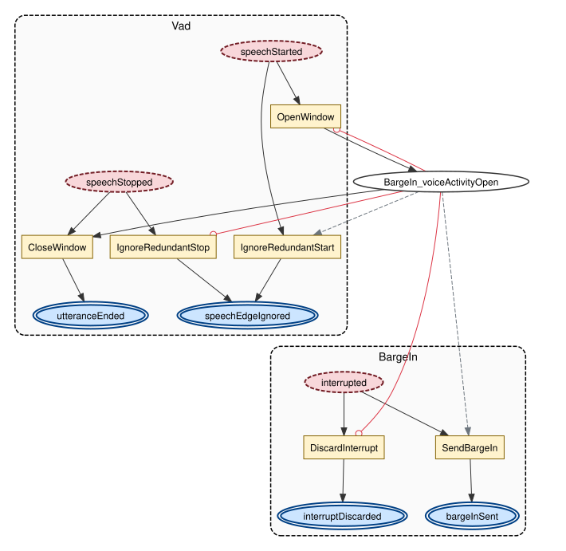</p>

<p align="center">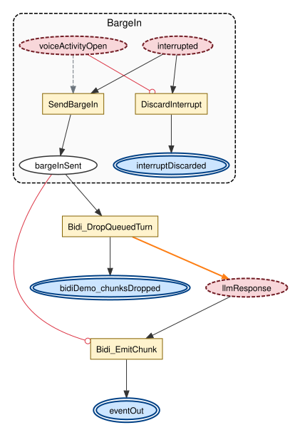</p>

**Proved.** `VoiceSessionDemoTest.composed_voice_demo_net_is_smt_proven_deadlock_free`
proves `LlmStreamingStep` + `BargeIn` + `LiveApiRecovery` deadlock-free,
with its seven inputs (`VOICE_ACTIVITY_OPEN` among them) as `bounded(1)`
env places.

**Limits.** The proved net has no `Vad` subnet and no `Bidi_*`
transitions, and no safety property is proved on it.

*N1 and N2 are tracked in [ADR 0001](docs/adr/0001-pre-port-design-gate.md)
(as "README Case 2" and "README Case 1"), to be backed with a demo, a foil
and an SMT property.*

### N1 Not yet guaranteed: staleness across turns

**Status: Illustrative.**

**ADK side.** ADK Java 1.10.1: `InvocationContext.endInvocation` is a
plain non-volatile field, copied per agent run and per `ParallelAgent`
branch, so `setEndInvocation(true)` in one branch is invisible to
siblings and parent. Only `BaseAgent.run`, `BaseLlmFlow.runOneStep` and
`runLive` read it; the tool path never does
([detail](java/README.md#adk-java-1101-behaviour-the-argument-relies-on)).

**Net.** Each result token carries its generation (`Result{gen}`).
`LATEST_GENERATION` is seeded, because a read arc on an empty place would
disable every commit. `BumpGeneration` consumes `USER_NEW_TURN` and the
current generation and emits the next. Each commit site reads
`LATEST_GENERATION` and XOR-routes to its committed place or to
`DISCARDED`, which `DrainDiscarded` empties. A commit that started before
the bump still lands: that firing is the linearization point. A
freshness-read validator could reject a commit site that omits the read;
none ships yet. N1 is what would lift G4 from per turn to across turns.

<p align="center">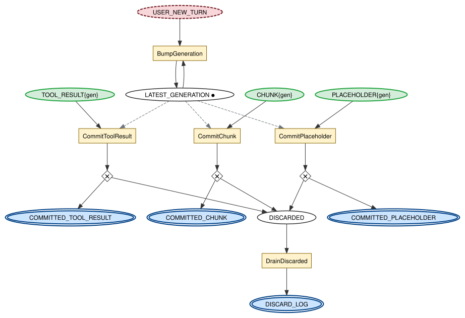</p>

### N2 Not yet guaranteed: variable-N fan-out

**Status: Illustrative.**

**ADK side.** ADK's idiom is `SequentialAgent(ParallelAgent(sub-agents
with outputKey), synthesizer)`: the branch count is fixed at build time,
and partial state is visible only through `session.state`. ADK Java:
RxJava's `Flowable.zip(Iterable, fn)` takes a variable count, but fixes
it at subscription.

**Net.** `Spawn` consumes the request and the seeded `BATCH_PERMIT`, and
its action emits N `JOB` and N `JOB_PENDING` tokens, so N is chosen per
request. `Collect` merges each `RESULT` into the `COLLECTOR` token and
consumes one `JOB_PENDING`; `OrthogonalRead` snapshots `COLLECTOR`
through a read arc; `Finish` (priority -10) fires under
`inhibitor(JOB_PENDING)` and returns the permit. A straggler from an
earlier batch needs N1's stamp.

<p align="center">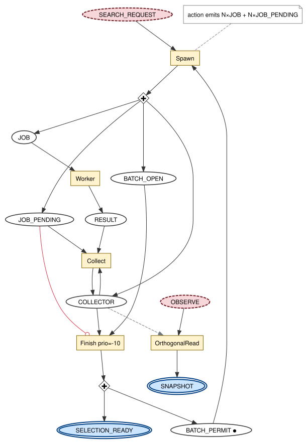</p>

## How it works

Each subnet declares typed ports such as `Place<LlmRequest>` and
`Place<ToolCalls>`. `PetriNet.Builder.compose(...)` (Java) binds subnet
ports by `(name, tokenType)` and rejects a type mismatch at build time
(MOD-022/MOD-025); Python's `NetSpec.compose` fuses places by name and
type, raises `TypeError` on a clash, and takes no port mappings. Wiring
an `LlmResponse` port into a `Content` port therefore fails when the net
is built, not at runtime. Because places carry domain colours rather
than an opaque `InvocationToken`, a DOT export of the net reads as the
agent process itself.

### Runtime model

- **One net per session**, built at session start and kept alive for
  the session's lifetime. A new user message is
  `inject(USER_IN, content)` into the already-running net.
- **One way in, one way out.** Input is `inject(envPlace, token)` (or
  `signal(place)` for a `Place<Void>`) from any thread, on any number of
  typed env places. Output is the `EVENT_OUT` bridge plus the
  `EventStore` decorator chain. There is deliberately no generic
  `observe(Place<T>)`, so egress stays narrow and auditable.
- **Any external signal is a typed env place** (commitment 1): declare
  it on the runner and `inject` into it from any thread.
  `ScrollAwareDemoTest` injects `Scroll` records onto `SCROLL_IN` from a
  separate thread, and the next turn reads the in-net count.

<p align="center">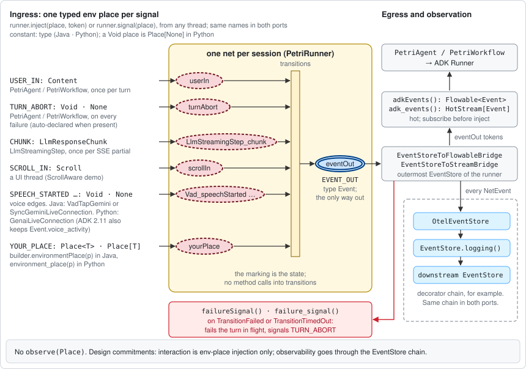</p>

`EventStoreToFlowableBridge` (Java) / `EventStoreToStreamBridge`
(Python) feeds `adkEvents()` / `adk_events()` from `EVENT_OUT`, and
`failureSignal()` / `failure_signal()` from `TransitionFailed` and
`TransitionTimedOut`. Subscribe to the event stream before you inject.

**Executors, per port.**

- **Java.** `PetriRunner.Builder` requires an explicit
  `orchestratorExecutor`; the library has no shared executor singleton.
  libpetri invokes actions inline on that pool, so make it
  virtual-threaded if actions block. An action that needs real fan-out
  takes its own pool, the way `ToolDispatchSubnet` takes a
  `dispatchExecutor`.
- **Python.** Actions run on libpetri's Tokio threads, which have no
  asyncio loop; await ADK coroutines through `on_loop(coro)`. One
  caller-owned `OrchestratorLoop` per process is passed with
  `.orchestrator(loop)`, and `start()` fails without it. libpetri-py may
  re-enter an async transition while an earlier firing is in flight, so
  ordering-sensitive actions are synchronous
  ([ADR 0006](docs/adr/0006-python-port-and-adk-python-compat.md)).

**OpenTelemetry through the `EventStore` chain.** `OtelEventStore` turns
transition firings into spans and delegates every event to the next
store, so it stacks with `EventStore.logging()` or your own recorder.
`MultiAgentDemoTest` wires it under stock `InMemoryRunner` and asserts
the spans. Nothing reads net state through a side channel (commitment
5). Python ships `OtelEventStore` too, with the same span tests.

### Boundary colour catalog (`AdkColours` / `adk_libpetri.colours`)

A fixed set of typed places that all stock subnets share. Composition
fuses them by name and token type, so you write port mappings only when
you want to (Java; Python's `NetSpec.compose` fuses by name and type
only). Same names in Python; `Place<Void>` is `Place[None]`.

| Colour | Type | Use |
|---|---|---|
| `USER_IN`              | `Place<Content>`             | user message inbound (env place) |
| `EVENT_OUT`            | `Place<Event>`               | agent event outbound |
| `LLM_REQUEST`          | `Place<LlmRequest>`          | prepared LLM request |
| `LLM_RESPONSE`         | `Place<LlmResponse>`         | LLM response (merged for streaming) |
| `TOOL_CALLS`           | `Place<ToolCalls>`           | list of FunctionCalls to dispatch |
| `TOOL_RESULTS`         | `Place<ToolResults>`         | list of FunctionResponses |
| `LEGACY_SESSION_WRITE` | `Place<LegacySessionWrite>`  | write-only bridge to ADK Session.state |
| `TRANSFER`             | `Place<TransferTarget>`      | agent-transfer routing token |
| `END_INVOCATION`       | `Place<Void>`                | termination signal (inhibitor source) |
| `TURN_PERMIT`          | `Place<Void>`                | one-turn-at-a-time permit, seeded by `PetriRunner` |
| `TURN_ABORT`           | `Place<Void>`                | clears a turn a failure stranded (env place, signalled by `PetriAgent`) |

Add your own colours for in-net state, such as
`Place<ConversationHistory>` or `Place<CurrentProduct>`: one typed place
per domain concept, never a single `Place<Map<String, Object>>` bag.

### Stock subnet catalog

Java: each is a `SubnetDef` (`TransferRouterSubnet.def(names)` is a
factory) that you compose with `PetriNet.builder().compose(...)` and
port inference. Python: each is a module (`adk_libpetri.subnet.llm_agent`,
…) exposing `DEF: NetSpec` (`transfer_router.def_(names)`) and
`action_bindings(...)`; compose with `NetSpec.compose`, bind with
`NetSpec.build` (rejects missing, unknown or doubly bound actions).
They are convenience templates, not the framework. The framework is the
composition primitives together with `SubnetDef.fromNet(...)`.

| Subnet | Input ports | Output ports | What it does |
|---|---|---|---|
| `LlmStepSubnet`         | `LLM_REQUEST` | `LLM_RESPONSE`                 | Calls `BaseLlm.generateContent`. `BeforeModel` can short-circuit via `Out.xor(continue, LLM_RESPONSE)`; `LlmCall` splits success from error with `Out.xor`; `AfterModel` / `OnModelError` callbacks feed `LLM_RESPONSE` |
| `ToolDispatchSubnet`    | `TOOL_CALLS`  | `TOOL_RESULTS`                 | One transition. Each call runs as its own task on the caller-supplied `dispatchExecutor` (required, no default; Python gathers coroutines on the loop), and the action joins the results itself (`allOf` / `asyncio.gather`), not with a net AND-join. Per-call errors are captured in the response payload |
| `PromptBuilderSubnet`   | `USER_IN`     | `LLM_REQUEST`                  | Builds `LlmRequest` (model, system instruction, tools) |
| `RouterSubnet`          | `LLM_RESPONSE`| `Out.xor(TOOL_CALLS, TRANSFER, EVENT_OUT)` | Routes by response shape. `transfer_to_agent` takes precedence |
| `LlmAgentSubnet`        | `USER_IN`, `TURN_ABORT` | `EVENT_OUT`, `TRANSFER` | The canonical composition ([below](#the-canonical-composition-llmagentsubnet)) |
| `PersistStateSubnet`    | `LEGACY_SESSION_WRITE` | terminal | One transition draining `LegacySessionWrite` tokens to `BaseSessionService.appendEvent`, bounded by `persistTimeout` (default 5 s). The only writer transition in the net; in Python, where libpetri-py may re-enter a transition, the action also holds a lock so appends run one at a time |
| `TransferRouterSubnet`  | `TRANSFER`    | `target/<name>*`, `target/_unknown`, `EVENT_OUT` | `Out.xor` over compile-time-known target places. A hallucinated name routes to a typed error Event ([G3](#g3-typed-fallbacks-no-dead-letters)) |
| `LlmStreamingStepSubnet` *(experimental)* | `LLM_REQUEST` | `LLM_RESPONSE`, `EVENT_OUT` | SSE counterpart of `LlmStep`: each model chunk becomes a partial `Event` through a `CHUNK` env place, in arrival order; the merged response continues to `LLM_RESPONSE` |
| `StreamingLlmAgentSubnet` *(experimental)* | `USER_IN`, `TURN_ABORT` | `EVENT_OUT`, `TRANSFER` | `LlmAgentSubnet` over `LlmStreamingStep`, turn permit included. Wire it with `runnerFactory(...)` / `runner_factory(...)`, which gives each session its own executor handle |

**Compose your own.** When ADK's typed surface does not model a provider
feature yet, declare a place typed to that feature and a transition
whose action calls the provider directly. `RawProviderPassthroughDemoTest`
does it with no stock subnet and no shared bag colour.

Voice-specific subnets (`BargeIn`, `LiveApiRecovery`, `Vad`) are not part
of the shipped library. They live under
`java/src/test/java/org/libpetri/adk/demos/voice/` and
`python/tests/demos/voice/` as composable exemplars of
[G5](#g5-escalation-ladders-timed-recovery-as-places) and
[G6](#g6-full-duplex-vad-barge-in-chunk-drop-ordering-experimental).
`Vad` turns speech-activity edges into the `VOICE_ACTIVITY_OPEN` window
that `BargeIn` reads.

### The canonical composition: `LlmAgentSubnet`

`LlmAgentSubnet` composes its own turn transitions with `LlmStep`,
`Router`'s route and `ToolDispatch`, one turn at a time:

1. **`StartTurn`** takes the session's single `TURN_PERMIT` with the
   `USER_IN`; input that arrives mid-turn waits
   ([G1](#g1-one-turn-at-a-time-and-no-stranded-turn)).
2. **`BuildPrompt`** seeds K `REASK_BUDGET` tokens and the user turn on
   the in-net `CONVERSATION` place
   ([G2](#g2-bounded-autonomous-loops-reask-budget)).
3. **`ReAsk`** spends one budget token per tool round and replays the
   whole conversation; `ReAskExhaustedFallback` answers once the budget
   is empty ([G2](#g2-bounded-autonomous-loops-reask-budget)).
4. **`EmitAnswer` / `EmitTransfer`** emit the answer or the transfer,
   clear the turn and return the permit.
5. **`AbortTurn`** clears a turn a failed transition stranded after
   `PetriAgent` signals `TURN_ABORT`; **`DropAbort`** consumes a stray
   abort when no turn is in flight
   ([G1](#g1-one-turn-at-a-time-and-no-stranded-turn)).

`PetriRunner` seeds the permit and declares `TURN_ABORT`, so wiring is
unchanged. [ADR 0005](docs/adr/0005-llm-agent-turn-permit.md) explains
why the permit is a seeded token rather than an inhibitor. Persisting to
ADK's `Session.state` is a separate `PersistStateSubnet` you compose
alongside.

<p align="center">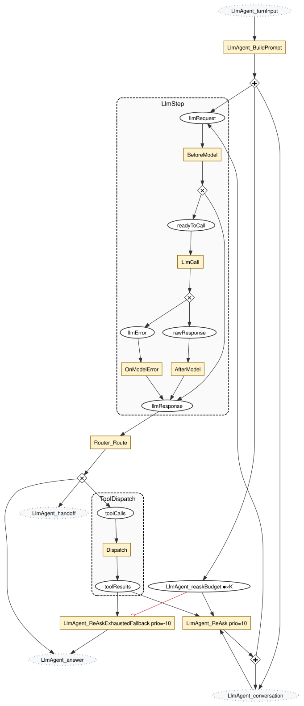</p>

## ADK integration

The net plugs into ADK through one adapter per port. Nothing in ADK is
patched or forked ([design commitment 4](#design-commitments)).

### `PetriAgent`: stock `Runner`, no source change

`PetriAgent extends BaseAgent` is the turn-based seam. Per invocation it gets
or creates the session's `PetriRunner`, subscribes to the runner's egress and
failure signal, injects the user's message onto `USER_IN` and returns the
event stream at once; events arrive through it later. The turn is its first
non-partial event, or under `StreamingMode.SSE` every partial through the
first non-partial one. The abridged `runAsyncImpl`/`runLiveImpl` code is in
[java/README.md](java/README.md#how-petriagent-drives-a-turn).

<p align="center">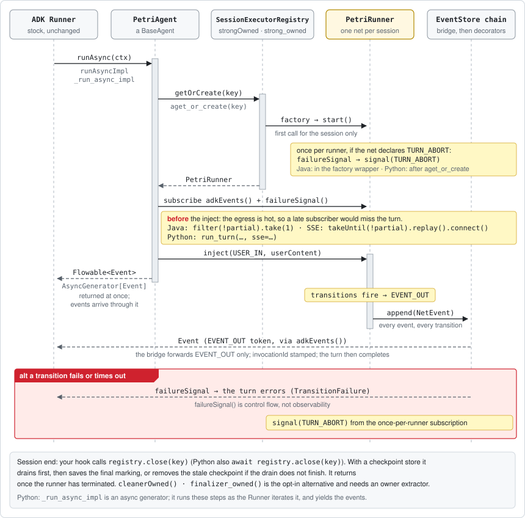</p>

`runAsyncImpl` replaces ADK orchestration: the net decides the whole
request/response. `runLiveImpl` is, by default, only the egress half; an agent
built with `PetriAgent.builder(...).live(liveConfig)` runs full Live/BIDI
([BIDI and voice](#bidi-and-voice)). When a transition fails or times out
mid-turn, `PetriAgent` fails the turn rather than waiting forever. For a net
that has `TURN_ABORT` (any net with an `LlmAgentSubnet` or
`StreamingLlmAgentSubnet`) it also signals `TURN_ABORT`, through one
subscription per runner made when the runner is created, so the net lets go
of the turn and serves the next. Stock `InMemoryRunner(agent)` consumes a
`PetriAgent` like any other `BaseAgent`.

**Python.** `PetriAgent` is the same adapter: a pydantic `BaseAgent` with an
async run path, built with `PetriAgent.builder(...)`, whose runner factory may
return an awaitable. It serves as a `Runner` root, or as a node inside an ADK
2 `Workflow`, where `input_mapper`, `output_mapper` and `route_mapper` map the
node input, output and outgoing route. Like the rest of the Python port it is
0.x and experimental. A compiled workflow is served instead as
`PetriWorkflow`, a `BaseNode`, because ADK 2.11 runs a `BaseAgent` root on its
legacy agent path, which has no node `Context` to run child nodes with
([ADR 0006](docs/adr/0006-python-port-and-adk-python-compat.md),
[From Workflow to net](#from-workflow-to-net-from_workflow-python-experimental)).

### Java and Python names

Place and transition names are identical in both ports. API names differ:

| Java | Python |
|---|---|
| `PetriAgent.builder(...)` / `PetriAgent.of(...)` | same |
| `runAsyncImpl` | `_run_async_impl` (delegates to `run_turn`) |
| `SessionExecutorRegistry.strongOwned()` / `cleanerOwned()` | `strong_owned()` / `finalizer_owned()` |
| `Builder.ownerExtractor(...)` | `owner_extractor(...)` |
| `getOrCreate` | `get_or_create` (sync factory) / `aget_or_create` |
| `close` / `closeAll` | `close` / `close_all`, `aclose` / `aclose_all` |
| `SessionKey.from(session)` | `SessionKey.of(session)` |
| `PetriRunner.builder(net)…orchestratorExecutor(ex).start()` | `PetriRunner.builder(spec, actions)…orchestrator(loop).astart()` |
| `environmentPlace` | `environment_place` |
| `adkEvents(): Flowable<Event>` | `adk_events(): HotStream[Event]` |
| `failureSignal()` | `failure_signal()` |
| `resumeFrom` / `excludeFromCheckpoint` | `resume_from` / `exclude_from_checkpoint` |
| `SubnetActions.bindComposed` | `bind_composed` / `NetSpec.build` |
| `PetriNet.builder().compose` + `SubnetDef.fromNet` | `NetSpec.compose` |
| `AdkColours` | `adk_libpetri.colours` |
| `EventStoreToFlowableBridge` | `EventStoreToStreamBridge` |
| `LiveConnection` (`BaseLlmConnection` + `rawReceive`) | `LiveConnection` Protocol (`raw_receive`) |
| `BidiPetriAgent.bridge` → `Flowable<Event>` | `bidi_petri_agent.bridge` → `AsyncGenerator[Event]` |
| `ManualClock` (test support) | `lp.SteppedClock` |
| `@Experimental` | `@experimental` |
| `SyncGeminiLlm` / `SyncGeminiLiveConnection` (exemplars) | `DirectGenaiLlm` / `GenaiLiveConnection` (exemplars) |

### Session lifetime: `SessionExecutorRegistry`

The registry lazily creates one `PetriRunner` per
`(appName, userId, sessionId)`, so consecutive `runAsync` calls reuse the same
long-lived executor. It has two modes:

- **`strongOwned()`** (`strong_owned()`), the default. A runner lives until an
  explicit `close(SessionKey)` from your session-end hook (or `closeAll()` at
  shutdown). A forgotten close is a *visible* leak: `size()` grows.
- **`cleanerOwned()`** (`finalizer_owned()`), opt-in, for callers that hold a
  stable strong owner whose GC tracks session end. A `Cleaner` (Python:
  `weakref.finalize`) tears the runner down when the owner is collected. The
  agent names that owner through `.ownerExtractor(...)`, and `build()` rejects
  a cleaner-owned registry without one. An owner held too weakly is collected
  mid-session and the runner is torn down *silently*, turning every later
  `inject(...)` into a no-op. `ctx.session()` with `InMemorySessionService`
  is such an owner, because it returns defensive copies.

Neither mode can register a runner without a teardown route. The wiring
snippet is in [java/README.md](java/README.md#how-petriagent-drives-a-turn).

### Checkpoints *(experimental)*

A registry built with a `SessionCheckpointStore` (`strongOwned(store)` or
`cleanerOwned(store)`) checkpoints each session when it is torn down:

- **Drain, then save.** Teardown refuses new injects, lets actions in flight
  finish, then saves the final marking without `EVENT_OUT` (delivered events
  are egress, not state).
- **Resume.** A runner factory that calls `.resumeFrom(store, key)` starts
  from that checkpoint, or from its initial marking when there is none. Until
  the save lands, a `getOrCreate` for the key waits, so the replacement
  resumes from what its predecessor left.
- **No stale checkpoints.** A run that does not drain within the checkpoint
  timeout loses its checkpoint. `registry.discard(key)` ends a session
  without saving it.

The store is written at session end and read before a runner starts, never
during execution, so the marking stays the state. The test-scope
`AgentStateCheckpointStore` exemplar (both ports) keeps the checkpoint in
ADK's session history as an event's `EventActions.agentState`, so it persists
wherever your `BaseSessionService` does; a `Codec` decides what each token
value becomes. `load` reads the newest marking event, so `remove` appends
a tombstone that hides earlier markings (`AgentStateCheckpointStoreTest`,
both ports).

### Calling the model

Java: ADK's `Gemini.generateContent` hops to `ForkJoinPool.commonPool()`; call
genai synchronously on a virtual thread with the `SyncGeminiLlm` exemplar
([java/README.md](java/README.md#calling-gemini-without-commonpool)). Python:
ADK's `Gemini` awaits `client.aio` on the running loop, so there is no hop;
the `direct_genai_llm.py` exemplar is optional.

### BIDI and voice

*Experimental.* The BIDI plumbing splits into a shipped half and a consumer
half.

**The shipped half** is `bridge(liveRequestQueue, connection, runner,
onServerMessage)`. It forwards inbound `LiveRequest` frames to the connection
and hands each raw server message from the `LiveConnection` to your
`onServerMessage` callback, which decodes and injects. Voice signals reach the
net through `runner.signal(place)`, the unit-token injection for every
`Place<Void>` edge (speech start/stop, barge-in, `END_INVOCATION`). When the
egress ends, both ports stop the pumps and close the connection; a
raw-receive error fails the stream.

<p align="center">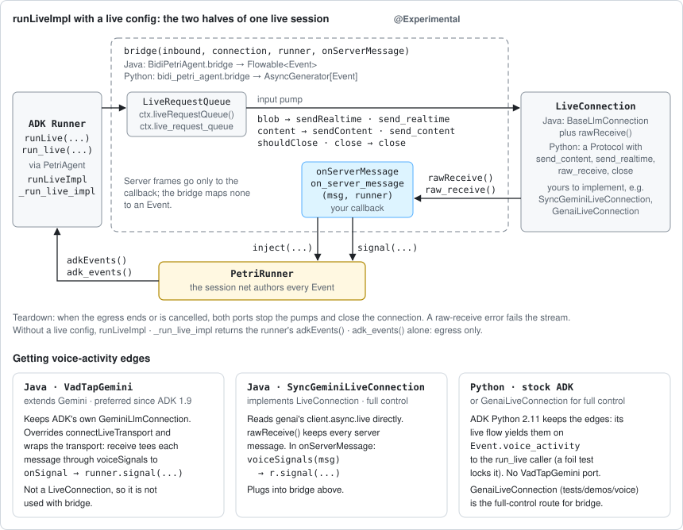</p>

The bridge authors **no** events; it returns only the net's egress. Model
content enters like every other signal, `runner.inject(modelChunkPlace,
content)`, and a net transition authors each outbound `Event`, setting
`partial` and `turnComplete` from the marking. Turn shape is a marking-level
decision, which is what lets barge-in drop queued chunks structurally.

So is egress *ordering*. A burst of frames enters the marking in one pass, and
each enabled transition then fires at most once per pass, so a terminal
transition enabled alongside still-queued chunks would emit between them. The
fix is an arc, not a callback convention. From
`VoiceSessionDemoTest.bidi_voice_via_baselllmconnection_bridges_frames_through_net`:

```java
var emitTurnEnd = Transition.builder("Bidi_EmitTurnEnd")
        .inputs(Arc.In.one(BIDI_TURN_COMPLETE))
        // Orders egress structurally: the terminal cannot fire while response
        // chunks are still queued, so no application-side await is needed.
        .inhibitor(AdkColours.LLM_RESPONSE)
        .outputs(Arc.Out.place(AdkColours.EVENT_OUT))
        .build();
```

With that arc the decode callback stays fire-and-forget and never blocks the
transport's reader thread.

**The consumer half** stays caller-side, because signal names, tool routing
and reconnect policy vary per transport. ADK Java 1.10.1's
`GeminiLlmConnection` turns a VAD-only frame into an "Unknown server message"
error, so the speech-activity edges never reach a `receive()` consumer
(`VoiceVadEdgeAdkFoilTest`). Two exemplars recover them without a fork
([java/README.md](java/README.md#live-bidi)):

- **`VadTapGemini`** (Java, preferred) keeps ADK's `GeminiLlmConnection` and
  wraps the live transport under it through ADK 1.9's `connectLiveTransport`
  seam. It is not a `LiveConnection`; its callback signals env places directly.
- **`SyncGeminiLiveConnection`** (Java, full control) is a copy-and-adapt
  `LiveConnection` that reads genai's Live session directly and plugs into
  `bridge`. It is tied to the genai SDK version, so it is yours to own.

Python: ADK Python 2.11 keeps the edges (`Event.voice_activity`;
`test_voice_vad_edge_adk_foil` locks it in). `GenaiLiveConnection` in
`python/tests/demos/voice/` is the optional full-control route.

**Do not shadow-fork ADK to get a live connection.** Never put copies of
`com.google.adk.models.Gemini` / `GeminiLlmConnection` on the classpath at
ADK's own fully-qualified names to fix the `commonPool` hops or surface the
VAD edges. That is a fork by classpath shadowing and breaks
[design commitment 4](#design-commitments). Use `VadTapGemini`, or implement
`LiveConnection` and call `bridge(...)`, instead.

## Design commitments

The rest of the design rests on these, in both ports. Each exists to make a
class of bug impossible to express, not merely discouraged.

1. **Interaction is env-place injection only.** Every external signal (a
   user message, [a scroll event](java/src/test/java/org/libpetri/adk/demos/ScrollAwareDemoTest.java), a sensor reading, a webhook, an audio
   frame) enters a running net through `inject(envPlace, token)` on its
   own typed place. There are no method calls into transitions and no
   side channels.
2. **The marking is the state.** State lives in tokens. External stores
   (ADK `Session.state`, a database, a cache) are write-only legacy
   bridges, never read from inside the net during execution. Read arcs
   snapshot typed in-net places instead.
3. **Typed colours per domain concept.** A place carries a typed colour
   (`Place<LlmRequest>`, `Place<Content>`), never a single
   `Place<Map<String,Object>>` bag. The one bag-shaped colour,
   `LegacySessionWrite`, is named loudly and used only for the Session
   export bridge.
4. **Zero forks.** ADK is integrated through the `PetriAgent extends
   BaseAgent` adapter (and, in Python, `PetriWorkflow`, a `BaseNode`),
   never by forking it. Where a defect lives in ADK's wrapper over genai
   (the `commonPool` hops, [the dropped VAD signals](java/src/test/java/org/libpetri/adk/demos/VoiceVadEdgeAdkFoilTest.java);
   both defects are ADK Java's, and ADK Python 2.11 has neither), thin
   user code wraps or bypasses the wrapper; nobody patches a fork of genai
   or ADK. The exemplars per port are in [Calling the model](#calling-the-model)
   and [BIDI and voice](#bidi-and-voice).
5. **Observability is an `EventStore` decorator chain.**
   `OtelEventStore`, `EventStore.logging()` and any structured-logging or
   debug-recording store wrap each other via the delegate pattern. Side
   effects live in transition actions; there is no second observability
   channel and no `observe(Place<T>)`. `PetriRunner.failureSignal()` is
   control flow, not observation: it carries `TransitionFailure`s (the
   failing transition's name, whether the action threw or blew its
   deadline, and its instance prefix when composed) so a caller can end
   an in-flight unit of work. It never carries net state, and every
   failure it reports is already on the `EventStore` chain. In Python any
   object with `append(event)` is a store in that chain.
6. **Autonomous loops are bounded structurally.** [The reask-budget
   pattern](#g2-bounded-autonomous-loops-reask-budget) (`Place<Void>` plus priority plus inhibitor fallback) bounds
   the LLM-and-tool loop in the topology, not with a counter in
   application state. It bounds autonomous runaway, not loops in general:
   besides that loop it bounds, in Python, a back edge of a compiled
   workflow that the caller budgets explicitly via `back_edge_budget`,
   and only that ([ADR 0007](docs/adr/0007-compiled-workflow-back-edge-budgets.md)).
7. **Stock subnets are templates, not the framework.** The framework is
   the composition primitives (`PetriNet.builder().compose()` +
   `SubnetDef.fromNet(...)` in Java; `NetSpec.compose` in Python). The nine
   stock subnets are convenient starting points; you are expected to
   compose your own.
8. **Per-session executor lifetime is caller-owned.** A session runner
   lives in `strongOwned()` until the caller invokes `close(SessionKey)` or
   `closeAll()`, or in `cleanerOwned()` / `finalizer_owned()` until a
   stable caller-owned lifetime object, which the `PetriAgent` builder's
   required `ownerExtractor` returns, is collected (not `ctx.session()`;
   see [Session lifetime](#session-lifetime-sessionexecutorregistry)).
   The library holds no
   shared executor singleton; runner shutdown drains the net and completes
   the hot ADK event stream.

## Verification

Every CI build runs the following in both ports: `./mvnw verify` in the
Java job and `REQUIRE_Z3=1 pytest` in the Python job (Python 3.11 and
3.13). Each SMT row below is a test that asserts the proof result, so a
claim that stops holding fails the build instead of turning into
`Unknown`. Each job's z3 gate (`Z3NativeGateTest`, `tests/test_z3_gate.py`)
fails the build when `REQUIRE_Z3=1` is set and no `z3` binary is found. A
local build without z3 skips the SMT tests (`@EnabledIf("z3Available")`
in Java, `requires_z3` in Python).

Both ports also golden-check the stock subnets against `spec/fixtures/nets`
([Development](#development)). The
cross-port property list is [spec/06-verification.md](spec/06-verification.md),
and [spec/coverage-matrix.md](spec/coverage-matrix.md) maps each
requirement to its tests in both ports. A Python test is the Java test's
name with a `test_` prefix; the tables below name a Python test only where
it differs.

### How to read the proofs

- **One property per `verify()`.** Each row's properties are proved one
  call at a time, through the test helpers (`SmtProofs` in Java and
  `assert_each_proven` in Python, or libpetri's `VerificationHarness` in
  both ports). In Java,
  `SmtVerifier.property(p)` replaces the property rather than adding one,
  so a chain of `.property(...)` calls checks only the last.
- **In-flight split, with exceptions per port.** Every other proof runs
  with libpetri's in-flight split (Java 8.0, libpetri-py 7.x). Whenever
  another transition tests a transition's output with an inhibitor, reset
  or drain, the verifier models that transition as a start step and a
  completion step, because the executor fires other transitions in
  between. A synchronous action does not close that gap in Java: its
  outputs land at the end of the firing pass, and an inhibitor or reset
  earlier in the pass does not see them.
  - *Java: one exception*, the race permit, which assumes atomic firing.
    The assumption is exact: without it, the only counterexample restarts
    the seed transition while an earlier firing of it is still in flight,
    which the Java executor never does (libpetri CONC-002), and libpetri's
    report says so.
  - *Python: two exceptions*, the race permit and the composed BIDI
    net's per-place bound (see State space below). The Rust executor may
    start a transition again while an earlier firing is in flight, so
    CONC-002 does not apply. Both are exact because `Race_Start` and every
    action with an output in the BIDI subnets are synchronous, and a
    synchronous action completes inside its firing.
    `test_without_atomic_firing_quiet_ignored_bound_rests_on_firings_not_overlapping`
    locks this in: without the assumption the verifier finds two
    overlapping `IgnoreQuiet` firings.
- **Pattern bounds are per turn.** The demos do not tag branch results
  with the turn that started them, so a turn that starts while the
  previous one is still committing can see that commit land after its
  reset. Only the permit bound is claimed across turns.
  [N1](#n1-not-yet-guaranteed-staleness-across-turns) sketches the stamp
  that would lift that limit.
- **Budget bounds are stated in seeds.** libpetri has no weighted output
  arc, so a seed transition that writes N permits is modelled as writing
  one, and a bound of N would hold trivially. The property that matters
  is that the place never holds more than one seed's worth, which fails
  when a second seed can land before the first is cleared.
- **Primitives stay primitives.** Anything already expressible as a
  libpetri primitive stays one: mutual exclusion is
  `SmtProperty.mutualExclusion`, not a wrapper that only adds null checks.

### Evidence

**SMT proofs** (libpetri's SMT verifier, needs `z3`):

| What is proved | Net | Test | Python | Guarantee |
|---|---|---|---|---|
| Deadlock-free; k transfers reach exactly k outcomes: a known target each, or a typed error event for an unknown name (through `_unknown`) | `TransferRouter` alone, `SubnetDef.verify`, `arrivals(k, k)` | `StockSubnetProofsTest` | same | [G3](#g3-typed-fallbacks-no-dead-letters) |
| `LlmStep`, `Router` and `ToolDispatch` are each deadlock-free and turn k inputs into exactly k outcomes; `PersistState` is deadlock-free, so it takes every write. `PromptBuilder` has no proof of its own | each subnet alone, `arrivals(k, k)` | `StockSubnetProofsTest` | same | [stock subnet hygiene](#stock-subnet-catalog) |
| The composed `LlmAgent` is deadlock-free, rests holding only its permit, and turns k user inputs into exactly k outcomes (one answer, fallback or transfer each) | `LlmAgentSubnet`, `arrivals(k, k)` | `StockSubnetProofsTest` | same | [G1](#g1-one-turn-at-a-time-and-no-stranded-turn) |
| At most one turn in flight and one conversation (plus one permit for the streaming agent); for `LlmAgentSubnet`, a reask budget that never stacks across user inputs | `LlmAgentSubnet`, two arrivals; `StreamingLlmAgentSubnet` with its chunk stream open (budget not proved there) | `StockSubnetProofsTest` | same | [G1](#g1-one-turn-at-a-time-and-no-stranded-turn), [G2](#g2-bounded-autonomous-loops-reask-budget) |
| A failure at any step of a turn is recovered (deadlock-free, one turn, one conversation); aborts at any moment never mint a second permit | `LlmAgentSubnet` with a failure model, and with `TURN_ABORT` arrivals | `StockSubnetProofsTest` | same | [G1](#g1-one-turn-at-a-time-and-no-stranded-turn) |
| Deadlock-free with the chunk stream open: every request is taken and every chunk drains to an event or the merged response | `LlmStreamingStepSubnet`, two requests | `LlmStreamingStepSubnetTest` | same | SSE |
| Deadlock-free; at most one egress event per turn (`eventOutBounded`) | multi-agent demo net | `MultiAgentDemoTest` | same | [G3](#g3-typed-fallbacks-no-dead-letters) |
| Deadlock-free | voice composition without its Router (streaming step, barge-in, Live-API recovery, `StartStream`), env places including `MODEL_QUIET` and `VOICE_ACTIVITY_OPEN` modelled `bounded(1)` | `VoiceSessionDemoTest` | same | [G5](#g5-escalation-ladders-timed-recovery-as-places), [G6](#g6-full-duplex-vad-barge-in-chunk-drop-ordering-experimental) |
| One winner per turn: one race commit and one race event; one quorum synthesis and one quorum event; one optimistic commit, with mutually exclusive verdicts. Each net is deadlock-free | the three pattern demos, one turn | `Pattern{A,B,C}_*DemoTest` | same | [G4](#g4-at-most-one-commit-per-turn-race-optimistic-commit-quorum) |
| The race permit never stacks across turns (assumes atomic firing, see above) | Pattern A, two arrivals | `PatternA_SpeculativeRaceDemoTest` | same; exact because `Race_Start` is synchronous | [G4](#g4-at-most-one-commit-per-turn-race-optimistic-commit-quorum) |
| Sample DAGs (linear, router, fan-join, retrying, concurrent): every safety claim (one turn, permit never doubles, one terminal output, serial nodes, and no unmatched route where a router has one) and deadlock freedom. With an interruptible node: safety only, on the match-free over-approximation. With a budgeted cycle: safety and deadlock freedom; the budget bounds the cycle by construction, and termination is not a separate property | compiled workflows, two user inputs (`arrivals(2)`; deadlock freedom under `arrivals(2, 2)`) | — | Python only: `tests/workflow/test_compile.py` | [from_workflow](#from-workflow-to-net-from_workflow-python-experimental) |

The race regression that replays the double-commit marking is
`two_results_ready_in_one_pass_commit_exactly_once` in Java and
`test_all_results_ready_in_one_pass_commit_exactly_once` in Python.

**Structural validators** (`AdkNetInvariants`, Python
`adk_libpetri.verify`; no solver needed; the Python ones take a `NetSpec`):

- `singleLegacySessionWriter` catches parallel writes to `Session.state`,
  and `transferDemuxHasUnknownFallback` catches dead-letter accumulation.
  Both run on the multi-agent demo net. There the writer check passes
  vacuously, since that net has no `PersistStateSubnet` and so no writer;
  its own tests run it on a net with one writer and on one with two.
- `endInvocationInhibitsAll` catches advancing transitions that ignore
  the end signal. The stock subnets do not use `END_INVOCATION`, so this
  check is for your own nets; its tests run it on synthetic ones.

**State space.** Java: `StateClassGraph.build(net, initial, 256, {MODEL_QUIET}, bounded(1))`
on the composed BIDI subnets (`LlmStreamingStep`, `BargeIn` and
`LiveApiRecovery`, without `Vad`, in `LiveApiRecoverySubnetTest`)
completes (`isComplete()`) from one `LLM_REQUEST` seed. It bounds that
seed, not a session. libpetri-py has no `StateClassGraph` binding, so
Python proves the same claim with SMT instead: on the same composition,
seed and env place, every place holds at most one token
(`test_composed_bidi_voice_net_is_bounded_with_model_quiet_as_a_bounded_env_place`,
under the atomic-firing exception above).

**Timing.** The verifier is untimed, so timing claims are clock tests,
not Z3. Java's `LiveApiRecoverySubnetTest` runs on `ManualClock` and
asserts the ladder's boundaries to the millisecond
([G5](#g5-escalation-ladders-timed-recovery-as-places)). Python runs the
same scenarios on libpetri's `SteppedClock`, which moves only when the test
advances it, with the same boundaries.

### When the proofs caught us

- **Chained properties checked only the last.** Every test that chained
  `.property(...)` on one `SmtVerifier` verified only its final
  property; three of the unchecked bounds did not hold
  ([CHANGELOG](CHANGELOG.md)).
- **Two conversations in one agent.** A second `USER_IN` during turn 1's
  tool loop fired `BuildPrompt` at once, and a `BuildPrompt` reset and a
  `ReAsk` in the same pass left two `CONVERSATION` tokens, because a reset
  clears only the marking the pass started with. Review experiment E2
  reproduced it; experiment E9 showed that an inhibitor-only gate on
  `StartTurn` cannot be proved under the in-flight split. The fix is the
  seeded turn permit, now proved without atomic firing
  ([ADR 0005](docs/adr/0005-llm-agent-turn-permit.md)).
- **The race committed twice.** `inhibitor(RACE_WON)` let two results
  ready in one pass both commit; a consumed `RACE_PERMIT` fixed it, and a
  regression test replays the marking (CHANGELOG).
- **`CHUNK_BUDGET` bounded nothing.** The streaming emit returned the
  permit it took, and the proof passed only because nothing seeded a
  request; the budget is gone (CHANGELOG).
- **A compiled workflow could end a turn mid-retry.** A bookkeeping
  transition that moves a token from one place to another holds it in no
  place while it fires. The verifier found that a turn could end in that
  gap, so every such transition now takes and returns a seeded `wf/quiet`
  token that every turn end reads
  ([ADR 0007](docs/adr/0007-compiled-workflow-back-edge-budgets.md)).
- **`actionExecutor` never ran actions, and a throwing action was
  silent.** Actions ran inline on the orchestrator pool, and under the
  default no-op event store a failure left no trace
  ([ADR 0003](docs/adr/0003-libpetri-3-and-adk-1.8.md), "Two findings the
  version numbers did not predict").
- **Stricter checks turned proofs red.** libpetri 5.0's strict
  deadlock-freedom failed three proofs, each on a by-design leftover, and
  libpetri 8.0's in-flight split exposed two false claims
  ([ADR 0004](docs/adr/0004-libpetri-8-and-adk-1.10.md)).

## Development

| Path | Contents |
|---|---|
| [`java/`](java/) | Java port (Maven wrapper, Java 25) |
| [`python/`](python/) | Python port (`adk_libpetri`, Python 3.11+) |
| [`spec/`](spec/) | shared contracts, and the subnet fixtures in `spec/fixtures/nets/` that both ports golden-check |
| [`docs/adr/`](docs/adr/) | design decisions and version-compatibility records |
| [`docs/diagrams/`](docs/diagrams/) | generated diagrams: DOT sources and rendered SVGs |
| [`docs/assets/`](docs/assets/) | hand-drawn SVGs |

**Java.**

```bash
cd java
./mvnw verify
```

The SMT proof tests need a `z3` binary (4.8 or later) on `PATH` or named
by `LIBPETRI_Z3`; without one they skip locally, and the state-class-graph
check, which needs no solver, still runs. How CI makes the proofs
mandatory is under [Verification](#verification).

**Python.**

```bash
cd python
python3.12 -m venv .venv && . .venv/bin/activate && pip install -e '.[dev]'
REQUIRE_Z3=1 pytest
ruff check . && ruff format --check . && pyright
```

The same `z3` gate applies.

**Cross-port fixtures.** Java writes the subnet fixtures, and both
`SpecFixturesTest` and Python's `tests/conformance` golden-check them, so a
stock subnet changes in both ports or in neither:

```bash
cd java && ./mvnw test -Dtest=SpecFixturesTest -Dspec.fixtures.write=true
```

**Diagrams.** The DOT files in `docs/diagrams/dot/` have three sources:
`ReadmeDiagramsTest` exports the Java-net diagrams from the nets the tests
run, a Python test exports the two compiled-workflow diagrams, and
`docs/diagrams/src/index.ts` writes the illustrative `sketch-*.dot` files.
Without its write flag each test is a golden check, so a drifted DOT file
fails the build. `npm run build` writes the sketches and renders every DOT
file to SVG:

```bash
cd java && ./mvnw test -Dtest=ReadmeDiagramsTest -Dreadme.diagrams.write=true
cd ../python && READMEDIAGRAMS_WRITE=1 pytest tests/readme_diagrams
cd ../docs/diagrams && npm install && npm run build   # Node.js 20+, graphviz dot
```

Only the render step needs Node.js and graphviz; CI needs neither Node.js
nor graphviz. See [`docs/diagrams/`](docs/diagrams/).

**ADK version compatibility.** Each ADK bump has a recorded re-check. Java:
the procedure is in [ADR 0002](docs/adr/0002-adk-version-compat.md) and the
most recent record is [ADR 0004](docs/adr/0004-libpetri-8-and-adk-1.10.md).
Python: [ADR 0006](docs/adr/0006-python-port-and-adk-python-compat.md)
covers ADK Python 2.11 and its own re-check procedure.

## Relationship to libpetri

adk-libpetri is a sibling project of [libpetri](https://github.com/debe/libpetri),
not a fork, and each port consumes the matching libpetri port. Java uses
`org.libpetri:libpetri:8.0.0` from Maven Central. Python uses
`libpetri>=7.2,<8` from PyPI, a binding over libpetri's Rust runtime, so
its executor semantics are Rust's: it may start a transition again while
an earlier firing of it is still in flight. Python `EventStore` chaining,
token capture, `SteppedClock` and `action_on_loop` came upstream in
libpetri-py 7.2 for this port
([ADR 0006](docs/adr/0006-python-port-and-adk-python-compat.md)). The
shared design principles (env-place-only interaction, typed colours per
concept, marking-as-state, `EventStore`-decorated observability) come from
libpetri and apply identically here.

## License

Apache 2.0. See [`LICENSE`](LICENSE).
