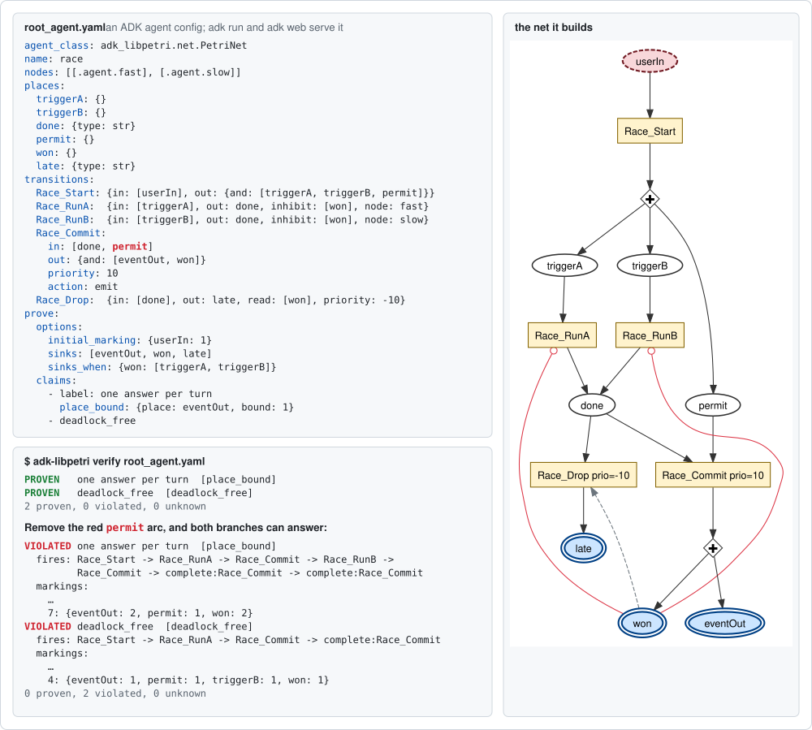

# adk-libpetri

[](https://github.com/debe/adk-libpetri/actions/workflows/ci.yml)
[](https://central.sonatype.com/artifact/org.libpetri/adk-libpetri)
[](LICENSE)
<!-- add PyPI badge at python/v0.1.0 -->

adk-libpetri compiles Google ADK agents into Coloured Time Petri nets, proves
properties of them with Z3 before they run, and runs them under ADK's own
`Runner` on the [libpetri](https://github.com/debe/libpetri) runtime. A race,
a join, a cancellation, a retry and a loop bound each become places and arcs,
which the solver can check.

<p align="center"></p>

*Left, a complete blueprint. Middle, the obvious way to let only the first
branch answer: commit only while nobody has won (`inhibit: [won]`). It is
deadlock-free, and Z3 still finds the run in which both commits start before
either lands, so two answers leave. Right, the fix: each commit consumes the
one `permit`, and both claims are proven. Every panel is generated from the
two YAML files.*

In Python (ADK 2.11) there are three ways in:

- **Compile an ADK 2 `Workflow`.** `from_workflow` turns the graph into a net
  and proves it, and `PetriWorkflow` serves the net wherever
  `Runner(node=workflow)` served the graph. 22 of ADK's 24 runnable workflow
  samples compile and emit the same events as under ADK.
- **Write the net in YAML or JSON.** `agent_class: adk_libpetri.net.PetriNet`
  is an ADK agent config, so `adk run` and `adk web` serve it.
  `adk-libpetri check` and `verify` catch a wrong net before it runs, and a
  JSON Schema and an authoring guide help people and agents write one.
  Blueprints mount each other by file reference.
- **Compose it in code** from stock subnets (`LlmAgent`, `ToolDispatch`,
  `Router`, ...) and run it as a `PetriAgent`, an ordinary `BaseAgent`.

The Java port (ADK Java 1.10.1) replaces `SequentialAgent`, `ParallelAgent`,
`LoopAgent`, `BaseLlmFlow` and `AgentTransfer` with the same nets behind the
same `PetriAgent`. Neither port forks ADK or genai.

## Contents

- [Quick start (Python)](#quick-start-python)
- [Java](#java)
- [What is proved](#what-is-proved)
- [Why a Petri net](#why-a-petri-net)
- [Guarantees](#guarantees)
- [How it works](#how-it-works)
- [ADK integration](#adk-integration)
- [Design commitments](#design-commitments)
- [Verification](#verification)
- [Project status](#project-status)
- [Development](#development)

## Quick start (Python)

```bash
pip install adk-libpetri   # not on PyPI yet: pip install -e python/ from a clone
```

Python 3.11+, `google-adk~=2.11.0`, `libpetri>=7.2,<8`. Proofs need a `z3`
binary (4.8+) on `PATH`; the runtime does not.
[`python/README.md`](python/README.md) has the full reference.

### Compile a Workflow

```python
from google.adk.runners import InMemoryRunner
from adk_libpetri import OrchestratorLoop
from adk_libpetri.workflow import PetriWorkflow, compile_workflow, verify_workflow

compiled = compile_workflow(workflow)            # report: kept, approximated, rejected
for proof in verify_workflow(compiled, k=2):     # one Z3 verify() per claim
    print(proof.result.verdict, proof.label)

loop = OrchestratorLoop()                        # one per process
runner = InMemoryRunner(node=PetriWorkflow.from_compiled(compiled, orchestrator=loop),
                        app_name="app")          # in place of InMemoryRunner(node=workflow)
```

`agent_class: adk_libpetri.workflow.PetriWorkflow` with a Workflow's `edges:`
does the same from `root_agent.yaml`. The net schedules the work (triggers,
routes, joins, retries, concurrency, interrupts, the turn), and each ADK node
still runs through ADK's own node runner inside the invocation. Z3 proves
these claims about the schedule:

| Claim | ADK's `Workflow` | Compiled net |
|---|---|---|
| one turn at a time per session | not modelled | `place_bound(wf/turnActive, 1)` |
| the turn permit never doubles | not modelled | `place_bound(turnPermit, 1)` |
| at most one terminal node outputs | raises at finalize | `unreachable(wf/terminalConflict)` |
| every node runs serially | runtime queue | `place_bound(wf/<node>/idle, 1)` |
| no turn gets stuck | no | `deadlock_free` (not claimed with interrupts) |
| a loop is bounded | no bound | opt-in `back_edge_budget` ([ADR 0007](docs/adr/0007-compiled-workflow-back-edge-budgets.md)) |
| route coverage (a lint) | logs, ends the branch | `unreachable(wf/<node>/unmatched)` |

A retry is a loop of places with a timed backoff transition at ADK's delay.
The proofs fold each loop into its run; the folding is sound and costs no
more than a node without retries. A cycle without a budget compiles, and the
report marks it approximated: safety and deadlock freedom are provable, and
termination is open. `back_edge_budget={(a, b):
K}` routes the edge through K permits, and a fallback transition fails the run
with `LoopBudgetExhausted` once they are spent. It is the
[reask-budget](#g2-bounded-autonomous-loops-reask-budget) shape:

<p align="center"></p>

**Parity.** The 24 runnable samples under `contributing/samples` in
google/adk-python v2.11.0, vendored in `python/tests/workflow/adk_samples`,
run natively and compiled with a scripted model, compared event by event
(outputs, authors, node paths, texts, session state, the exception
`run_async` raises). 22 compile and match, 10 of them with
`state="legacy_read"` because they read session state. 2 use `mode='task'`
agents and are rejected. One gap is open: a resumable app gets no
`agent_state` checkpoints from the compiled node. The compiler rejects what it
cannot translate faithfully and reports what it approximates.

<details><summary>The compiled router sample, as a net</summary>

<p align="center"></p>

*Two terminal nodes, each with its own output place. The view shows one of
the two turn endings and omits the abort, empty, failed and two-output ones.*

</details>

### Write the net in YAML or JSON

A `Workflow` has no way to express a race with one winner, a quorum, a permit
or an inhibitor fallback. A `PetriNet` blueprint writes the net itself, in
the agent config format that people and ADK's Agent Builder Assistant already
write; the figure at the top is a complete one. The YAML twins of Patterns A,
B and C ([`demos/patterns/yaml`](python/tests/demos/patterns/yaml)) build the
same nets as the hand-written demos and pass the same tests and proofs.

- **The turn** is `PetriAgent`'s: the input lands on `userIn`, and the first
  token on `eventOut` answers. A `node:` transition runs its ADK node inside
  the invocation; its route picks an xor branch, and a failure takes the
  `error` branch or fails the turn as under `Workflow`.
- **Composition is a file reference.** `nodes: [[race.yaml]]` plus
  `subnets: {first: {net: race_agent, bind: {userIn: question, eventOut:
  answer}}}` fuses the bound ports and prefixes the rest `first/`, so one
  blueprint mounts twice. `stock: llm_agent` mounts a stock subnet configured
  from an ADK `LlmAgent`.
- **Errors name the key path and a fix**, so an agent that writes a net can
  repair it:
  `transitions.Triage_Answer.out.xor.default: unknown place 'answerd'. Fix: did you mean 'answered'?`
- **Tooling.** `adk-libpetri check FILE` validates without Z3;
  `adk-libpetri verify FILE [--k N] [--recursive]` runs `prove:` and exits
  nonzero on a violation, with the counterexample. The schema is
  [`net/schema.json`](python/src/adk_libpetri/net/schema.json) and the guide
  for agents is [`net/AUTHORING.md`](python/src/adk_libpetri/net/AUTHORING.md).

The proofs are structural and untimed, and they treat every xor as a free
choice, so a claim holds for any value a node returns. By default inputs arrive turn by turn:
a safety claim covers one turn, `deadlock_free` two. The design is
[ADR 0008](docs/adr/0008-petri-net-blueprints.md); the format is in
[`python/README.md`](python/README.md#3-write-the-net-in-yaml-petrinet).

### Compose it in code

One `LlmAgent` subnet (prompt, model call, routing, tool dispatch, a bounded
re-ask loop) run by stock `InMemoryRunner`:

```python
from google.adk.runners import InMemoryRunner
from adk_libpetri import OrchestratorLoop
from adk_libpetri import colours as C
from adk_libpetri.runner import PetriAgent, PetriRunner, SessionExecutorRegistry, SessionKey
from adk_libpetri.subnet import llm_agent

loop = OrchestratorLoop()
config = llm_agent.Config(name="my_agent", model="gemini-2.5-flash",
                          system_instruction="Be helpful.", reask_budget=3)

def start(key):  # one runner per session; builder rejects missing or unknown actions
    return (PetriRunner.builder(llm_agent.DEF, llm_agent.action_bindings(your_model(), config))
            .environment_place(C.USER_IN).orchestrator(loop).astart())

registry = SessionExecutorRegistry.strong_owned()
runner = InMemoryRunner(agent=PetriAgent.builder("my_agent", registry, start).build(),
                        app_name="app")
# session-end hook: await registry.aclose(SessionKey.of(session))
```

CI proves [G1](#g1-one-turn-at-a-time-and-no-stranded-turn) and
[G2](#g2-bounded-autonomous-loops-reask-budget) for this subnet.

## Java

```xml
<dependency>
    <groupId>org.libpetri</groupId>
    <artifactId>adk-libpetri</artifactId>
    <version>0.4.0</version>
</dependency>
```

Not on Maven Central yet: build it with `cd java && ./mvnw install`. Java 25,
ADK Java 1.10.1, libpetri 8.0.0. Read the
[protobuf version floor](java/README.md#protobuf-version-floor) before you pin
protobuf yourself. The same agent as above:

```java
var config = LlmAgentSubnet.Config.builder("my_agent", "gemini-2.5-flash")
        .systemInstruction("Be helpful.").reaskBudget(3)
        .dispatchExecutor(Executors.newVirtualThreadPerTaskExecutor())
        .build();
var net = SubnetActions.bindComposed(               // rejects missing, unknown or doubly bound
        PetriNet.builder("hello").compose(LlmAgentSubnet.DEF).build(),
        LlmAgentSubnet.actionBindings(yourModel(), config));

var registry = SessionExecutorRegistry.strongOwned();
var agent = PetriAgent.builder("my_agent", registry,
                key -> PetriRunner.builder(net)
                        .environmentPlace(AdkColours.USER_IN)
                        .orchestratorExecutor(Executors.newVirtualThreadPerTaskExecutor())
                        .start())
        .build();
var runner = new InMemoryRunner(agent);             // stock ADK
// session-end hook: registry.close(SessionKey.from(session));
```

[`java/README.md`](java/README.md) has the full program, SSE streaming,
Live/BIDI and the two end-to-end demos.

## What is proved

Each row names a guarantee, its net mechanism, what stock ADK does instead,
and how far the claim reaches. Five status labels recur: **Proven + foil**
(an SMT proof plus an ADK-only foil test that locks in stock ADK's
behaviour), **Proven, no foil**, **Behavioural + foil**, **Behavioural**
(tests, no SMT), and **Illustrative** (a sketch no port runs). Read
[How to read the proofs](#how-to-read-the-proofs) before relying on a row;
[Evidence](#evidence) lists the tests.

| Guarantee | Mechanism | Stock ADK | Status | Scope |
|---|---|---|---|---|
| [One turn in flight](#g1-one-turn-at-a-time-and-no-stranded-turn) | Seeded `TURN_PERMIT` | Java's `Runner` does not serialise a session; Python's `Workflow` does not model it | Proven, no foil | Two arrivals, no atomic-firing assumption |
| [Every input gets one outcome; failures recovered](#g1-one-turn-at-a-time-and-no-stranded-turn) | `AbortTurn`, `DropAbort` | No counterpart | Proven, no foil | `arrivals(k, k)`, a failure at every step |
| [Reask budget never stacks](#g2-bounded-autonomous-loops-reask-budget) | Priority plus `inhibitor(REASK_BUDGET)` | `maxLlmCalls`, which fails the invocation | Proven, no foil | Stated in seeds |
| [Unknown transfer target is a typed error](#g3-typed-fallbacks-no-dead-letters) | `Out.xor` with an `_unknown` branch | Java: silent no-op; Python: a bare `ValueError` | Proven + foil | One turn, multi-agent net |
| [Race: one commit per turn](#g4-at-most-one-commit-per-turn-race-optimistic-commit-quorum) | Consumed `RACE_PERMIT` | First escalation wins (Java); losers not cancelled (Python) | Proven + foil | Per turn, untimed |
| [Optimistic commit: one commit](#g4-at-most-one-commit-per-turn-race-optimistic-commit-quorum) | XOR verdict | Custom `BaseAgent` (Java); pre-warming double-commits (Python) | Proven + foil | Per turn |
| [K-of-N: one synthesis](#g4-at-most-one-commit-per-turn-race-optimistic-commit-quorum) | `In.exactly(3, RESULT)` | Waits for all N | Proven + foil | Per turn |
| [Silence escalation ladder](#g5-escalation-ladders-timed-recovery-as-places) | `delayed` rungs under `inhibitor(MODEL_ACTIVE)` | No counterpart | Behavioural | Clock tests, to the millisecond |
| [Voice composition deadlock-free](#g6-full-duplex-vad-barge-in-chunk-drop-ordering-experimental) | Env places modelled `bounded(1)` | No counterpart | Proven, no foil | `deadlock_free` only |
| [VAD edges recovered](#g6-full-duplex-vad-barge-in-chunk-drop-ordering-experimental) | `VadTapGemini` plus the `Vad` window | ADK Java 1.10.1 maps them to an error | Behavioural + foil | Java only; ADK Python keeps the edges |
| [Compiled workflow safety](#compile-a-workflow) | Turn permit, idle place per node, terminal-conflict place | Raises at finalize; ends the branch on an unmatched route | Proven, no foil | Python only |
| [Blueprint claims](#write-the-net-in-yaml-or-json) | The claims in `prove:` | No counterpart | Proven, no foil | Python only; per the claim's printed scope |

Unless a row says otherwise, both ports run the same proof.

## Why a Petri net

ADK Java builds an agent process as a tree of sequences and runs its
concurrency on RxJava. ADK Python 2 replaced the tree with a graph
`Workflow`, because nested sequence and parallel shapes cannot hold a
concurrent process. A Coloured Time Petri net goes further:

- Transitions with disjoint inputs fire concurrently.
- A loop is a cycle, a join is one transition with several inputs, and a
  branch is an XOR output, so the diagram shows the behaviour.
- Inhibitor, read and reset arcs and timings state "fire only while X is
  empty", "read without consuming", "fire after 3 s of silence" and "clear
  this region" in the net itself.
- The marking is the state. Tokens carry typed colours (`LlmRequest`,
  `Content`, `ToolCalls`), and no external state object can race against
  itself.

A net expresses everything a graph `Workflow` does: a transition with several
input places is an AND-join, and a shared place that feeds competing
transitions is a race. Exclusion, bounded loops and pre-emption are arcs and
priorities. A graph runtime learns its state while it runs; a net's
properties can be proved before it runs. For a linear flow a plain graph is
simpler to write. Where ordering, exclusion or cancellation matter, the net
gives you a model to check, and it still runs under ADK.

ADK supplies what libpetri alone lacks: sessions and session services, the
`Content`/`Event` wire protocol shared with the Gemini API, and `BaseTool`
with its MCP adapters. ADK's evaluator and the deploy targets behind
`BaseAgent` (A2A, Vertex Agent Engine, Cloud Run) should work too, though no
test here exercises them. A project that needs none of this can drive
libpetri directly.

## Guarantees

Each section gives the **ADK side** (with the foil test if there is one), the
**net**, what is **proved**, and the **limits**. Test names are Java's; the
Python twin adds a `test_` prefix and lives under `python/tests/`.

### Reading the diagrams

<p align="center"></p>

Net diagrams are exported from the nets the tests run, and the workflow
diagrams from the Python compiler. Both ports golden-check the stock subnets
against [`spec/fixtures/nets`](spec/fixtures/nets), so one diagram describes
both. Sketches are marked Illustrative.

<details>
<summary>The notation in full</summary>

- Ellipses are places. Pink dashed: an env place, injected from outside.
  Green: no producer in the view. Blue, double outline: no consumer. Dotted
  grey: continues outside the view.
- `●` marks a place seeded with one token; `●×K` a place one firing fills with
  K tokens (the proofs count such firings).
- Boxes are transitions. `prio=N` ranks enabled transitions; `[3000, ∞]ms` is
  a firing window, shown on timed diagrams only.
- ✚ sends a token to every branch, ✕ to exactly one. On an input arc, `×3`
  takes exactly three, `≥N` at least N, `*` all.
- Red arc ending in a circle: inhibitor. Grey dashed: read. Bold orange:
  reset; a "reset: +N places" note bundles N more.
- A rounded dashed frame is a subnet cluster; its prefix (`LiveApiRecovery_`)
  is omitted inside it.
- Labels are the real place names (`userIn`, `LlmAgent_reaskBudget`); the
  prose uses the constant names (`USER_IN`, `REASK_BUDGET`).
- Component diagrams: grey, an ADK or library component; yellow, the session
  net; blue, your code or an observer. Solid arrow: call or data; dashed:
  return.

</details>

### G1 One turn at a time, and no stranded turn

**Status: Proven, no foil.**

**ADK side.** ADK Java's `Runner` does not serialise invocations per session,
so a client that retries after a timeout sends the next input while the last
turn still runs ([ADR 0005](docs/adr/0005-llm-agent-turn-permit.md)). ADK
Python's `Workflow` does not model it either.

**Net.** An admission token:

- `LlmAgent_StartTurn` consumes `USER_IN` and `TURN_PERMIT` and produces
  `TURN_ACTIVE` and `TURN_INPUT`.
- `LlmAgent_EmitAnswer` and `LlmAgent_EmitTransfer` return the permit and
  reset `REASK_BUDGET`.
- `LlmAgent_AbortTurn` (priority 30) consumes `TURN_ABORT` and `TURN_ACTIVE`,
  returns the permit, and resets every place a turn holds.
- `LlmAgent_DropAbort` (priority 30) drops a `TURN_ABORT` that finds the
  permit at rest. It outranks `StartTurn`: at equal priority, an abort and an
  input landing in one pass would let `StartTurn` take the permit and
  `AbortTurn` wipe the fresh turn.

The permit is a seeded token because the verifier lets an inhibitor-guarded
transition start twice from one marking; exclusion needs a token that both
contenders consume (ADR 0005).

<p align="center"></p>

**Proved** in `StockSubnetProofsTest`: one turn in flight, one conversation,
one budget seed, one permit however aborts arrive, one outcome per input, and
recovery from a failure at any step.

**Limits.** The permit serialises turns but does not stamp them (N1). A second
input waits in `USER_IN` for the next turn. ADR 0005 leaves open what an
abort does to the late output of an action still running.

### G2 Bounded autonomous loops (reask budget)

**Status: Proven, no foil.**

**ADK side.** `BaseLlmFlow` re-asks the model until an event is final. Its
only cap, `RunConfig.maxLlmCalls` (`max_llm_calls`), raises once exceeded, so
the invocation fails and the user gets no answer.

**Net.** `LlmAgent_BuildPrompt` fills `REASK_BUDGET` with K tokens.
`LlmAgent_ReAsk` (priority 10) spends one per tool round, so it fires at most
K times per turn. `LlmAgent_ReAskExhaustedFallback` (priority -10), under
`inhibitor(REASK_BUDGET)`, answers with the configured fallback once the
budget is empty. K is `reaskBudget` / `reask_budget` (default 3).

<p align="center"></p>

**Proved.** `budgetPlaceBounded(REASK_BUDGET, 1)`: the budget never holds a
second turn's seed ([How to read the proofs](#how-to-read-the-proofs)).

**Limits.** The budget bounds autonomous runaway only: the LLM-and-tool loop,
and in Python a workflow back edge the caller budgets
([ADR 0007](docs/adr/0007-compiled-workflow-back-edge-budgets.md)).

### G3 Typed fallbacks: no dead letters

**Status: Proven + foil.**

**ADK side.** ADK Java's `findAgent` returns `Optional.empty()` for a made-up
name and `transferToAgent` records it unvalidated; the failure surfaces later,
untyped or as a silent no-op
([`TransferUnknownTargetAdkFoilTest`](java/src/test/java/org/libpetri/adk/demos/TransferUnknownTargetAdkFoilTest.java)).
ADK Python 2.11 raises a bare `ValueError` and ends the invocation with no
error `Event`
([foil](python/tests/demos/test_transfer_unknown_target_adk_foil.py)).

**Net.** `TransferRouter_Demux` routes each `TRANSFER` through `Out.xor` over
one place per known agent plus `TransferRouter_target/_unknown`;
`TransferRouter_EmitUnknownError` turns `_unknown` into a typed error `Event`.
Every token has a consumer.

<p align="center"></p>

**Proved.** k transfers reach exactly k outcomes; the multi-agent demo net is
deadlock-free with one event per turn (`MultiAgentDemoTest`), and
`hallucinated_agent_name_surfaces_as_typed_error_event_not_npe` runs the typed
error through `InMemoryRunner`.

**Limits.** The target set is fixed when the net is built.

### G4 At most one commit per turn: race, optimistic commit, quorum

**Status: Proven + foil.** Per turn.

**ADK side.** ADK Java 1.10.1's `ParallelAgent` is
`Flowable.merge(branches).takeUntil(escalate)`: first escalation wins, with no
preference order, no K-of-N and no provable at-most-once commit
([detail](java/README.md#adk-java-1101-behaviour-the-argument-relies-on)).
ADK Python 2.11's `Workflow`: `JoinNode` waits for every predecessor, a plain
successor fires once per branch, and losers are not cancelled
([foils](python/tests/demos/patterns/)).

**Net.** Each pattern commits through one structural gate.

- **A, first wins** (`PatternA_SpeculativeRaceDemoTest`). `Race_Start` mints one
  `RACE_PERMIT`; each `Race_Commit*` consumes it. Unstarted branches are held
  off by `inhibitor(RACE_WON)`; a branch in flight finishes and drains through
  `Race_Discard*`. The gate is a consumed permit because an inhibitor reads
  the pass-start marking, and two commits ready in one pass would both fire.
- **B, K of N** (`PatternB_QuorumDemoTest`). Five branches feed `RESULT`;
  `Quorum_Synthesize` consumes `In.exactly(3, RESULT)`, so K is in the
  topology, and `Quorum_AbsorbLate` sinks the stragglers.
- **C, preference plus fallback** (`PatternC_OptimisticCommitDemoTest`). Cheap
  and slow paths start together; `Opt_Validate` XOR-routes to a verdict, and
  `Opt_CommitCheap` or `Opt_CommitSlow` commits.

<p align="center"></p>

<p align="center"></p>

<details>
<summary>Optimistic commit (Pattern C) diagram</summary>

<p align="center"></p>

</details>

All three also run as YAML blueprints
([`demos/patterns/yaml`](python/tests/demos/patterns/yaml)), with the same
behaviour tests and proofs.

**Proved**, one property per `verify()`: one commit and one event per turn for
each pattern, exclusive verdicts for C, and a race permit that never stacks
across two turns (assumes atomic firing, exact on both executors).

**Limits.** Per turn and untimed. A branch still running when the next turn
starts lands in that turn; for B it counts as a vote.
[N1](#n1-not-yet-guaranteed-staleness-across-turns) is the fix.

### G5 Escalation ladders: timed recovery as places

**Status: Behavioural** (the demo ladder); **Illustrative** (the SLA sketch).

A ladder is a chain of rung places, each drained by a timed transition that
the awaited event disables. The event must also consume the rung it lands on,
or a later silence escalates from a stale rung.

**Demo.** `LiveApiRecoverySubnet` (test scope, `demos/voice/`) recovers a
Live-API model that goes silent mid-turn. `Nudge`, after `nudgeAfter` and
under `inhibitor(MODEL_ACTIVE)`, asks the host to re-send `turnComplete`;
`Recover`, a further `reconnectAfter` later, asks it to reconnect. `Answered`
and `AnsweredLate` consume the current rung once the model speaks. The host
injects `RESPONSE_AWAITED`, `MODEL_ACTIVE` and `MODEL_QUIET` as env places.

<p align="center"></p>

**Tested.** Seven `ManualClock` tests pin each rung to the millisecond
([list](java/README.md#silence-ladder-timing-tests)); Python runs them on
`SteppedClock` with the same boundaries.

**Proved.** The composed voice net, ladder included, is deadlock-free.

**Limits.** The verifier is untimed, so no timing is proved.

<details>
<summary>Tiered SLA sketch</summary>

A primary answer if it lands in time, else a fallback after 2 s, else a cached
default after 3 s more. One rung token per turn, consumed by every answer, so
an answer cancels escalation and at most one answer leaves.

<p align="center"></p>

</details>

### G6 Full duplex: VAD, barge-in, chunk drop, ordering *(experimental)*

**Status: Proven, no foil** (deadlock freedom of streaming, barge-in and
recovery); **Behavioural + foil** (VAD-edge recovery); **Behavioural** (the
rest).

**ADK side.** ADK Java 1.10.1's `GeminiLlmConnection` maps a VAD-only frame to
an "Unknown server message" error
([`VoiceVadEdgeAdkFoilTest`](java/src/test/java/org/libpetri/adk/demos/VoiceVadEdgeAdkFoilTest.java)).
ADK Python 2.11 keeps the edges on `Event.voice_activity`.

**Net.** Each failure mode is a small motif:

- **Vad window.** `Vad_OpenWindow` and `Vad_CloseWindow` track speech; two
  ignore transitions absorb repeated edges.
- **Barge-in.** `BargeIn_SendBargeIn` fires under `read(VOICE_ACTIVITY_OPEN)`,
  `BargeIn_DiscardInterrupt` under its inhibitor.
- **Chunk drop.** `Bidi_EmitChunk` runs under `inhibitor(BARGE_IN_SENT)`, and
  `Bidi_DropQueuedTurn` resets `LLM_RESPONSE`, so a barge-in drops the queued
  chunks.
- **Ordering.** `Bidi_EmitTurnEnd` runs under `inhibitor(LLM_RESPONSE)`, so
  the terminal event waits for queued chunks.

<p align="center"></p>

<p align="center"></p>

**Proved.** `LlmStreamingStep` + `BargeIn` + `LiveApiRecovery` is
deadlock-free with its seven inputs as `bounded(1)` env places.

**Limits.** The proved net has no `Vad` subnet and no `Bidi_*` transitions,
and no safety property is proved on it.

*N1 and N2 are tracked in [ADR 0001](docs/adr/0001-pre-port-design-gate.md),
to be backed with a demo, a foil and an SMT property.*

### N1 Not yet guaranteed: staleness across turns

**Status: Illustrative.**

ADK Java's `InvocationContext.endInvocation` is a plain field copied per agent
run and per `ParallelAgent` branch, so one branch's `setEndInvocation(true)`
is invisible to its siblings, and the tool path never reads it
([detail](java/README.md#adk-java-1101-behaviour-the-argument-relies-on)).

The sketch stamps each result with its generation. `BumpGeneration` advances a
seeded `LATEST_GENERATION` on every new turn; each commit site reads it and
routes a stale result to `DISCARDED`. N1 would lift G4 from per turn to
across turns.

<p align="center"></p>

### N2 Not yet guaranteed: variable-N fan-out

**Status: Illustrative.**

ADK fixes the branch count when it builds `ParallelAgent`, and partial results
are visible only through `session.state`. In the sketch, `Spawn` emits N `JOB`
and N `JOB_PENDING` tokens, N chosen per request; `Collect` merges results;
`Finish` fires under `inhibitor(JOB_PENDING)` and returns the permit.

<p align="center"></p>

## How it works

Subnets declare typed ports (`Place<LlmRequest>`, `Place<ToolCalls>`).
Composition fuses places by name and type and rejects a type clash when the
net is built: Java's `PetriNet.Builder.compose(...)`, Python's
`NetSpec.compose`, a blueprint's `subnets:`. Because places carry domain
colours, a diagram of the net reads as the agent process.

### Runtime model

- **One net per session**, built at session start and alive until the session
  ends. A new user message is `inject(USER_IN, content)` into the running net.
- **One way in, one way out.** Every external signal is a typed env place,
  filled by `inject(place, token)` or `signal(place)` from any thread. Output
  is the `EVENT_OUT` bridge and the `EventStore` decorator chain. There is no
  generic `observe(place)`.

<p align="center"></p>

- **Executors.** Java: `PetriRunner.Builder` needs an explicit
  `orchestratorExecutor` (virtual threads if actions block). Python: actions
  run on libpetri's Tokio threads without an asyncio loop and await ADK
  coroutines through `on_loop(coro)`; one caller-owned `OrchestratorLoop` per
  process. libpetri-py may re-enter an async transition, so
  ordering-sensitive actions are synchronous
  ([ADR 0006](docs/adr/0006-python-port-and-adk-python-compat.md)).
- **OpenTelemetry.** `OtelEventStore` turns firings into spans and delegates
  to the next store, so it stacks with `EventStore.logging()` or your own.

### Boundary colours (`AdkColours` / `adk_libpetri.colours`)

The typed places every stock subnet shares; the same names in both ports
(`Place<Void>` is `Place[None]` in Python).

| Colour | Type | Use |
|---|---|---|
| `USER_IN` | `Content` | user message in (env place) |
| `EVENT_OUT` | `Event` | agent event out |
| `LLM_REQUEST` / `LLM_RESPONSE` | `LlmRequest` / `LlmResponse` | model call in and out |
| `TOOL_CALLS` / `TOOL_RESULTS` | `ToolCalls` / `ToolResults` | function calls and responses |
| `TRANSFER` | `TransferTarget` | agent-transfer routing token |
| `LEGACY_SESSION_WRITE` | `LegacySessionWrite` | write-only bridge to `Session.state` |
| `END_INVOCATION` | `Void` | termination signal |
| `TURN_PERMIT` | `Void` | one-turn-at-a-time permit, seeded by `PetriRunner` |
| `TURN_ABORT` | `Void` | clears a stranded turn (env place) |

Add your own colours for in-net state, one typed place per concept, never a
`Place<Map<String, Object>>` bag.

### Stock subnets

Starting points for your own compositions. Each is a `SubnetDef`
(Java) or a module with `DEF: NetSpec` and `action_bindings(...)` (Python);
`NetSpec.build` and `SubnetActions.bindComposed` reject a missing, unknown or
doubly bound action.

| Subnet | In | Out | What it does |
|---|---|---|---|
| `LlmStep` | `LLM_REQUEST` | `LLM_RESPONSE` | One model call; `BeforeModel` can short-circuit, `LlmCall` splits success from error, callbacks feed the response |
| `ToolDispatch` | `TOOL_CALLS` | `TOOL_RESULTS` | Runs every call concurrently and joins them; per-call errors go in the response |
| `PromptBuilder` | `USER_IN` | `LLM_REQUEST` | Builds the request (model, instruction, tools) |
| `Router` | `LLM_RESPONSE` | `TOOL_CALLS` ✕ `TRANSFER` ✕ `EVENT_OUT` | Routes by response shape; `transfer_to_agent` wins |
| `LlmAgent` | `USER_IN`, `TURN_ABORT` | `EVENT_OUT`, `TRANSFER` | The canonical composition, below |
| `PersistState` | `LEGACY_SESSION_WRITE` | — | The only writer to `Session.state`, one append at a time |
| `TransferRouter` | `TRANSFER` | `target/<name>`, `target/_unknown` | XOR over known targets; a made-up name becomes a typed error ([G3](#g3-typed-fallbacks-no-dead-letters)) |
| `LlmStreamingStep` *(exp.)* | `LLM_REQUEST` | `LLM_RESPONSE`, `EVENT_OUT` | SSE: each chunk becomes a partial `Event`, in order |
| `StreamingLlmAgent` *(exp.)* | `USER_IN`, `TURN_ABORT` | `EVENT_OUT`, `TRANSFER` | `LlmAgent` over `LlmStreamingStep` |

The voice subnets (`BargeIn`, `LiveApiRecovery`, `Vad`) are test-scope
exemplars under `demos/voice/`; the library does not ship them.
`RawProviderPassthroughDemoTest` shows a provider feature ADK does not model
yet, reached with one typed place and one transition.

### The canonical composition: `LlmAgent`

`LlmAgent` composes its turn transitions with `LlmStep`, `Router`'s route and
`ToolDispatch`:

1. **`StartTurn`** takes the permit with the input ([G1](#g1-one-turn-at-a-time-and-no-stranded-turn)).
2. **`BuildPrompt`** seeds K budget tokens and puts the user turn on the
   in-net `CONVERSATION` place.
3. **`ReAsk`** spends one token per tool round and replays the conversation;
   `ReAskExhaustedFallback` answers when the budget is empty ([G2](#g2-bounded-autonomous-loops-reask-budget)).
4. **`EmitAnswer` / `EmitTransfer`** end the turn and return the permit.
5. **`AbortTurn`** clears a turn a failure stranded; **`DropAbort`** drops a
   stray abort.

<p align="center"></p>

## ADK integration

One adapter per entry point; nothing in ADK is patched or forked.

- **`PetriAgent`** (both ports) is a `BaseAgent`. Per invocation it gets or
  creates the session's runner, subscribes to its egress and failure signal,
  injects the message on `USER_IN`, and returns the event stream. A failed or
  timed-out transition fails the turn and signals `TURN_ABORT`, so the net
  serves the next turn. In Python it also runs as a `Workflow` node, with
  input, output and route mappers.
- **`PetriWorkflow`** and **`PetriNet`** (Python) are `BaseNode`s, because
  ADK 2.11 runs a `BaseAgent` root on its legacy path, which cannot run child
  nodes. Both nest inside another `Workflow`.
- **`BidiPetriAgent.bridge`** *(experimental)* pumps Live/BIDI frames into a
  `LiveConnection` and hands each server message to your callback, which
  injects into the net. The net authors every outbound `Event`, so barge-in
  can drop queued chunks structurally.

<p align="center"></p>

<details>
<summary>Live/BIDI: the two halves of a live session</summary>

<p align="center"></p>

ADK Java 1.10.1 drops the voice-activity edges, so Java recovers them with
`VadTapGemini` (wraps ADK's live transport through the `connectLiveTransport`
seam) or `SyncGeminiLiveConnection` (reads genai directly). ADK Python 2.11
keeps them. Never shadow ADK's classes on the classpath to fix this: that is a
fork. Details are in [java/README.md](java/README.md#live-bidi).

</details>

### Session lifetime: `SessionExecutorRegistry`

The registry creates one runner per `(appName, userId, sessionId)` on first
use and reuses it for every later turn.

- **`strongOwned()`** (`strong_owned()`), the default: the runner lives until
  your session-end hook calls `close(key)`, or `closeAll()` at shutdown. A
  forgotten close is a visible leak: `size()` grows.
- **`cleanerOwned()`** (`finalizer_owned()`), opt-in: the runner is torn down
  when a stable owner you name through `ownerExtractor(...)` is collected.
  `ctx.session()` with `InMemorySessionService` is not such an owner: it
  returns copies, and the runner dies mid-session.

A registry built with a `SessionCheckpointStore` *(experimental)* drains each
session at teardown, saves its final marking without `EVENT_OUT`, and a runner
factory that calls `resumeFrom(store, key)` starts from it. The store is never
read during execution, so the marking stays the state.

Both ports use the same place and transition names; the API names follow each
language's conventions (`strongOwned` / `strong_owned`). Java's
`Gemini.generateContent` hops to `ForkJoinPool.commonPool()`; the
`SyncGeminiLlm` exemplar avoids it
([java/README.md](java/README.md#calling-gemini-without-commonpool)).

## Design commitments

Each one rules out a class of bug by construction.

1. **Interaction is env-place injection only.** A user message, a scroll
   event, a webhook or an audio frame enters through `inject` on its own
   typed place. No method calls into transitions, no side channels.
2. **The marking is the state.** External stores (`Session.state`, a
   database) are write-only bridges, never read inside the net. Read arcs on
   typed in-net places replace them.
3. **Typed colours per domain concept.** Never one `Place<Map<String,
   Object>>` bag. The single bag-shaped colour, `LegacySessionWrite`, serves
   only the Session export bridge.
4. **Zero forks.** ADK plugs in through `PetriAgent` (and, in Python,
   `PetriWorkflow` and `PetriNet`). Where a defect lives in ADK's wrapper
   over genai, thin user code wraps or bypasses it.
5. **Observability is an `EventStore` decorator chain.** `OtelEventStore`,
   `EventStore.logging()` and your own stores wrap each other.
   `failureSignal()` is control flow: it ends a turn and never carries net
   state.
6. **Autonomous loops are bounded structurally**, by the
   [reask-budget pattern](#g2-bounded-autonomous-loops-reask-budget): the
   LLM-and-tool loop and, in Python, a workflow back edge the caller budgets.
   Other loops need bounds of their own.
7. **The framework is the composition primitives**: `compose` and
   `SubnetDef.fromNet` in Java, `NetSpec.compose` and blueprints in Python.
   Stock subnets are starting points.
8. **Per-session runner lifetime is caller-owned.** Every registry mode has a
   teardown route; the library holds no shared executor.

## Verification

CI runs `./mvnw verify` and `REQUIRE_Z3=1 pytest` (Python 3.11 and 3.13) on
every build. Each SMT row below is a test that asserts the verdict, so a
claim that stops holding fails the build. A gate test (`Z3NativeGateTest`,
`tests/test_z3_gate.py`) fails it when `REQUIRE_Z3=1` is set and `z3` is
missing; locally without `z3` the proofs skip. Both ports golden-check the
stock subnets against `spec/fixtures/nets`.
[spec/coverage-matrix.md](spec/coverage-matrix.md) maps each requirement to
its tests in both ports.

### How to read the proofs

- **One property per `verify()`.** In Java, `SmtVerifier.property(p)`
  replaces the property, so a chain of calls checks only the last; the test
  helpers prove one at a time.
- **In-flight split.** When a transition's output is tested by another
  transition's inhibitor, reset or drain, the verifier models it as a start
  and a completion step, because the executor fires other transitions in
  between. Two Python proofs (the race permit, the BIDI per-place bound) and
  one Java proof (the race permit) assume atomic firing instead; each is
  exact because the actions involved are synchronous.
- **Pattern bounds are per turn.** Results carry no turn stamp, so only the
  permit bound is claimed across turns.
- **Budget bounds are stated in seeds.** libpetri models a seed of N permits
  as one token, so the claim is that a place never holds a second seed.

### Evidence

| What is proved | Net | Test | Guarantee |
|---|---|---|---|
| Deadlock-free; k transfers reach exactly k outcomes | `TransferRouter`, `arrivals(k, k)` | `StockSubnetProofsTest` | [G3](#g3-typed-fallbacks-no-dead-letters) |
| `LlmStep`, `Router`, `ToolDispatch` each deadlock-free with k inputs to k outcomes; `PersistState` deadlock-free | each alone, `arrivals(k, k)` | `StockSubnetProofsTest` | [Stock subnets](#stock-subnets) |
| `LlmAgent` deadlock-free, rests holding only its permit, k inputs to k outcomes | `LlmAgent`, `arrivals(k, k)` | `StockSubnetProofsTest` | [G1](#g1-one-turn-at-a-time-and-no-stranded-turn) |
| One turn in flight, one conversation, a budget that never stacks | `LlmAgent`, two arrivals; `StreamingLlmAgent` | `StockSubnetProofsTest` | [G1](#g1-one-turn-at-a-time-and-no-stranded-turn), [G2](#g2-bounded-autonomous-loops-reask-budget) |
| A failure at any step is recovered; aborts never mint a second permit | `LlmAgent` with a failure model | `StockSubnetProofsTest` | [G1](#g1-one-turn-at-a-time-and-no-stranded-turn) |
| Deadlock-free with the chunk stream open | `LlmStreamingStep` | `LlmStreamingStepSubnetTest` | SSE |
| Deadlock-free; one egress event per turn | multi-agent demo | `MultiAgentDemoTest` | [G3](#g3-typed-fallbacks-no-dead-letters) |
| Deadlock-free | voice composition, env places `bounded(1)` | `VoiceSessionDemoTest` | [G5](#g5-escalation-ladders-timed-recovery-as-places), [G6](#g6-full-duplex-vad-barge-in-chunk-drop-ordering-experimental) |
| One commit and one event per turn; exclusive verdicts; each deadlock-free | Patterns A, B, C | `Pattern{A,B,C}_*DemoTest`, YAML twins | [G4](#g4-at-most-one-commit-per-turn-race-optimistic-commit-quorum) |
| The race permit never stacks across turns | Pattern A, two arrivals | `PatternA_SpeculativeRaceDemoTest` | [G4](#g4-at-most-one-commit-per-turn-race-optimistic-commit-quorum) |
| Every safety claim and deadlock freedom on sample DAGs (linear, router, fan-join, retrying, concurrent, budgeted cycle) | compiled workflows | Python: `tests/workflow/test_compile.py` | [Compile a Workflow](#compile-a-workflow) |
| Each blueprint's `prove:` claims, including a composed net that mounts the race twice and an `llm_agent` | YAML blueprints | Python: `tests/net`, `demos/patterns/yaml` | [YAML or JSON](#write-the-net-in-yaml-or-json) |

Structural validators (`AdkNetInvariants`, `adk_libpetri.verify`) need no
solver: `singleLegacySessionWriter`, `transferDemuxHasUnknownFallback` and
`endInvocationInhibitsAll`. Java's state-class graph of the composed BIDI
subnets completes from one request; Python, without that binding, proves the
same composition one-bounded with SMT. The verifier is untimed; clock tests
check the timing claims.

### When the proofs caught us

- **Chained properties checked only the last**, and three of the unchecked
  bounds did not hold ([CHANGELOG](CHANGELOG.md)).
- **Two conversations in one agent.** A second input during a tool loop fired
  `BuildPrompt` again; a reset and a `ReAsk` in one pass left two
  `CONVERSATION` tokens. The seeded turn permit fixed it
  ([ADR 0005](docs/adr/0005-llm-agent-turn-permit.md)).
- **The race committed twice** under `inhibitor(RACE_WON)` when two results
  were ready in one pass; a consumed `RACE_PERMIT` fixed it.
- **`CHUNK_BUDGET` bounded nothing**: the streaming emit returned the permit it
  took. The budget is gone.
- **A compiled workflow could end a turn mid-retry**, in the gap while a
  bookkeeping transition held a token in no place; a seeded `wf/quiet` token
  closed it ([ADR 0007](docs/adr/0007-compiled-workflow-back-edge-budgets.md)).
- **A blueprint proved deadlock-free hung on its second turn**: the proof
  covered one turn and the net never returned its permit. `deadlock_free` now
  covers two turns in a row, and every verdict prints its scope
  ([ADR 0008](docs/adr/0008-petri-net-blueprints.md)).

## Project status

Early-stage, versioned **0.x**: a minor release may break API. The runtime,
the stock subnets and the proved demos pass on every build, and the boundary
between the net and ADK is still moving. Settled: the turn-based path (`PetriAgent`,
the non-streaming subnets, `SessionExecutorRegistry`). Experimental, and
marked so in source: SSE, BIDI/live, checkpoints, `from_workflow` and
blueprints.

| Port | ADK | libpetri | Release |
|---|---|---|---|
| **Python** ([`python/`](python/)) | ADK Python 2.11 (`google-adk~=2.11.0`) | `libpetri>=7.2,<8` (PyPI, over the Rust runtime) | 0.1.0, unreleased |
| **Java** ([`java/`](java/)) | ADK Java 1.10.1 | `org.libpetri:libpetri:8.0.0` | 0.4.0, unreleased |
| TypeScript, Rust | reserved | | |

Each port has its own version and tags (`python/v…`, `java/v…`).

## Development

<p align="center"></p>

```bash
cd python && python3.12 -m venv .venv && . .venv/bin/activate && pip install -e '.[dev]'
REQUIRE_Z3=1 pytest && ruff check . && ruff format --check . && pyright

cd java && ./mvnw verify          # the SMT tests need z3 4.8+ on PATH or LIBPETRI_Z3
```

- **Fixtures.** Java writes `spec/fixtures/nets` and both ports golden-check
  it, so a stock subnet changes in both ports or neither:
  `cd java && ./mvnw test -Dtest=SpecFixturesTest -Dspec.fixtures.write=true`.
- **Diagrams.** `ReadmeDiagramsTest` (Java) and `tests/readme_diagrams`
  (Python) export DOT from the nets the tests run, and fail on a drifted file;
  `docs/diagrams/src/index.ts` writes the sketches; `npm run build` renders
  all of them to SVG ([`docs/diagrams/`](docs/diagrams/)). Only rendering
  needs Node.js 20+ and graphviz.
- **ADK bumps** follow a recorded re-check:
  [ADR 0002](docs/adr/0002-adk-version-compat.md) for Java,
  [ADR 0006](docs/adr/0006-python-port-and-adk-python-compat.md) for Python.

adk-libpetri is a sibling project of [libpetri](https://github.com/debe/libpetri),
and each port uses the matching libpetri port. Python's libpetri is a
binding over the Rust runtime, which may start a transition again while an
earlier firing is in flight. The design principles (env-place interaction,
typed colours, marking as state, `EventStore` observability) come from
libpetri.

## License

Apache 2.0. See [`LICENSE`](LICENSE).
