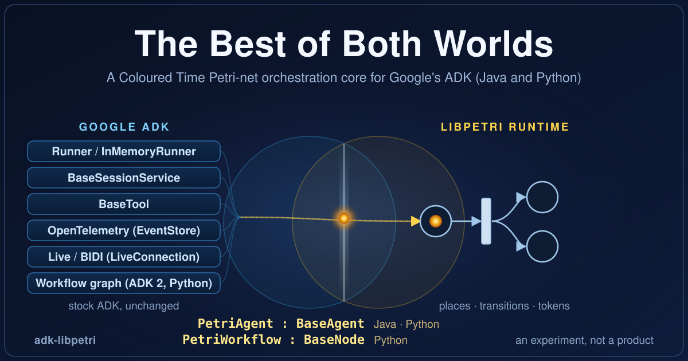
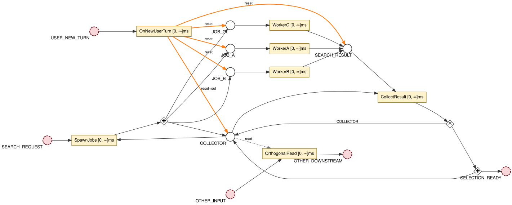
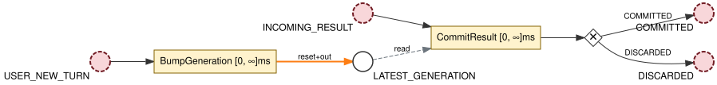
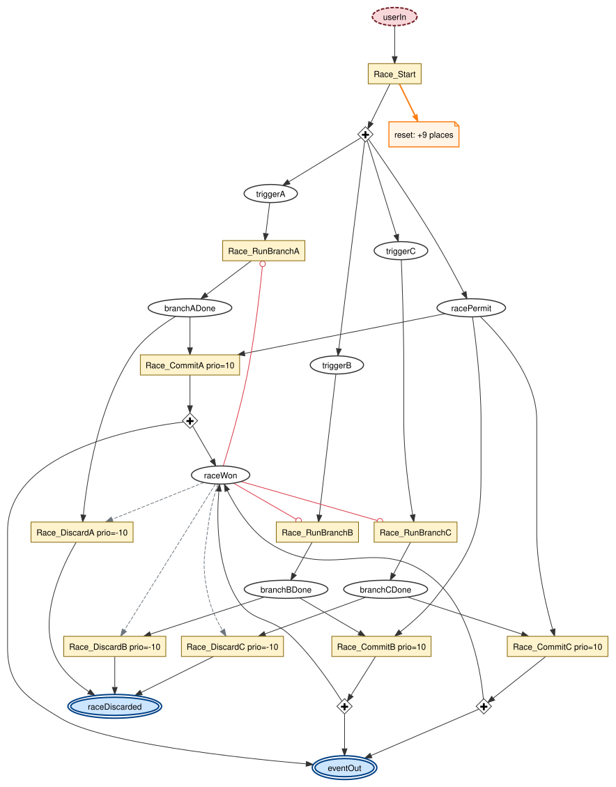
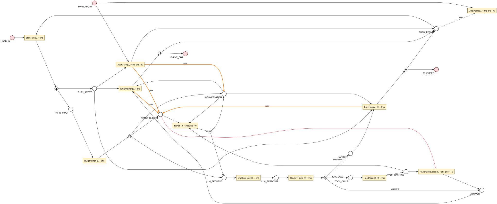
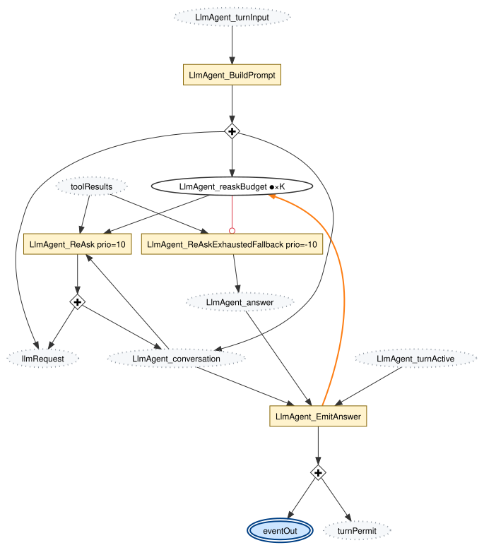

# adk-libpetri

[](https://github.com/debe/adk-libpetri/actions/workflows/ci.yml)
[](https://central.sonatype.com/artifact/org.libpetri/adk-libpetri)
[](LICENSE)

<p align="center">
  
</p>

adk-libpetri replaces Google ADK Java's orchestration core with a
Coloured Time Petri Net runtime built on
[libpetri](https://github.com/debe/libpetri). The pieces it replaces
are `SequentialAgent`, `ParallelAgent`, `LoopAgent`, `BaseLlmFlow`,
`AgentTransfer`, and the `Runner` that drives them over an RxJava
pipeline. In their place, the whole control flow of a session is one
coloured Petri net you compose from typed subnets. Stock ADK `Runner`
consumes turn-based sessions through `PetriAgent`; Live/BIDI paths use
the provider-neutral `BidiPetriAgent` bridge over `LiveConnection`.
There is no fork of ADK and no fork of genai.

Both shipped demo nets are Z3-proved deadlock-free on every
`mvn verify`, CI included: the workflow installs the `z3` binary and a
gate test fails the build if it cannot be found, so the proofs cannot
quietly turn into skips. The composed BIDI voice net additionally has its
reachable state space confirmed finite by bounded state-class graph
exploration.

## Project status

This is early-stage. The runtime, the stock subnets, and both verified
demos are real and pass on every build, but the scope of the ADK
integration is still being worked out. Which slices of the ADK surface
a Petri-driven agent should own, and exactly where the net-to-ADK seam
belongs, are still open questions this repo is exploring. Expect the
boundary colour catalog, the stock subnet set, and the adapter shape to
move as that scope is found. Releases are working snapshots of that
exploration, not a frozen API.

Versioning says the same thing: this is **0.x**, and a minor version may
break API. Within that, the turn-based path (`PetriAgent.builder` and the
`PetriAgent.of` shorthands, the stock non-streaming subnets,
`SessionExecutorRegistry`) is the settled part.
The SSE-streaming and BIDI/live surfaces are marked `@Experimental` in
source and move faster than the rest.

## Install

```xml
<dependency>
    <groupId>org.libpetri</groupId>
    <artifactId>adk-libpetri</artifactId>
    <version>0.4.0</version>
</dependency>
```

```groovy
implementation 'org.libpetri:adk-libpetri:0.4.0'
```

Java 25 or later. ADK and libpetri come transitively; read the protobuf
floor note under [Consuming from a project](#consuming-from-a-project-protobuf-version-floor)
before pinning protobuf yourself or using an enforced platform BOM.

## What the enhancement is

ADK Java expresses an agent process as a sequence with concurrency
layered on at runtime (`BaseLlmFlow` over RxJava 3). That shape gives
you `before` and `after`. It does not give you semantics for what flows
along the edges, nor native concurrency, inhibition, mutual exclusion,
time, structural loops, or proof. Each of those arrives as a separate
operator chain or annotation, and past a certain complexity the diagram
on the whiteboard stops matching the artefact in production.

A Coloured Time Petri Net makes each of those a structural property of
one artefact:

- **Concurrency is the default.** Two transitions with disjoint
  preconditions fire independently. Parallelism is a property of the
  runtime, not an operator the caller composes.
- **Loops are cycles in the topology**, not a `LoopAgent` wrapped
  around a sequence.
- **Branching is `Out.xor`; joins are multi-arc `In.one`.** The diagram
  expresses what happens.
- **Inhibitor, read, and reset arcs, and time, are first-class.** "Fire
  only if X is absent," "atomic snapshot of upstream state without
  consuming it," "fire after T units of silence," and "reset this whole
  region in one firing" are arcs, not guard code hidden in callbacks.
- **The marking is the state.** Tokens carry typed domain colours
  (`Place<LlmRequest>`, `Place<Content>`, `Place<FunctionCall>`). There
  is no external state object racing against itself.
- **Causality is structural.** A transition fires when its
  preconditions are present, not when a previous step "called" it.

Coloured Petri nets with inhibitor arcs are Turing-complete, a
long-established property that the library's coloured timed nets with
inhibitor and reset arcs inherit. The expressive ceiling is a property
of the shape, not of the library.

The formal model is well established and research-grade tools exist
(CPN Tools, TINA, LoLA), but a fast, deployable runtime for it has not.
libpetri fills that gap with a fast executor, structural composition
with type inference, a state-class graph for bounded-reachability
checks, and IC3/SMT-backed verification via Z3. adk-libpetri is the
first applied showcase of that runtime against a real orchestration
problem.

## Why the sequence shape runs out

The bug classes that haunt agent frameworks at scale are not
implementation bugs in those frameworks. They are shape mismatches
between the runtime and the process being modelled. Three of the four
cases below are the same failure: a check-and-act race the prevailing
APIs leave open because the check runs at one boundary (a callback, a
`session.state` read, a flag at the top of a step) while the act runs
at another. A single transition firing collapses the check and the act
into one atomic step, so the window between them does not exist. The
fourth case covers full-duplex failure modes that are hard to express
in any sequence-shaped runtime. Each case names the closest one-liner
in ADK or RxJava and why it does not survive composition.

Cases 3 and 4 are backed by executable demos with machine-checked
properties (`PatternA_SpeculativeRaceDemoTest`, `VoiceSessionDemoTest`).
Cases 1 and 2 are illustrative: the diagrams and argument below show the
shape, but there is not yet a dedicated `COLLECTOR` / `LATEST_GENERATION`
demo with a paired ADK foil. The closest executable head-to-heads today
are the composition-pattern demos (`PatternB` quorum, `PatternC`
optimistic-commit). Backing cases 1 and 2 with their own demo, foil, and
SMT property is tracked in
[`docs/adr/0001-pre-port-design-gate.md`](docs/adr/0001-pre-port-design-gate.md).

### 1. Concurrent fan-out with batch-scoped state

A retrieval-heavy agent dispatches a batch of tagged jobs whose count
varies per request (an intent classifier picks 1 or 3 strategies).
Results accumulate into a record carrying the expected count, the
per-strategy buckets, and a merge rule derived from the intent. While
the batch is in flight, an orthogonal subnet wants to read the partial
state (to skip a redundant computation, or send an "I'm still
searching" placeholder), and a new user turn must abort the in-flight
workers and the partial accumulator before the next batch.

The closest one-liner is `Flowable.zip(a, b, c)`, but it handles fan-in
for a fixed arity only, exposes the accumulator to nothing else, offers
no single reset point for new-turn cancellation, and has no home for
the per-batch merge rule. The ADK accumulator pattern (`ParallelAgent`
plus a `ConcurrentHashMap` plus a `CountDownLatch`) separates the
accumulator update, the latch decrement, and the downstream emit by
TOCTOU windows.

In the net, the accumulator is the token in a typed `COLLECTOR` place.
`CollectResult` consumes one result plus the `COLLECTOR`, merges, and
uses `Out.xor` to either return the collector alone or return it
together with the downstream signal. `OrthogonalRead` reads `COLLECTOR`
through a read arc, so orthogonal subnets get atomic snapshots without
disturbing the merge. `OnNewUserTurn` consumes `USER_NEW_TURN` and
resets `COLLECTOR` and every job place in one firing; the whole
in-flight batch cancels atomically.

<p align="center">
  
</p>

### 2. Stale-result detection across many commit sites

A long-running session has streaming chunks, parallel tool results, and
placeholder replies in flight at once. When the user takes a new turn,
the generation counter advances, and every in-flight result that lands
after the advance must be discarded before it enters conversation
history or triggers another model call.

The closest one-liner is an `AtomicReference<Generation>` in
`session.state` with an `if (current.get() != myGen) discard()` at each
commit site. The read is atomic; the problem is that the check is not
one site but one per result-emitting transition, and missing it at any
one leaks stale data. This is exactly the failure mode of ADK's
advisory `endInvocation` flag, which is checked at the top of each step
while an in-flight `Flowable.merge` of parallel tool calls fires past
it.

In the net, `LATEST_GENERATION` holds the current generation token. The
commit transition reads it and XOR-routes to a committed or discarded
leaf. `BumpGeneration` consumes `USER_NEW_TURN`, resets
`LATEST_GENERATION`, and emits a fresh token, invalidating every
in-flight commit at once. Each additional commit site is one more
transition carrying the same `read(LATEST_GENERATION)` arc, which lifts
the discipline into a build-time invariant: a freshness-read validator
fits the same template as the structural validators in
[Verification](#verification) and rejects any composed net whose commit
transitions omit the read arc. The "remember to check everywhere"
answer ADK gives for `endInvocation` becomes a compile-time refusal.

<p align="center">
  
</p>

### 3. Speculative race with composable cancellation

Two paths fire concurrently: a slow accurate compute and a fast
approximate one. The slow path is preferred if it returns within a
2-second deadline; otherwise the fast result commits at the deadline.
The user can barge in at any point, and both in-flight paths must cancel
atomically, so that nothing from the cancelled race can still answer and
the next turn starts clean. A third tier (a cached default at five seconds) must slot in
without disturbing the at-most-once invariant or the cancellation.

The closest one-liner is
`Mono.first(slow, fast.delayElement(ofSeconds(2)))`, but barge-in needs
`takeUntil` on each path, at-most-once needs an external flag tracked
alongside the chain, the SLA disappears into a `delayElement` call
indistinguishable from a debounce, and adding the third tier means
rewriting the composition. None of these properties survive into a
formal checker.

In the net, `StartBoth` forks the request into `SLOW_INFLIGHT`,
`FAST_INFLIGHT`, and `TIMER_PENDING`, and seeds one `RESPONSE_PERMIT`.
`CommitSlow` fires as soon as `SLOW_DONE` lands and takes the permit;
`CommitFastOnTimeout` needs `FAST_DONE`, `TIMER_EXPIRED` and the same
permit. The at-most-once invariant `PlaceBound(RESPONSE, 1)` is visible
in the diagram and SMT-checkable. `OnBargeInOrNewTurn` resets every race
place, the permit included, in one firing. The third tier is one more
transition consuming the same permit with a longer timer; the invariant
and the cancellation are unchanged because both are properties of the
topology.

The permit is load-bearing. Guarding each commit with an inhibitor on a
`RESPONSE_SENT` marker instead looks equivalent and is not: an
inhibitor reads the marking as of the start of an orchestrator pass,
so two commits that become ready in the same pass both fire. This case
is backed by `PatternA_SpeculativeRaceDemoTest`, which first used the
inhibitor form and replays that double commit as a regression test.

<p align="center">
  
</p>

### 4. Voice and full-duplex failure modes

A voice agent streams partial responses, detects barge-in mid-stream,
applies a two-stage silence-recovery timer, and resets stale state on
new utterances. The four modes interact: a barge-in must suppress
further chunks, a recovery transition must not fire while the model is
speaking, and a new utterance must wipe in-flight tool requests and
pending recovery flags.

The closest one-liner is a `Flux` with `timeout(silence)` plus
`takeUntil(bargeIn)` plus `switchMap(newUtterance)`, each handling one
mode in isolation. The composition is where it breaks: the silence
timeout fires against a chunk the barge-in had logically cancelled but
the stream had not yet seen, and the new-utterance reset races the
in-flight recovery.

In the net, each mode is one arc: an inhibitor on `MODEL_ACTIVE` gates
recovery, a read arc on `VOICE_ACTIVITY_OPEN` gates barge-in dispatch,
each chunk enters through its own `CHUNK` env-place injection and leaves
through one emit transition in arrival order, and reset arcs on the
new-utterance transition wipe in-flight state. They compose because
they are all properties of the marking. `VoiceSessionDemoTest` composes
the four into one long-lived per-session net; Z3 proves it deadlock-free
with the state-class graph bounded under 256 reachable markings. The
composed topology is rendered in
[`bidi-composition.svg`](docs/diagrams/svg/bidi-composition.svg).

### Relation to ADK 2.0's workflow runtime

The same shape argument is now visible in ADK's own direction. ADK 2.0
(the Python line; the Java SDK remains on the 1.x contract this project
targets) replaces the hierarchical agent executor (the nesting of
`SequentialAgent`, `ParallelAgent`, and `LoopAgent`) with a *workflow
runtime* that evaluates agents, tools, and functions as nodes in an
execution graph. The move off the tree is itself an acknowledgement that
nesting sequence and parallel shapes projects a concurrent process onto
a structure too narrow to hold it.

A coloured timed Petri net is a superset of that graph model on the axes
that govern orchestration correctness. Concurrency is the firing rule
rather than a coordinator layered onto the graph: a marking holds many
tokens across many places at once, a transition with several input
places *is* an AND-join, and a shared place feeding competing
transitions *is* a race. Synchronization, choice, mutual exclusion,
bounded loops, and pre-emption are expressed structurally (through
input and inhibitor arcs, priorities, and read arcs) rather than as
imperative checks inside node bodies.

The decisive difference is when correctness is established. A graph
runtime tracks graph state at run time and reports it after the fact;
the marking lets the same properties be proved before execution.
`AdkNetInvariants` runs three structural validators on every build, Z3
proves the assembled demo nets and the stock subnets deadlock-free, and
bounded state-class-graph exploration confirms the BIDI demo net's
reachable space is finite. The trade is modelling
discipline: a plain graph is simpler to author for linear or fan-out
flows, and a managed runtime supplies retries, telemetry, and hosted
execution out of the box. Where the ordering, exclusion, and
cancellation guarantees of the orchestration are load-bearing, a
verifiable net is the stronger foundation, and `PetriAgent` keeps it
inside the ADK contract.

## What this looks like for ADK

The whole control flow is one user-designed coloured Petri net composed
from typed subnets, consumed by stock ADK `Runner` through the
`PetriAgent` adapter. The ADK source tree is untouched. Three benefits
carry the design:

1. **Compose-time type safety.** Each subnet declares typed ports such
   as `Place<LlmRequest>` and `Place<List<FunctionCall>>`.
   `PetriNet.Builder.compose(...)` auto-binds by `(name, tokenType)`
   structural match, so wiring an `LlmResponse` port into a `Content`
   port fails at net-build time, not at runtime.
2. **The diagram reads as a domain process.** Places carry domain
   colours (`Content`, `LlmRequest`, `FunctionCall`,
   `LegacySessionWrite`), not an opaque `InvocationToken`. Rendering the
   net via libpetri's `DotExporter` shows the agent process directly;
   every diagram here is generated that way (see
   [`docs/diagrams/`](docs/diagrams/)).
3. **Structural bug-class elimination, SMT-verified.** The TOCTOU,
   race, and NPE patterns above become structurally absent or are caught
   at net-build time. `AdkNetInvariants` ships three structural
   validators that run on every `mvn verify`, plus SMT property
   factories. Z3 proves properties on the assembled demo nets and on the
   stock subnets, several of them alone (see [Verification](#verification)).

### Runtime model

- **One `PetriNet` per session**, built at session start and kept alive
  for the session lifetime. A new user message is
  `executor.inject(USER_IN, content)` into the already-running net.
- **The only interaction with a running net is env-place tokens.** Input
  is `inject(envPlace, token)` from any thread. Output is the
  `EVENT_OUT` bridge plus the `EventStore` decorator chain. There are no
  method calls into the net and no side channels. Ingress is generic
  (any number of typed env places); egress is deliberately narrow (no
  generic `observe(Place<T>)`), so the net keeps one auditable way in
  and one way out.

  `PetriRunner.failureSignal()` is the one deliberate exception, and it
  is control flow rather than observation: it carries transition
  failures so a caller can end the unit of work that was in flight. It
  emits `TransitionFailure` (the failing transition's name, whether the
  action threw or blew its deadline, and its instance prefix when
  composed), never net state, so it cannot become a back door onto the
  marking. Observability stays on the `EventStore` chain, which sees
  every failure whether or not anyone subscribes.
- **Executors are caller-supplied.** `PetriRunner.Builder` requires an
  explicit `orchestratorExecutor`. The library carries no shared
  executor singleton; callers own lifecycle. libpetri invokes actions
  inline rather than submitting them, so that one pool is also where
  every transition action runs.
- **The marking is the state.** Read arcs to typed in-net places are
  fine. External stores (ADK `Session.state`, a database, a cache) are
  write-only legacy bridges, never read from inside the net during
  execution. The only bag-shaped colour is `LegacySessionWrite`, named
  loudly and used only for the ADK Session export bridge.

### Calling Gemini without `commonPool`

The async genai client, and ADK's own `Gemini.generateContent`,
schedule continuations on `ForkJoinPool.commonPool()`, the shared
singleton this project bans. The fix needs no fork: call genai's
synchronous API on a virtual thread. genai's sync facade
(`client.models.generateContent` / `generateContentStream`) and
OkHttp's synchronous `execute()` both run on the calling thread, so a
`BaseLlm` that calls genai synchronously keeps the whole call (HTTP
I/O, parsing, mapping) on the thread that invoked it and never touches
`commonPool`.

That thread is the orchestrator thread. libpetri calls
`action.execute(ctx)` inline and never submits it anywhere, so a
transition action runs on whichever thread is running the orchestrator
loop, taken from `orchestratorExecutor`. Making that a
virtual-thread executor is what keeps blocking cheap; a blocking action
holds the thread and serialises the net while it runs. Actions that
need real fan-out take their own pool, the way `ToolDispatchSubnet`
takes a `dispatchExecutor`.

```java
// build once, share across sessions, close() on shutdown
Client client = Client.builder().apiKey(apiKey).build();
BaseLlm llm  = new SyncGeminiLlm("gemini-2.0-flash", client); // ~25-line adapter; see demos/

var bound = SubnetActions.bindComposed(net, LlmStepSubnet.actionBindings(llm));
runner = PetriRunner.builder(bound)
    .environmentPlace(AdkColours.USER_IN)
    // actions run inline on this pool, so blocking the call is cheap here
    .orchestratorExecutor(Executors.newVirtualThreadPerTaskExecutor())
    .start();
```

`SyncGeminiLlm` is an exemplar under `demos/`, not library code. It
reuses ADK's public `GeminiUtil` / `LlmResponse.create` mappers, and
server-streaming drains genai's sync `ResponseStream` per chunk on the
same virtual thread. BIDI/Live is a separate path. The VAD and barge-in
signals (`LiveServerContent.interrupted()`,
`LiveServerMessage.voiceActivity()`) are already public on genai, and
ADK's `GeminiLlmConnection` drops the voice-activity edges, so voice
needs no fork either. The preferred route is the `VadTapGemini` exemplar:
it keeps ADK's own `GeminiLlmConnection` and wraps the live transport
under it through the `connectLiveTransport` seam ADK 1.9 added, so each
voice-activity edge reaches your callback before ADK sees the message.
For full control, `SyncGeminiLiveConnection` reads genai's Live session
directly (`client.async.live.connect` plus `AsyncSession.receive`).
Either way ADK's wrappers are wrapped or bypassed in thin user code
rather than patched.

The BIDI plumbing splits into a shipped half and a consumer half. The
shipped half is `BidiPetriAgent.bridge(liveRequestQueue, connection,
runner, onServerMessage)`: it owns the generic bidirectional pump,
forwarding inbound `LiveRequest` frames to the connection and tapping the
raw server stream into your `onServerMessage` decode/inject callback. The
connection is a `LiveConnection` (shipped interface: `BaseLlmConnection`
plus `rawReceive()`, the raw `LiveServerMessage` stream ADK's
`LlmResponse` drops). Voice signals reach the net through
`runner.signal(place)`, the unit-token injection the env-place model needs
for every `Place<Void>` edge (speech start/stop, barge-in,
`END_INVOCATION`).

The bridge authors **no** events: what it returns is the net's egress
(`adkEvents()`) alone. Model content goes in through the same seam as
every other signal, `runner.inject(modelChunkPlace, content)`, and a net
transition authors the outbound `Event` with `partial` and `turnComplete`
set from the marking. Turn shape is therefore a marking-level decision,
which is what lets barge-in structurally drop queued chunks: a bridge that
maps frames straight to events keeps model content outside the marking,
where no transition can cancel it.

Egress *ordering* becomes a marking-level decision too, and that is the
part worth getting right. A burst of frames is admitted to the marking in
one pass, after which each enabled transition fires at most once per pass,
so a terminal transition enabled alongside still-queued chunks emits in
between them. The fix is an arc, not a callback convention: inhibit the
terminal transition on the chunk place and it cannot fire while content is
queued.

```java
Transition.builder("T_EmitFinal")
        .inputs(Arc.In.one(TURN_COMPLETE))
        .inhibitor(MODEL_CHUNK)          // no terminal while chunks are queued
        .outputs(Arc.Out.place(AdkColours.EVENT_OUT))
        .build();
```

With that arc the decode callback stays fire-and-forget and never blocks
the transport's reader thread. This is the general shape of the argument:
a property that a stream-merging orchestrator can only document as a rule
for callers to follow is, in a net, an arc that makes the violation
unreachable.

The consumer half stays an exemplar. `SyncGeminiLiveConnection` (under
`demos/`, the BIDI sibling of `SyncGeminiLlm`) is the copy-and-adapt
`LiveConnection` over `client.async.live`, with a
`voiceSignals(LiveServerMessage)` decoder and explicit `turnComplete`
control; the connection is genai-SDK-specific (down to the websocket
close quirk), so it is yours to own. **Do not shadow-fork ADK to get a
live connection**: never drop copies of `com.google.adk.models.Gemini` /
`GeminiLlmConnection` onto the classpath at ADK's own fully-qualified
names to fix the `commonPool` hops or surface the VAD edges. That is a
fork by classpath shadowing and breaks design commitment #4; implement
`LiveConnection` and call `bridge(...)` instead.

### Boundary colour catalog (`AdkColours`)

A fixed set of typed places that all stock subnets share. Compose-time
inference fuses them by `(name, tokenType)` structural equality, so
users do not write port mappings unless they want to.

| Colour | Type | Use |
|---|---|---|
| `USER_IN`              | `Place<Content>`             | user message inbound (env place) |
| `EVENT_OUT`            | `Place<Event>`               | agent event outbound |
| `LLM_REQUEST`          | `Place<LlmRequest>`          | prepared LLM request |
| `LLM_RESPONSE`         | `Place<LlmResponse>`         | LLM response (merged for streaming) |
| `TOOL_CALLS`           | `Place<ToolCalls>`           | list of FunctionCalls to dispatch |
| `TOOL_RESULTS`         | `Place<ToolResults>`         | list of FunctionResponses |
| `LEGACY_SESSION_WRITE` | `Place<LegacySessionWrite>`  | write-only bridge to ADK Session.state |
| `TRANSFER`             | `Place<TransferTarget>`      | agent-transfer routing token |
| `END_INVOCATION`       | `Place<Void>`                | termination signal (inhibitor source) |

Users add their own colours for in-net state such as
`Place<ConversationHistory>` or `Place<CurrentProduct>`. The convention
is typed places per domain concept, never a single
`Place<Map<String, Object>>` bag.

### Stock subnet catalog

Each is an overridable `SubnetDef` or factory; users compose via
`PetriNet.builder().compose(SubnetDef)` with port inference. These are
convenience templates, not the framework. The framework is the
composition primitives together with `SubnetDef.fromNet(...)`.

| Subnet | Input ports | Output ports | What it does |
|---|---|---|---|
| `LlmStepSubnet`         | `LLM_REQUEST` | `LLM_RESPONSE`                 | Calls `BaseLlm.generateContent`. Before/After/Error callback transitions with `Out.xor(continue, shortCircuit)` |
| `ToolDispatchSubnet`    | `TOOL_CALLS`  | `TOOL_RESULTS`                 | Per-call task on a virtual-thread executor, AND-join of results. Per-call errors captured in the response payload |
| `PromptBuilderSubnet`   | `USER_IN`     | `LLM_REQUEST`                  | Builds `LlmRequest` (model, system instruction, tools) |
| `RouterSubnet`          | `LLM_RESPONSE`| `Out.xor(TOOL_CALLS, TRANSFER, EVENT_OUT)` | Routes by response shape. `transfer_to_agent` takes precedence |
| `LlmAgentSubnet`        | `USER_IN`, `TURN_ABORT` | `EVENT_OUT`, `TRANSFER` | Its own `StartTurn`/`BuildPrompt` plus `LlmStep`, `Router`'s route and `ToolDispatch`, with a reask-budget feedback loop that structurally bounds the autonomous tool loop. Each re-ask replays the invocation's conversation from an in-net `CONVERSATION` place. Runs one turn at a time under a `TURN_PERMIT`; a later input queues until the turn ends, and `TURN_ABORT` clears a turn a failure stranded |
| `PersistStateSubnet`    | `LEGACY_SESSION_WRITE` | terminal | Single transition draining `StateDelta` to `BaseSessionService.appendEvent`, bounded by an action timeout (`persistTimeout`, default 5 s). Race-free by construction: one writer transition in the entire net |
| `TransferRouterSubnet`  | `TRANSFER`    | `target/<name>*`, `target/_unknown`, `EVENT_OUT` | `Out.xor` over compile-time-known target places. A hallucinated name routes to a typed error Event, not an NPE |
| `LlmStreamingStepSubnet` *(experimental)* | `LLM_REQUEST` | `LLM_RESPONSE`, `EVENT_OUT` | SSE counterpart of `LlmStep`: each model chunk becomes a partial `Event` through a `CHUNK` env place, emitted in arrival order; the merged response continues to `LLM_RESPONSE` |
| `StreamingLlmAgentSubnet` *(experimental)* | `USER_IN`, `TURN_ABORT` | `EVENT_OUT`, `TRANSFER` | `LlmAgentSubnet` over `LlmStreamingStep`, turn permit included. Wire it with `StreamingLlmAgentSubnet.runnerFactory(...)`, which gives each session its own executor handle |

The canonical composition is `LlmAgentSubnet`: prompt build, LLM call,
route, tool dispatch and the reask-budget feedback loop, one turn at a
time. `StartTurn` takes the session's single `TURN_PERMIT` with the
`USER_IN`, so an input that arrives mid-turn (a client retry, say) waits
until the turn has ended instead of trampling it. `BuildPrompt` seeds K
budget tokens (the diagram shows one arc; K is per-session via
`LlmAgentSubnet.Config.Builder.reaskBudget(int)`) and the conversation's user
turn. Each `ReAsk` consumes a budget token and extends the conversation
with the model's function-call turn and the tool responses, so the
continuation request carries the whole invocation. The router's answer
and transfer land on the agent's own places, and `EmitAnswer` /
`EmitTransfer` emit them, clear the turn's conversation and budget, and
return the permit. A transition that fails strands its turn;
`PetriAgent` then signals `TURN_ABORT`, and `AbortTurn` clears the turn
and returns the permit. `PetriRunner` seeds the permit and declares
`TURN_ABORT`, so wiring is unchanged. Why the permit is a seeded token
rather than an inhibitor is in
[ADR 0005](docs/adr/0005-llm-agent-turn-permit.md). Persisting to ADK's
`Session.state` is a separate `PersistStateSubnet` you compose alongside.

<p align="center">
  
</p>

#### Bounding autonomous loops: the reask budget

An LLM-and-tool loop that re-asks the model after every tool batch is
the classic autonomous-runaway risk. The net bounds it structurally,
not with a counter in application state. `BuildPrompt` seeds K tokens
into a `Place<Void> REASK_BUDGET`; each re-ask consumes one. When the
budget place is empty, an inhibitor-guarded, lower-priority fallback
transition is the only one still enabled, so the loop ends with a
graceful answer instead of spinning. The bound is visible in the
diagram and SMT-checkable.

<p align="center">
   REASK_BUDGET; when the budget is exhausted the fallback transition fires"
       width="720">
</p>

Voice-specific demo subnets (`BargeIn`, `LiveApiRecovery`, `Vad`) are
not part of the shipped library. They live under
`src/test/java/org/libpetri/adk/demos/voice/` as composable exemplars of
the patterns in [case 4](#4-voice-and-full-duplex-failure-modes). The
speech-activity edges `Vad` turns into a window come from the Live API,
which ADK's wrapper drops; the `VadTapGemini` exemplar recovers them by
wrapping ADK's own live transport (see design commitment 4).

### Composition patterns ADK orchestration can't express

Three patterns sit outside what `SequentialAgent`, `ParallelAgent`,
`LoopAgent`, and `AgentTransfer` can express, each because ADK's agent
vocabulary lacks a primitive (first-wins, K-of-N, path switching), and
each is roughly 40 to 50 LOC of `PetriNet.builder()` user code. Each is
paired with an ADK-only foil test that locks in the broken behaviour.

- **Speculative race with structural cancellation.** One `RACE_PERMIT`
  token per turn that every commit consumes; the first result takes it,
  and losers structurally cannot commit. A `RACE_WON` marker cancels
  branches that have not started and drains late results. Z3 proves
  `PlaceBound(RACE_WON, 1)` and `PlaceBound(EVENT_OUT, 1)` per turn.
  `PatternA_SpeculativeRaceDemoTest` / `PatternA_AdkOnlyFoilTest`.
- **Late-join / K-of-N quorum.** `Arc.In.exactly(K, RESULT)` fires the
  instant K branches return; late arrivals drain to a typed `DISCARDED`
  sink. Runtime is bounded by the K-th-fastest branch, not the slowest.
  `PatternB_QuorumDemoTest` / `PatternB_AdkOnlyFoilTest`.
- **Optimistic commit with structural fallback.** Cheap and slow paths
  run concurrently; an XOR validation transition enables exactly one of
  the cheap-commit and slow-commit paths, and a `COMMITTED` marker
  cancels the slow path once either commits. Z3 proves
  `PlaceBound(COMMITTED, 1)` per turn. `PatternC_OptimisticCommitDemoTest` /
  `PatternC_AdkOnlyFoilTest`.

All six tests live under
`java/src/test/java/org/libpetri/adk/demos/patterns/`. Each foil test
passes as a green-locked assertion of the broken behaviour; if a future
ADK release fixes one, the assertion flips red and the catalog gets
updated.

### Stock ADK Runner integration without a source change

`PetriAgent extends BaseAgent` (in
`java/src/main/java/org/libpetri/adk/runner/`) is the turn-based
integration seam. Its core run paths are:

```java
@Override
protected Flowable<Event> runAsyncImpl(InvocationContext ctx) {
    SessionKey key = SessionKey.from(ctx.session());
    PetriRunner runner = runnerFor(ctx, key);           // registry.getOrCreate
    Content userContent = ctx.userContent().orElse(null);
    if (userContent == null) return Flowable.empty();

    // One ADK invocation id across the turn, and a transition failure
    // fails the turn (failureSignal is control flow, not observability).
    Flowable<Event> egress = runner.adkEvents()
            .map(e -> e.toBuilder().invocationId(ctx.invocationId()).build());

    if (ctx.runConfig().streamingMode() == StreamingMode.SSE) {
        // Partials through to the first non-partial event.
        var turn = Flowable.merge(egress, turnFailureSignal(runner))
                .takeUntil(e -> !e.partial().orElse(false))
                .replay();
        turn.connect();                                 // subscribe BEFORE inject
        runner.inject(AdkColours.USER_IN, userContent);
        return turn;
    }

    // Default: the turn's single terminal (non-partial) event.
    CompletableFuture<Event> next = new CompletableFuture<>();
    Flowable.merge(egress.filter(e -> !e.partial().orElse(false)), turnFailureSignal(runner))
            .take(1)
            .subscribe(next::complete, next::completeExceptionally);
    runner.inject(AdkColours.USER_IN, userContent);
    return Single.fromCompletionStage(next).toFlowable();
}

@Override
protected Flowable<Event> runLiveImpl(InvocationContext ctx) {
    PetriRunner runner = runnerFor(ctx, SessionKey.from(ctx.session()));
    if (liveConfig == null) return runner.adkEvents();  // egress only
    return BidiPetriAgent.bridge(ctx.liveRequestQueue().orElseThrow(),
            liveConfig.connectionFactory().apply(ctx), runner, liveConfig.onServerMessage());
}
```

(Abridged from `PetriAgent.java`; the real methods also open an
OpenTelemetry invocation span when tracing is wired.)

The two paths divide cleanly. `runAsyncImpl` replaces ADK
orchestration: the net is the brain for the whole request/response.
`runLiveImpl` is, by default, only the egress half: it exposes the
net's ADK event stream to `Runner`. An agent built with a `LiveConfig`
(`PetriAgent.builder(...).live(liveConfig)`) runs full Live/BIDI through
`BidiPetriAgent.bridge(...)` with a provider-specific `LiveConnection`:
the helper forwards `LiveRequestQueue` frames to the connection and hands
each raw server message to the consumer callback, which injects model
content and VAD/barge-in/tool signals into the `PetriRunner`. The helper
maps nothing itself: a net transition authors every `Event`.
Provider-specific frame decoding stays caller-side because signal names,
tool routing, and reconnect policy vary per transport.

`SessionExecutorRegistry` lazily creates one `PetriRunner` per
`(appName, userId, sessionId)`, so consecutive `runAsync` calls reuse
the same long-lived executor. Stock `InMemoryRunner(agent)` consumes a
`PetriAgent` like any other `BaseAgent`, so existing apps swap
orchestrators without touching the rest. The registry ships in two
modes. `strongOwned()` is the recommended default: entries live until an
explicit `close(SessionKey)`, and a forgotten close is a *visible* leak
(`size()` grows monotonically). `cleanerOwned()` is opt-in, for callers
that genuinely hold a stable strong owner whose GC tracks session end; it
adds `Cleaner`-based auto-teardown so an orphaned session runner
(orchestrator thread, hot processor, marking state) cannot leak: there is
no API path that registers a runner without attaching its teardown hook.
The catch that makes it opt-in rather than the default (a too-weakly-held
owner is collected mid-session and the runner is torn down *silently*,
turning every later `inject(...)` into a no-op) is exactly why a
framework without a clean strong owner should pick `strongOwned()`.

Wiring is one builder call. Under `strongOwned()` the per-invocation
owner is only an identity, so it can be left out:

```java
var registry = SessionExecutorRegistry.strongOwned();
var agent = PetriAgent.builder("assistant", registry,
        key -> PetriRunner.builder(SubnetActions.bindComposed(net, agentBindings, routerBindings))
            .environmentPlace(AdkColours.USER_IN)
            .orchestratorExecutor(executor)
            .start())
    .description("Routes to the right specialist")
    .build();
// from the session-end hook:
registry.close(SessionKey.from(session));
```

`SubnetActions.bindComposed` binds several subnets' action maps at once
and rejects a missing, unknown or doubly-bound transition, where
`PetriNet.bindActions(Map)` would silently bind `passthrough()`.

*Experimental:* a registry built with a `SessionCheckpointStore`
(`strongOwned(store)`) checkpoints each session when it is torn down. It
drains the runner first, refusing new injects and letting actions in
flight finish, then saves the marking the run ended in, without
`EVENT_OUT` (delivered events are egress, not state). A runner factory
that calls `.resumeFrom(store, key)` starts from that checkpoint, or from
its `initialMarking` when there is none. Until the save lands, a
`getOrCreate` for the key waits, so the replacement always resumes from
what its predecessor left. A run that does not drain within the
checkpoint timeout loses its checkpoint rather than keep a stale one, and
`registry.discard(key)` ends a session without saving it. The marking
stays the state: the store is written at session end and read before a
runner starts, never during execution. The `AgentStateCheckpointStore`
exemplar keeps the checkpoint in ADK's own session history, as an
event's `EventActions.agentState`.

### Why ADK and not pure libpetri?

libpetri on its own can drive a composed net through its native
executor, and that is the right choice for some projects. The ADK layer
adds:

- **Session model.** ADK's `Session`, `SessionService`, and the
  in-memory and persistent variants provide per-user conversation state
  and the session lifecycle the ADK ecosystem expects.
- **Wire protocol.** `Content`, `Part`, `Event`, `FunctionCall`, and
  `FunctionResponse` are the envelope shared with the Gemini API, the
  Agent-to-Agent (A2A) protocol, and the managed deploy targets.
- **Tool ecosystem.** `BaseTool` and adapters for the Model Context
  Protocol (MCP), A2A clients, and built-in tool families reuse from a
  Petri-driven agent exactly as from any `BaseAgent`.
- **Deploy targets.** Vertex Agent Engine and Cloud Run agent hosting
  accept the ADK contract; a `PetriAgent` deploys with no extra
  transport adapter.
- **Composition with non-Petri agents.** A `SequentialAgent`,
  `ParallelAgent`, or `LoopAgent` can hold a `PetriAgent` as a child, so
  existing deployments adopt the Petri runtime incrementally.
- **Evaluation.** When ADK Java grows an evaluator, a `PetriAgent` is
  already a `BaseAgent` and plugs in.

Pure libpetri solves the orchestration shape problem; the ADK layer
adds the protocol, deploy, and ecosystem integration the Google agent
platform expects. Projects that need none of it can drive libpetri
directly.

## Design commitments

These are the structural commitments the rest of the design rests on.
Each exists to make a class of bug impossible to express, not merely
discouraged.

1. **Interaction is env-place injection only.** Every external signal
   (a user message, a scroll event, a sensor reading, a webhook, an
   audio frame) enters a running net through `inject(envPlace, token)`
   on its own typed place. There are no method calls into transitions
   and no side channels.
2. **The marking is the state.** State lives in tokens. External stores
   (ADK `Session.state`, a database, a cache) are write-only legacy
   bridges, never read from inside the net during execution. Read arcs
   snapshot typed in-net places instead.
3. **Typed colours per domain concept.** A place carries a typed colour
   (`Place<LlmRequest>`, `Place<Content>`), never a single
   `Place<Map<String,Object>>` bag. The one bag-shaped colour,
   `LegacySessionWrite`, is named loudly and used only for the Session
   export bridge.
4. **Zero forks.** ADK is integrated through the `PetriAgent extends
   BaseAgent` adapter, never by forking it. Where a defect lives in
   ADK's wrapper over genai (the `commonPool` hops, the dropped VAD
   signals), the wrapper is bypassed or wrapped in thin user code, not
   patched in a fork of genai or ADK. `SyncGeminiLlm` calls genai
   directly for the LLM path. For VAD the preferred route is
   `VadTapGemini`, which wraps ADK's own live transport through the
   `connectLiveTransport` seam ADK 1.9 added; `SyncGeminiLiveConnection`,
   a direct read of genai's Live session, remains for full control.
5. **Observability is an `EventStore` decorator chain.**
   `OtelEventStore`, `EventStore.logging()`, and any structured-logging
   or debug-recording store wrap each other via the delegate pattern.
   Side effects live in transition actions; there is no second
   observability channel and no `observe(Place<T>)`.
   `PetriRunner.failureSignal()` is not a counterexample: it carries
   `TransitionFailure`s so a caller can end an in-flight unit of work,
   and every failure it reports is already on the `EventStore` chain.
6. **Autonomous loops are bounded structurally.** The reask-budget
   pattern (`Place<Void>` plus priority plus inhibitor fallback) bounds
   the LLM-and-tool loop in the topology, not with a counter in
   application state.
7. **Stock subnets are templates, not the framework.** The framework is
   the composition primitives (`PetriNet.builder().compose()` plus
   `SubnetDef.fromNet(...)`). The nine stock subnets are convenient
   starting points; you are expected to compose your own.
8. **Per-session executor lifetime is caller-owned.** A session runner
   lives in `strongOwned()` until the caller invokes `close(SessionKey)`,
   or in `cleanerOwned()` until a stable caller-owned lifetime object is
   collected. There is no shared executor singleton; runner shutdown
   drains the net and completes the hot ADK event stream.

## Verification

Every `mvn verify` runs the following. Each SMT row is a test that
asserts `isProven()`, so a claim that stops holding fails the build
rather than quietly turning into `Unknown`.

**Structural validators** (`AdkNetInvariants`, no solver needed):

- `singleLegacySessionWriter` catches parallel writes to
  `Session.state`, and `transferDemuxHasUnknownFallback` catches
  dead-letter accumulation. Both run on the multi-agent demo net, where
  the writer check passes vacuously: that net has no `PersistStateSubnet`
  and so no writer at all. Its tests run it on a net with one writer and
  on one with two.
- `endInvocationInhibitsAll` catches advancing transitions that ignore
  the end signal. The stock subnets do not use `END_INVOCATION`, so this
  is a check for your own nets; its test runs it on synthetic ones.

**SMT proofs** (libpetri's `SmtVerifier`, needs `z3`):

| What is proved | Net | Test |
|---|---|---|
| `LlmStep`, `Router`, `ToolDispatch` and `TransferRouter` are each deadlock-free and turn k inputs into exactly k outcomes; `PersistState` is deadlock-free, so it takes every write. `PromptBuilder` has no proof of its own, and the streaming pair is proved in the rows below | each of those five subnets alone, via `SubnetDef.verify` with `arrivals(k, k)` | `StockSubnetProofsTest` |
| The composed `LlmAgent` is deadlock-free, comes to rest holding only its permit, and turns k user inputs into exactly k outcomes (one answer, fallback or transfer each) | `LlmAgentSubnet` composed, `arrivals(k, k)` | `StockSubnetProofsTest` |
| One turn at a time: at most one turn in flight, one conversation, and a reask budget that never stacks across user inputs (commitment 6) | `LlmAgentSubnet`, two arrivals; `StreamingLlmAgentSubnet` with its chunk stream open | `StockSubnetProofsTest` |
| A failure at any step of a turn is recovered: still deadlock-free, one turn, one conversation; aborts at any moment never mint a second permit | `LlmAgentSubnet` with a failure model, and with `TURN_ABORT` arrivals | `StockSubnetProofsTest` |
| Deadlock-free with the chunk stream open: every request is taken and every chunk drains to an event or the merged response | `LlmStreamingStepSubnet`, two requests | `LlmStreamingStepSubnetTest` |
| Deadlock-free; at most one egress event per turn (`eventOutBounded`) | multi-agent demo net | `MultiAgentDemoTest` |
| Deadlock-free | voice demo net | `VoiceSessionDemoTest` |
| One winner per turn: one race commit and one race event; one quorum synthesis and one quorum event; one optimistic commit, with mutually exclusive validation verdicts. Each net is deadlock-free | the three pattern demos, one turn | `Pattern{A,B,C}_*DemoTest` |
| The race permit never stacks across turns | Pattern A, two arrivals | `PatternA_SpeculativeRaceDemoTest` |

Each row's properties are proved one `verify()` call at a time, through
the test helper `SmtProofs` or libpetri's `VerificationHarness`.
`SmtVerifier.property(p)` replaces the property rather than adding one, so
a chain of `.property(...)` calls checks only the last.

One proof assumes atomic firing: the race permit.
Every other proof runs with libpetri 8.0's in-flight split, which
verifies a transition as a start step and a completion step whenever
another transition tests its output with an inhibitor, reset or drain,
because the executor fires other transitions in between. A synchronous
action does not close that gap: its outputs land at the end of the
firing pass, and an inhibitor or reset earlier in the pass does not see
them. For the exception the assumption is exact. Without it, the
only counterexample starts the seed transition again while an earlier
firing of it is in flight, which the Java executor never does (libpetri
CONC-002), and libpetri's report says so. The reask budget used to be the
second exception; under the turn permit, which `StartTurn` consumes, no
second seed can start, and its bound proves with the split.

The pattern bounds are per turn. The demos do not tag branch results
with the turn that started them, so a turn that starts while the
previous one is still committing can see that commit land after its
reset. Only the permit bound is claimed across turns.

Budget bounds are stated in seeds. libpetri has no weighted output arc,
so a seed transition that writes N permits is modelled as writing one,
and a bound of N would hold trivially. The property that matters is
that the place never holds more than one seed's worth, which fails
when a second seed can land before the first one is cleared.

Anything already expressible as a libpetri primitive stays one: mutual
exclusion is `SmtProperty.mutualExclusion` rather than a wrapper that
only adds null checks.

**State space**: the BIDI demo's reachable state space is confirmed
bounded by `StateClassGraph.build(net, initial, 256)` terminating within
the exploration cap.

The tests assert the proof result rather than relying on example
traces.

## Languages

| | Status |
|---|---|
| **Java** | Working. See [`java/`](java/) |
| TypeScript | Reserved. Slot here when ready |
| Rust       | Reserved |
| Python     | Reserved (matches `adk-python` SDK reach) |

The repo follows the same multi-language layout as
[libpetri](https://github.com/debe/libpetri). Add a sibling subdir
(`typescript/`, `rust/`, `python/`) when porting.

### Quickstart (Java)

```bash
cd java
./mvnw verify
```

The Java suite includes unit, integration, demo, and verification tests.
The deadlock-free and bounded-state tests need a `z3` binary (4.8 or
later) on `PATH`, or named by `LIBPETRI_Z3`; libpetri runs it as an
external process. Those tests carry `@EnabledIf("z3Available")` so the
build passes even without Z3 installed. That skip is a convenience for
contributors, not for CI: the workflow installs `z3` and sets
`REQUIRE_Z3`, which turns `Z3NativeGateTest` into a hard failure if it
is missing. Otherwise the verification suite could disappear and the
badge would stay green. See [`java/README.md`](java/README.md) for
composition patterns and the two end-to-end demos.

### Consuming from a project: protobuf version floor

ADK 1.10.1's transitives (notably `com.google.cloud:google-cloud-dlp`
and `com.google.longrunning`) ship protobuf gencode compiled against
4.33.x. The protobuf runtime contract is "runtime at least linked
gencode," so consumers that pin protobuf-java to an older version hit
`ProtobufRuntimeVersionException` at first class-load, typically inside
an apparently-unrelated dependency. The failure is silent until that
load, and the stack trace points at the consumer's code rather than at
the version pin that caused the downgrade.

adk-libpetri pins protobuf-java to 4.33.5 via `dependencyManagement` in
its own POM, so direct consumers get the right version transitively.
Consumers using an enforced platform BOM (Helidon's `enforcedPlatform`,
Spring Boot's BOM in strict mode) must add an explicit override to undo
the BOM's downgrade. Gradle:

```groovy
configurations.all {
    resolutionStrategy {
        force 'com.google.protobuf:protobuf-java:4.33.5'
        force 'com.google.protobuf:protobuf-java-util:4.33.5'
    }
}
```

Maven consumers using a BOM should add an explicit
`<dependencyManagement>` entry for the same coordinates, since the
nearest-wins rules favour the consumer's BOM over a transitive's. The
same pattern applies to any other gencode-bumped dependency (Guava is a
watch-item: shipped at 33.5.0 but commonly managed to 32.x).

Which ADK version each claim here was verified against, what changed
between ADK releases, and how to re-check it on the next bump are recorded
in the version-compatibility ADRs, most recently
[ADR 0004](docs/adr/0004-libpetri-8-and-adk-1.10.md); the re-check procedure
itself lives in [ADR 0002](docs/adr/0002-adk-version-compat.md).

## Relationship to libpetri

adk-libpetri consumes libpetri from Maven Central
(`org.libpetri:libpetri:8.0.0`). It is a sibling project, not a fork.
The shared design principles (env-place-only interaction, typed colours
per concept, marking-as-state, EventStore-decorated observability) come
from libpetri and apply identically here.

## License

Apache 2.0. See [`LICENSE`](LICENSE).
